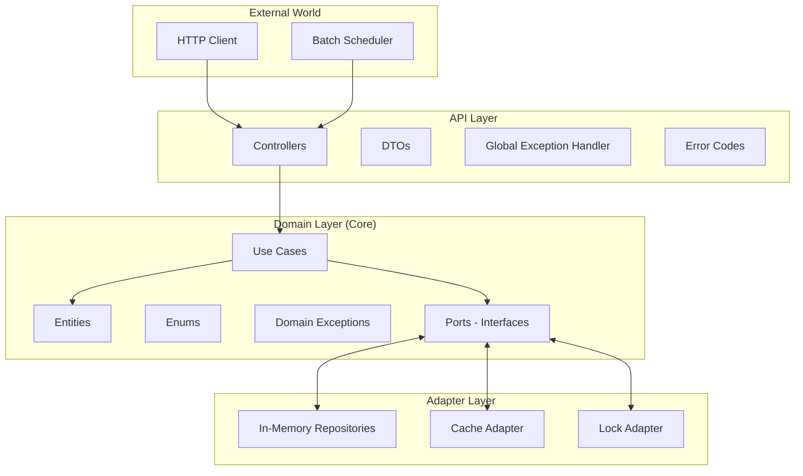

# 🏗️ 아키텍처 가이드

## 📋 목차

1. [헥사고날 아키텍처 개요](#헥사고날-아키텍처-개요)
2. [레이어별 상세 설명](#레이어별-상세-설명)
3. [의존성 관리](#의존성-관리)
4. [포트와 어댑터 패턴](#포트와-어댑터-패턴)
5. [실제 구현 예시](#실제-구현-예시)
6. [아키텍처 원칙](#아키텍처-원칙)

## 헥사고날 아키텍처 개요

### 🎯 선택 이유
- **비즈니스 로직과 기술적 관심사 분리**: 복잡한 이커머스 비즈니스 규칙을 순수하게 유지
- **테스트 용이성**: 외부 의존성 없이 도메인 로직 테스트 가능
- **확장성**: 새로운 기술 스택으로 전환 시 도메인 로직 변경 불필요
- **유지보수성**: 레이어별 책임 분리로 코드 이해와 수정 용이

### 🔄 의존성 방향
```
외부 세계 → API Layer → Domain Layer ← Adapter Layer
```

**핵심 원칙**: 도메인 레이어는 어떤 외부 기술에도 의존하지 않는다!

### 📊 아키텍처 다이어그램



## 레이어별 상세 설명

### 🌐 API Layer (`kr.hhplus.be.server.api`)

#### 📁 패키지 구조
```
api/
├── controller/           # REST API 컨트롤러
│   ├── BalanceController.java
│   ├── OrderController.java
│   └── ...
├── dto/                 # 데이터 전송 객체
│   ├── request/         # 요청 DTO
│   └── response/        # 응답 DTO
├── docs/                # API 문서 설정
│   └── annotation/      # 커스텀 Swagger 어노테이션
├── scheduler/           # 배치 작업
├── CommonResponse.java  # 표준 응답 포맷
├── ErrorCode.java       # 중앙 집중식 에러 코드
└── GlobalExceptionHandler.java  # 전역 예외 처리
```

#### 🎯 주요 책임
1. **HTTP 요청/응답 처리**: RESTful API 엔드포인트 제공
2. **데이터 변환**: 외부 형식 ↔ 도메인 객체 변환
3. **검증**: 요청 데이터 기본 검증 (형식, 필수값 등)
4. **예외 처리**: 도메인 예외를 HTTP 응답으로 변환
5. **문서화**: Swagger를 통한 API 문서 자동 생성

#### 💡 구현 원칙

**1. 컨트롤러는 얇게 유지**
```java
@RestController
@RequestMapping("/api/balance")
public class BalanceController {
    
    private final ChargeBalanceUseCase chargeBalanceUseCase;
    
    @PostMapping("/charge")
    public BalanceResponse chargeBalance(@RequestBody BalanceRequest request) {
        // ✅ 좋은 예: 비즈니스 로직은 UseCase에 위임
        request.validate(); // 기본 검증만
        Balance balance = chargeBalanceUseCase.execute(request.getUserId(), request.getAmount());
        return BalanceResponse.from(balance); // 도메인 → DTO 변환
    }
    
    // ❌ 나쁜 예: 컨트롤러에서 비즈니스 로직 처리
    // if (amount > MAX_AMOUNT) { ... }
    // balanceRepository.save(...);
}
```

**2. DTO는 도메인과 분리**
```java
// ✅ 좋은 예: 명확한 변환 메서드
public record BalanceResponse(
    Long userId,
    BigDecimal amount,
    LocalDateTime updatedAt
) {
    public static BalanceResponse from(Balance balance) {
        return new BalanceResponse(
            balance.getUser().getId(),
            balance.getAmount(),
            balance.getUpdatedAt()
        );
    }
}
```

### 🏠 Domain Layer (`kr.hhplus.be.server.domain`)

#### 📁 패키지 구조
```
domain/
├── entity/              # 도메인 엔티티
│   ├── Balance.java
│   ├── Order.java
│   ├── Product.java
│   └── ...
├── enums/              # 도메인 상태
│   ├── OrderStatus.java
│   ├── CouponStatus.java
│   └── ...
├── exception/          # 도메인 예외
│   ├── BalanceException.java
│   ├── OrderException.java
│   └── ...
├── port/               # 외부 시스템 인터페이스
│   ├── storage/        # 저장소 포트
│   ├── cache/          # 캐시 포트
│   └── locking/        # 락 포트
└── usecase/            # 비즈니스 로직
    ├── balance/
    ├── order/
    └── ...
```

#### 🎯 주요 책임
1. **비즈니스 규칙 구현**: 핵심 도메인 로직
2. **데이터 무결성**: 엔티티 상태 관리 및 검증
3. **상태 전이**: Enum 기반 명확한 상태 관리
4. **도메인 이벤트**: 비즈니스 이벤트 정의 및 처리

#### 💡 구현 원칙

**1. 엔티티는 자기 자신을 보호한다**
```java
@Getter
@SuperBuilder
public class Product extends BaseEntity {
    private int stock;
    private int reservedStock;
    
    // ✅ 좋은 예: 비즈니스 규칙을 엔티티 내부에서 처리
    public void reserveStock(int quantity) {
        validateQuantity(quantity);
        
        if (!hasAvailableStock(quantity)) {
            throw new ProductException.OutOfStock();
        }
        
        this.reservedStock += quantity;
    }
    
    public boolean hasAvailableStock(int quantity) {
        return (this.stock - this.reservedStock) >= quantity;
    }
    
    private void validateQuantity(int quantity) {
        if (quantity <= 0) {
            throw new IllegalArgumentException("Quantity must be positive");
        }
    }
}
```

**2. UseCase는 비즈니스 플로우를 조율한다**
```java
@Component
@RequiredArgsConstructor
public class ChargeBalanceUseCase {
    
    private final UserRepositoryPort userRepositoryPort;
    private final BalanceRepositoryPort balanceRepositoryPort;
    
    @Transactional
    public Balance execute(Long userId, BigDecimal amount) {
        // 1. 사용자 존재 확인
        User user = userRepositoryPort.findById(userId)
            .orElseThrow(() -> new UserException.NotFound());
        
        // 2. 잔액 조회 또는 생성
        Balance balance = balanceRepositoryPort.findByUserId(userId)
            .orElse(Balance.createNew(user));
        
        // 3. 잔액 충전 (비즈니스 로직)
        balance.charge(amount);
        
        // 4. 저장
        return balanceRepositoryPort.save(balance);
    }
}
```

**3. 도메인 예외는 의미있는 이름을 가진다**
```java
public class OrderException extends RuntimeException {
    
    public static class EmptyItems extends OrderException {
        public EmptyItems() {
            super("주문에는 최소 하나의 상품이 있어야 합니다");
        }
    }
    
    public static class AlreadyPaid extends OrderException {
        public AlreadyPaid(Long orderId) {
            super(String.format("주문 %d는 이미 결제되었습니다", orderId));
        }
    }
}
```

### 🔌 Adapter Layer (`kr.hhplus.be.server.adapter`)

#### 📁 패키지 구조
```
adapter/
├── storage/inmemory/    # In-Memory 저장소 구현
│   ├── InMemoryUserRepository.java
│   ├── InMemoryBalanceRepository.java
│   └── ...
├── cache/              # 캐시 구현 (향후 Redis 등)
└── locking/            # 락 구현
    └── InMemoryLockingAdapter.java
```

#### 🎯 주요 책임
1. **포트 구현**: 도메인에서 정의한 인터페이스 구현
2. **데이터 변환**: 외부 시스템 데이터 ↔ 도메인 객체 변환
3. **기술적 처리**: 트랜잭션, 연결 관리, 예외 변환

#### 💡 구현 원칙

**1. 포트 인터페이스를 충실히 구현**
```java
@Repository
public class InMemoryBalanceRepository implements BalanceRepositoryPort {
    
    private final Map<Long, Balance> balances = new ConcurrentHashMap<>();
    private final AtomicLong nextId = new AtomicLong(1L);
    
    @Override
    public Optional<Balance> findByUserId(Long userId) {
        return balances.values().stream()
            .filter(balance -> balance.getUser().getId().equals(userId))
            .findFirst();
    }
    
    @Override
    public Balance save(Balance balance) {
        // ConcurrentHashMap의 원자적 연산 활용
        Long balanceId = balance.getId() != null ? balance.getId() : nextId.getAndIncrement();
        
        return balances.compute(balanceId, (key, existing) -> {
            if (existing != null) {
                balance.onUpdate();
                balance.setId(existing.getId());
                balance.setCreatedAt(existing.getCreatedAt());
                return balance;
            } else {
                balance.onCreate();
                if (balance.getId() == null) {
                    balance.setId(balanceId);
                }
                return balance;
            }
        });
    }
}
```

## 의존성 관리

### 🔄 의존성 주입 방식

#### 1. 생성자 주입 (권장)
```java
@Component
@RequiredArgsConstructor  // Lombok으로 생성자 자동 생성
public class ChargeBalanceUseCase {
    
    private final UserRepositoryPort userRepositoryPort;
    private final BalanceRepositoryPort balanceRepositoryPort;
    
    // 생성자가 하나면 @Autowired 생략 가능
}
```

#### 2. Configuration 클래스에서 Bean 등록
```java
@Configuration
public class DomainConfig {
    
    @Bean
    public ChargeBalanceUseCase chargeBalanceUseCase(
        UserRepositoryPort userRepositoryPort,
        BalanceRepositoryPort balanceRepositoryPort
    ) {
        return new ChargeBalanceUseCase(userRepositoryPort, balanceRepositoryPort);
    }
}
```

### 🧪 테스트에서의 의존성 주입

```java
@ExtendWith(MockitoExtension.class)
class ChargeBalanceUseCaseTest {
    
    @Mock
    private UserRepositoryPort userRepositoryPort;
    
    @Mock
    private BalanceRepositoryPort balanceRepositoryPort;
    
    @InjectMocks
    private ChargeBalanceUseCase chargeBalanceUseCase;
    
    @Test
    void chargeBalance_Success() {
        // given
        User user = User.builder().id(1L).name("테스트").build();
        when(userRepositoryPort.findById(1L)).thenReturn(Optional.of(user));
        
        // when & then
        // ...
    }
}
```

## 포트와 어댑터 패턴

### 🔌 포트 (인터페이스) 정의

```java
// 도메인 레이어에서 정의
public interface BalanceRepositoryPort {
    Optional<Balance> findByUserId(Long userId);
    Balance save(Balance balance);
    void deleteByUserId(Long userId);
}
```

### 🔗 어댑터 (구현체) 작성

```java
// 어댑터 레이어에서 구현
@Repository
public class InMemoryBalanceRepository implements BalanceRepositoryPort {
    // 구현 세부사항...
}
```

### 🔄 다른 기술로 전환하기

**새로운 JPA 어댑터 추가**
```java
@Repository
@Profile("jpa")  // 프로파일로 구분
public class JpaBalanceRepository implements BalanceRepositoryPort {
    
    private final BalanceJpaRepository jpaRepository;
    
    @Override
    public Optional<Balance> findByUserId(Long userId) {
        return jpaRepository.findByUserId(userId)
            .map(this::toDomain);  // JPA Entity → Domain Entity 변환
    }
    
    private Balance toDomain(BalanceEntity entity) {
        // 변환 로직
    }
}
```

## 실제 구현 예시

### 📝 주문 생성 플로우

#### 1. API Layer
```java
@PostMapping
public OrderResponse createOrder(@RequestBody OrderRequest request) {
    request.validate();
    
    Map<Long, Integer> productQuantities = request.getProducts().stream()
        .collect(Collectors.toMap(
            OrderRequest.ProductQuantity::getProductId,
            OrderRequest.ProductQuantity::getQuantity
        ));
    
    Order order = createOrderUseCase.execute(
        request.getUserId(),
        productQuantities
    );
    
    return OrderResponse.from(order);
}
```

#### 2. Domain Layer (UseCase)
```java
@Component
@RequiredArgsConstructor
public class CreateOrderUseCase {
    
    private final UserRepositoryPort userRepositoryPort;
    private final ProductRepositoryPort productRepositoryPort;
    private final OrderRepositoryPort orderRepositoryPort;
    private final LockingPort lockingPort;
    
    @Transactional
    public Order execute(Long userId, Map<Long, Integer> productQuantities) {
        // 동시성 제어를 위한 락 획득
        String lockKey = "order-creation-" + userId;
        if (!lockingPort.acquireLock(lockKey)) {
            throw new ConcurrencyException.LockAcquisitionFailed();
        }
        
        try {
            // 1. 사용자 검증
            User user = userRepositoryPort.findById(userId)
                .orElseThrow(() -> new UserException.NotFound());
            
            // 2. 상품 조회 및 재고 예약
            List<OrderItem> orderItems = new ArrayList<>();
            BigDecimal totalAmount = BigDecimal.ZERO;
            
            for (Map.Entry<Long, Integer> entry : productQuantities.entrySet()) {
                Product product = productRepositoryPort.findById(entry.getKey())
                    .orElseThrow(() -> new ProductException.NotFound());
                
                int quantity = entry.getValue();
                product.reserveStock(quantity);  // 재고 예약
                productRepositoryPort.save(product);
                
                OrderItem orderItem = OrderItem.builder()
                    .product(product)
                    .quantity(quantity)
                    .unitPrice(product.getPrice())
                    .build();
                
                orderItems.add(orderItem);
                totalAmount = totalAmount.add(
                    product.getPrice().multiply(BigDecimal.valueOf(quantity))
                );
            }
            
            // 3. 주문 생성
            Order order = Order.builder()
                .user(user)
                .items(orderItems)
                .totalAmount(totalAmount)
                .status(OrderStatus.PENDING)
                .build();
            
            return orderRepositoryPort.save(order);
            
        } finally {
            lockingPort.releaseLock(lockKey);
        }
    }
}
```

#### 3. Adapter Layer
```java
@Repository
public class InMemoryOrderRepository implements OrderRepositoryPort {
    
    private final Map<Long, Order> orders = new ConcurrentHashMap<>();
    private final AtomicLong nextId = new AtomicLong(1L);
    
    @Override
    public Order save(Order order) {
        Long orderId = order.getId() != null ? order.getId() : nextId.getAndIncrement();
        
        return orders.compute(orderId, (key, existing) -> {
            if (existing != null) {
                order.onUpdate();
                order.setId(existing.getId());  
                order.setCreatedAt(existing.getCreatedAt());
                return order;
            } else {
                order.onCreate();
                if (order.getId() == null) {
                    order.setId(orderId);
                }
                return order;
            }
        });
    }
}
```

## 아키텍처 원칙

### ✅ 준수해야 할 원칙

1. **의존성 방향**: 외부 → 내부 (도메인을 향해)
2. **도메인 순수성**: 도메인 레이어는 외부 기술에 의존하지 않음
3. **인터페이스 분리**: 도메인에서 필요한 만큼만 포트 정의
4. **단일 책임**: 각 레이어는 명확한 하나의 책임만 가짐

### ❌ 피해야 할 안티패턴

1. **도메인에서 어댑터 직접 참조**
```java
// ❌ 나쁜 예
@Component
public class ChargeBalanceUseCase {
    private final InMemoryBalanceRepository repository;  // 구체 클래스 의존
}
```

2. **어댑터에서 도메인 로직 처리**
```java
// ❌ 나쁜 예  
@Repository
public class InMemoryBalanceRepository {
    public Balance save(Balance balance) {
        if (balance.getAmount().compareTo(BigDecimal.ZERO) < 0) {  // 비즈니스 로직
            throw new IllegalArgumentException("음수 불가");
        }
        // ...
    }
}
```

3. **순환 의존성**
```java
// ❌ 나쁜 예
public class OrderUseCase {
    private final ProductUseCase productUseCase;  // UseCase 간 직접 의존
}
```

### 🎯 아키텍처 검증 방법

#### 1. 패키지 의존성 체크
```java
// ArchUnit을 사용한 아키텍처 테스트 (향후 추가 예정)
@ArchTest
static final ArchRule domainShouldNotDependOnAdapters = 
    noClasses()
        .that().resideInAPackage("..domain..")
        .should().dependOnClassesThat()
        .resideInAPackage("..adapter..");
```

#### 2. 컴파일 타임 체크
- 도메인 패키지에서 `import kr.hhplus.be.server.adapter.*` 금지
- 도메인 패키지에서 Spring 어노테이션 최소화 (`@Component`, `@Transactional` 정도만)

### 🔄 확장 시나리오

#### 새로운 저장소 기술 추가
```java
// 1. 새로운 어댑터 구현
@Repository
@Profile("redis")
public class RedisBalanceRepository implements BalanceRepositoryPort {
    // Redis 관련 구현
}

// 2. 설정 변경만으로 전환
# application-prod.yml
spring:
  profiles:
    active: redis
```

#### 새로운 API 프로토콜 추가
```java
// GraphQL Controller 추가 (기존 UseCase 재사용)
@Controller
public class GraphQLBalanceController {
    private final ChargeBalanceUseCase chargeBalanceUseCase;  // 동일한 UseCase 사용
    
    @QueryMapping
    public BalanceResponse getBalance(@Argument Long userId) {
        // ...
    }
}
```

---

**다음 읽을 문서**: [03-domain-guide.md](03-domain-guide.md)