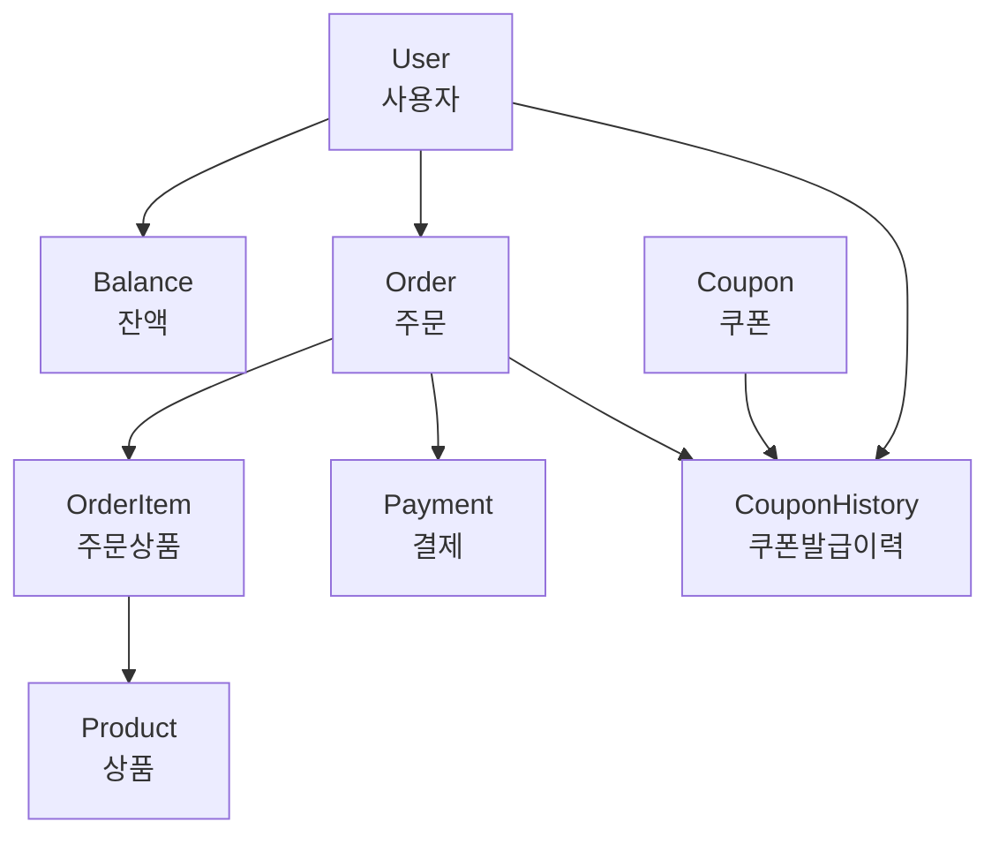
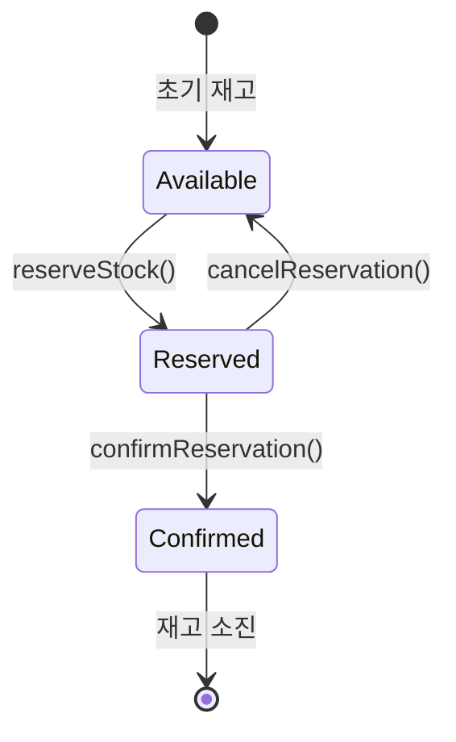

# 🏠 도메인 가이드

## 📋 목차

1. [도메인 개요](#도메인-개요)
2. [Balance 도메인](#balance-도메인)
3. [Product 도메인](#product-도메인)
4. [Order 도메인](#order-도메인)
5. [Coupon 도메인](#coupon-도메인)
6. [User 도메인](#user-도메인)
7. [도메인 간 상호작용](#도메인-간-상호작용)
8. [비즈니스 규칙 정리](#비즈니스-규칙-정리)

## 도메인 개요

### 🎯 도메인 관계도



### 🔄 핵심 비즈니스 플로우

1. **사용자 잔액 충전** → Balance 도메인
2. **상품 조회** → Product 도메인
3. **주문 생성** → Order 도메인 + Product 도메인 (재고 예약)
4. **쿠폰 발급** → Coupon 도메인 + User 도메인
5. **주문 결제** → Order 도메인 + Balance 도메인 + Product 도메인 (재고 확정)

## Balance 도메인

### 🎯 책임과 역할
- **사용자 잔액 관리**: 충전, 사용, 조회
- **잔액 검증**: 충전 금액 범위, 잔액 부족 검사
- **거래 이력**: 잔액 변동 추적 (향후 확장 예정)

### 📊 엔티티 구조

```java
@Getter
@SuperBuilder
public class Balance extends BaseEntity {
    private User user;              // 소유자
    private BigDecimal amount;      // 현재 잔액
    private LocalDateTime updatedAt; // 마지막 업데이트 시각
    
    // 비즈니스 로직
    public void charge(BigDecimal chargeAmount) { ... }
    public void deduct(BigDecimal deductAmount) { ... }
    public boolean hasEnoughBalance(BigDecimal requiredAmount) { ... }
}
```

### 🔧 주요 UseCase

#### 1. 잔액 충전 (ChargeBalanceUseCase)

```java
@Component
@RequiredArgsConstructor
public class ChargeBalanceUseCase {
    
    private final UserRepositoryPort userRepositoryPort;
    private final BalanceRepositoryPort balanceRepositoryPort;
    
    @Transactional
    public Balance execute(Long userId, BigDecimal amount) {
        // 1. 입력 검증
        validateChargeAmount(amount);
        
        // 2. 사용자 존재 확인
        User user = userRepositoryPort.findById(userId)
            .orElseThrow(() -> new UserException.NotFound());
        
        // 3. 잔액 조회 또는 생성
        Balance balance = balanceRepositoryPort.findByUserId(userId)
            .orElse(Balance.createNew(user));
        
        // 4. 잔액 충전 (도메인 로직)
        balance.charge(amount);
        
        // 5. 저장
        return balanceRepositoryPort.save(balance);
    }
    
    private void validateChargeAmount(BigDecimal amount) {
        if (amount == null || amount.compareTo(BigDecimal.ZERO) <= 0) {
            throw new BalanceException.InvalidAmount();
        }
        if (amount.compareTo(MAX_CHARGE_AMOUNT) > 0) {
            throw new BalanceException.InvalidAmount();
        }
    }
}
```

#### 2. 잔액 조회 (GetBalanceUseCase)

```java
@Component
@RequiredArgsConstructor
public class GetBalanceUseCase {
    
    private final BalanceRepositoryPort balanceRepositoryPort;
    private final BalanceCachePort balanceCachePort;  // 성능 최적화
    
    public Optional<Balance> execute(Long userId) {
        // 1. 캐시에서 먼저 조회
        Optional<Balance> cachedBalance = balanceCachePort.getBalance(userId);
        if (cachedBalance.isPresent()) {
            return cachedBalance;
        }
        
        // 2. 저장소에서 조회
        Optional<Balance> balance = balanceRepositoryPort.findByUserId(userId);
        
        // 3. 캐시에 저장
        balance.ifPresent(b -> balanceCachePort.setBalance(userId, b));
        
        return balance;
    }
}
```

### 📏 비즈니스 규칙

1. **충전 금액 제한**: 1,000원 ~ 1,000,000원
2. **잔액 상한**: 개인당 최대 10,000,000원
3. **동시성 제어**: 동일 사용자의 동시 충전/사용 시 순서 보장

### 🚨 예외 상황

```java
public class BalanceException extends RuntimeException {
    
    public static class NotFound extends BalanceException {
        public NotFound() {
            super("잔액 정보를 찾을 수 없습니다");
        }
    }
    
    public static class InsufficientBalance extends BalanceException {
        public InsufficientBalance(BigDecimal required, BigDecimal current) {
            super(String.format("잔액 부족: 필요 금액 %s, 현재 잔액 %s", required, current));
        }
    }
    
    public static class InvalidAmount extends BalanceException {
        public InvalidAmount() {
            super("유효하지 않은 금액입니다");
        }
    }
}
```

## Product 도메인

### 🎯 책임과 역할
- **상품 정보 관리**: 상품명, 가격, 재고
- **2단계 재고 관리**: 예약 → 확정 방식
- **인기 상품 통계**: 주문 데이터 기반 집계 (향후 확장)

### 📊 엔티티 구조

```java
@Getter
@SuperBuilder
public class Product extends BaseEntity {
    private String name;            // 상품명
    private BigDecimal price;       // 가격
    private int stock;              // 실제 재고
    private int reservedStock;      // 예약된 재고
    
    // 재고 관리 로직
    public void reserveStock(int quantity) { ... }      // 재고 예약
    public void confirmReservation(int quantity) { ... } // 예약 확정
    public void cancelReservation(int quantity) { ... }  // 예약 취소
    public boolean hasAvailableStock(int quantity) { ... } // 이용 가능한 재고 확인
}
```

### 🔧 재고 관리 상태 전이



### 🎯 주요 UseCase

#### 1. 상품 목록 조회 (GetProductUseCase)

```java
@Component
@RequiredArgsConstructor
public class GetProductUseCase {
    
    private final ProductRepositoryPort productRepositoryPort;
    
    public List<Product> execute(int limit, int offset) {
        validatePagination(limit, offset);
        
        return productRepositoryPort.findAll(limit, offset);
    }
    
    private void validatePagination(int limit, int offset) {
        if (limit <= 0 || limit > 100) {
            throw new IllegalArgumentException("Limit must be between 1 and 100");
        }
        if (offset < 0) {
            throw new IllegalArgumentException("Offset must not be negative");
        }
    }
}
```

#### 2. 인기 상품 조회 (GetPopularProductListUseCase)

```java
@Component
@RequiredArgsConstructor
public class GetPopularProductListUseCase {
    
    private final ProductRepositoryPort productRepositoryPort;
    private final OrderRepositoryPort orderRepositoryPort;
    
    public List<Product> execute(int days) {
        LocalDateTime fromDate = LocalDateTime.now().minusDays(days);
        
        // 1. 기간 내 주문된 상품별 수량 집계
        Map<Long, Long> productOrderCounts = orderRepositoryPort
            .findOrdersAfter(fromDate)
            .stream()
            .flatMap(order -> order.getItems().stream())
            .collect(Collectors.groupingBy(
                item -> item.getProduct().getId(),
                Collectors.summingLong(OrderItem::getQuantity)
            ));
        
        // 2. 상위 5개 상품 ID 추출
        List<Long> topProductIds = productOrderCounts.entrySet().stream()
            .sorted(Map.Entry.<Long, Long>comparingByValue().reversed())
            .limit(5)
            .map(Map.Entry::getKey)
            .collect(Collectors.toList());
        
        // 3. 상품 정보 조회
        return productRepositoryPort.findByIds(topProductIds);
    }
}
```

### 📏 비즈니스 규칙

1. **재고 예약**: 주문 생성 시 실제 재고는 차감하지 않고 예약만 처리
2. **재고 확정**: 결제 완료 시 예약된 재고를 실제 재고에서 차감
3. **이용 가능한 재고**: `실제 재고 - 예약된 재고`
4. **동시성 제어**: 동일 상품에 대한 동시 주문 시 재고 안정성 보장

### 🚨 예외 상황

```java
public class ProductException extends RuntimeException {
    
    public static class NotFound extends ProductException {
        public NotFound(Long productId) {
            super(String.format("상품을 찾을 수 없습니다: %d", productId));
        }
    }
    
    public static class OutOfStock extends ProductException {
        public OutOfStock() {
            super("상품 재고가 부족합니다");
        }
    }
    
    public static class InvalidReservation extends ProductException {
        public InvalidReservation(String message) {
            super(message);
        }
    }
}
```

## Order 도메인

### 🎯 책임과 역할
- **주문 생성**: 상품 정보와 수량으로 주문 생성
- **주문 상태 관리**: PENDING → PAID → COMPLETED
- **결제 처리**: 잔액 차감 및 재고 확정
- **주문 조회**: 개별 주문 및 사용자별 주문 목록

### 📊 엔티티 구조

```java
@Getter
@SuperBuilder
public class Order extends BaseEntity {
    private User user;                    // 주문자
    private List<OrderItem> items;        // 주문 상품 목록
    private BigDecimal totalAmount;       // 총 주문 금액
    private OrderStatus status;           // 주문 상태
    private List<Long> appliedCouponIds;  // 적용된 쿠폰 ID 목록
    
    // 비즈니스 로직
    public void pay() { ... }             // 결제 처리
    public boolean canPay() { ... }       // 결제 가능 여부
    public void complete() { ... }        // 주문 완료
}

@Getter
@SuperBuilder
public class OrderItem extends BaseEntity {
    private Product product;      // 상품
    private int quantity;         // 수량
    private BigDecimal unitPrice; // 단가 (주문 시점 가격)
    
    public BigDecimal getTotalPrice() {
        return unitPrice.multiply(BigDecimal.valueOf(quantity));
    }
}
```

### 🔄 주문 상태 전이

```java
public enum OrderStatus {
    PENDING("주문 대기"),      // 주문 생성, 재고 예약 완료
    PAID("결제 완료"),         // 결제 완료, 재고 확정
    COMPLETED("주문 완료"),     // 배송 등 모든 과정 완료
    CANCELLED("주문 취소");     // 주문 취소, 재고 복원
    
    public boolean canTransitionTo(OrderStatus newStatus) {
        switch (this) {
            case PENDING:
                return newStatus == PAID || newStatus == CANCELLED;
            case PAID:
                return newStatus == COMPLETED || newStatus == CANCELLED;
            case COMPLETED:
            case CANCELLED:
                return false;
            default:
                return false;
        }
    }
}
```

### 🎯 주요 UseCase

#### 1. 주문 생성 (CreateOrderUseCase)

```java
@Component
@RequiredArgsConstructor
public class CreateOrderUseCase {
    
    private final UserRepositoryPort userRepositoryPort;
    private final ProductRepositoryPort productRepositoryPort;
    private final OrderRepositoryPort orderRepositoryPort;
    private final LockingPort lockingPort;
    
    @Transactional
    public Order execute(Long userId, Map<Long, Integer> productQuantities) {
        // 동시성 제어
        String lockKey = "order-creation-" + userId;
        if (!lockingPort.acquireLock(lockKey)) {
            throw new ConcurrencyException.LockAcquisitionFailed();
        }
        
        try {
            // 1. 사용자 검증
            User user = userRepositoryPort.findById(userId)
                .orElseThrow(() -> new UserException.NotFound());
            
            // 2. 주문 상품 검증 및 재고 예약
            List<OrderItem> orderItems = new ArrayList<>();
            BigDecimal totalAmount = BigDecimal.ZERO;
            
            for (Map.Entry<Long, Integer> entry : productQuantities.entrySet()) {
                Long productId = entry.getKey();
                Integer quantity = entry.getValue();
                
                // 상품 조회
                Product product = productRepositoryPort.findById(productId)
                    .orElseThrow(() -> new ProductException.NotFound(productId));
                
                // 재고 예약
                product.reserveStock(quantity);
                productRepositoryPort.save(product);
                
                // 주문 아이템 생성
                OrderItem orderItem = OrderItem.builder()
                    .product(product)
                    .quantity(quantity)
                    .unitPrice(product.getPrice())
                    .build();
                
                orderItems.add(orderItem);
                totalAmount = totalAmount.add(
                    product.getPrice().multiply(BigDecimal.valueOf(quantity))
                );
            }
            
            // 3. 주문 생성
            Order order = Order.builder()
                .user(user)
                .items(orderItems)
                .totalAmount(totalAmount)
                .status(OrderStatus.PENDING)
                .build();
            
            return orderRepositoryPort.save(order);
            
        } finally {
            lockingPort.releaseLock(lockKey);
        }
    }
}
```

#### 2. 주문 결제 (PayOrderUseCase)

```java
@Component
@RequiredArgsConstructor
public class PayOrderUseCase {
    
    private final OrderRepositoryPort orderRepositoryPort;
    private final BalanceRepositoryPort balanceRepositoryPort;
    private final ProductRepositoryPort productRepositoryPort;
    private final PaymentRepositoryPort paymentRepositoryPort;
    
    @Transactional
    public Payment execute(Long orderId) {
        // 1. 주문 조회
        Order order = orderRepositoryPort.findById(orderId)
            .orElseThrow(() -> new OrderException.NotFound());
        
        // 2. 결제 가능 여부 확인
        if (!order.canPay()) {
            throw new OrderException.AlreadyPaid(orderId);
        }
        
        // 3. 잔액 확인 및 차감
        Balance balance = balanceRepositoryPort.findByUserId(order.getUser().getId())
            .orElseThrow(() -> new BalanceException.NotFound());
        
        if (!balance.hasEnoughBalance(order.getTotalAmount())) {
            throw new BalanceException.InsufficientBalance(
                order.getTotalAmount(), 
                balance.getAmount()
            );
        }
        
        balance.deduct(order.getTotalAmount());
        balanceRepositoryPort.save(balance);
        
        // 4. 재고 확정
        for (OrderItem item : order.getItems()) {
            Product product = item.getProduct();
            product.confirmReservation(item.getQuantity());
            productRepositoryPort.save(product);
        }
        
        // 5. 주문 상태 변경
        order.pay();
        orderRepositoryPort.save(order);
        
        // 6. 결제 정보 생성
        Payment payment = Payment.builder()
            .order(order)
            .user(order.getUser())
            .amount(order.getTotalAmount())
            .status(PaymentStatus.PAID)
            .paidAt(LocalDateTime.now())
            .build();
        
        return paymentRepositoryPort.save(payment);
    }
}
```

### 📏 비즈니스 규칙

1. **주문 최소 조건**: 최소 1개 이상의 상품 필요
2. **재고 예약**: 주문 생성 시 상품 재고 예약 처리
3. **결제 검증**: 잔액 부족 시 결제 불가
4. **원자성**: 주문-결제-재고 처리는 하나의 트랜잭션으로 처리

## Coupon 도메인

### 🎯 책임과 역할
- **쿠폰 발급**: 사용자별 쿠폰 발급 및 중복 발급 방지
- **쿠폰 상태 관리**: 활성/비활성/만료/소진 상태 관리
- **발급 이력 관리**: 누가 언제 어떤 쿠폰을 발급받았는지 추적
- **만료 처리**: 스케줄러 기반 자동 만료 처리

### 📊 엔티티 구조

```java
@Getter
@SuperBuilder
public class Coupon extends BaseEntity {
    private String code;              // 쿠폰 코드
    private BigDecimal discountRate;  // 할인율 (0.1 = 10%)
    private int maxIssuance;          // 최대 발급 수량
    private int issuedCount;          // 현재 발급 수량
    private LocalDateTime startDate;  // 발급 시작일
    private LocalDateTime endDate;    // 발급 종료일
    private CouponStatus status;      // 쿠폰 상태
    
    // 비즈니스 로직
    public boolean canIssue() { ... }          // 발급 가능 여부
    public void decreaseStock(int quantity) { ... } // 재고 감소
    public void updateStatusBasedOnConditions() { ... } // 상태 자동 업데이트
}

@Getter
@SuperBuilder
public class CouponHistory extends BaseEntity {
    private User user;                    // 발급받은 사용자
    private Coupon coupon;               // 발급된 쿠폰
    private CouponHistoryStatus status;  // 발급 이력 상태
    private LocalDateTime issuedAt;      // 발급 시각
    private LocalDateTime usedAt;        // 사용 시각
    
    // 비즈니스 로직
    public boolean canUse() { ... }      // 사용 가능 여부
    public void use() { ... }            // 사용 처리
}
```

### 🔄 쿠폰 상태 전이

```java
public enum CouponStatus {
    INACTIVE("활성화 대기"),    // 발급 시작 전
    ACTIVE("발급 가능"),       // 발급 가능 상태
    SOLD_OUT("재고 소진"),     // 발급 수량 소진
    EXPIRED("만료"),           // 발급 기간 만료
    DISABLED("비활성");        // 관리자에 의한 비활성화
    
    public boolean isIssuable() {
        return this == ACTIVE;
    }
    
    public boolean canTransitionTo(CouponStatus newStatus) {
        switch (this) {
            case INACTIVE:
                return newStatus == ACTIVE || newStatus == EXPIRED || newStatus == DISABLED;
            case ACTIVE:
                return newStatus == SOLD_OUT || newStatus == EXPIRED || newStatus == DISABLED;
            case SOLD_OUT:
                return newStatus == EXPIRED || newStatus == DISABLED;
            case EXPIRED:
                return newStatus == DISABLED;
            case DISABLED:
                return newStatus == ACTIVE;
            default:
                return false;
        }
    }
}
```

### 🎯 주요 UseCase

#### 1. 쿠폰 발급 (IssueCouponUseCase)

```java
@Component
@RequiredArgsConstructor
public class IssueCouponUseCase {
    
    private final UserRepositoryPort userRepositoryPort;
    private final CouponRepositoryPort couponRepositoryPort;
    private final CouponHistoryRepositoryPort couponHistoryRepositoryPort;
    private final LockingPort lockingPort;
    
    @Transactional
    public CouponHistory execute(Long userId, Long couponId) {
        String lockKey = "coupon-issuance-" + couponId;
        if (!lockingPort.acquireLock(lockKey)) {
            throw new ConcurrencyException.LockAcquisitionFailed();
        }
        
        try {
            // 1. 사용자 검증
            User user = userRepositoryPort.findById(userId)
                .orElseThrow(() -> new UserException.NotFound());
            
            // 2. 쿠폰 조회
            Coupon coupon = couponRepositoryPort.findById(couponId)
                .orElseThrow(() -> new CouponException.NotFound());
            
            // 3. 중복 발급 확인
            Optional<CouponHistory> existingHistory = couponHistoryRepositoryPort
                .findByUserIdAndCouponId(userId, couponId);
            
            if (existingHistory.isPresent()) {
                throw new CouponException.AlreadyIssued();
            }
            
            // 4. 발급 가능 여부 확인
            coupon.updateStatusBasedOnConditions();
            if (!coupon.canIssue()) {
                throw new CouponException.CouponNotIssuable();
            }
            
            // 5. 쿠폰 재고 감소
            coupon.decreaseStock(1);
            couponRepositoryPort.save(coupon);
            
            // 6. 발급 이력 생성
            CouponHistory history = CouponHistory.builder()
                .user(user)
                .coupon(coupon)
                .status(CouponHistoryStatus.ISSUED)
                .issuedAt(LocalDateTime.now())
                .build();
            
            return couponHistoryRepositoryPort.save(history);
            
        } finally {
            lockingPort.releaseLock(lockKey);
        }
    }
}
```

#### 2. 쿠폰 만료 처리 (ExpireCouponsUseCase)

```java
@Component
@RequiredArgsConstructor
public class ExpireCouponsUseCase {
    
    private final CouponRepositoryPort couponRepositoryPort;
    
    @Transactional
    @Scheduled(cron = "0 0 * * * *")  // 매시간 실행
    public void execute() {
        LocalDateTime now = LocalDateTime.now();
        
        List<Coupon> expirableCoupons = couponRepositoryPort.findExpirableCoupons(now);
        
        for (Coupon coupon : expirableCoupons) {
            coupon.updateStatusBasedOnConditions();
            couponRepositoryPort.save(coupon);
        }
        
        log.info("쿠폰 만료 처리 완료: {} 개 쿠폰 처리", expirableCoupons.size());
    }
}
```

### 📏 비즈니스 규칙

1. **중복 발급 방지**: 동일 사용자는 동일 쿠폰을 한 번만 발급 가능
2. **발급 기간 제한**: startDate ~ endDate 기간 내에서만 발급 가능
3. **수량 제한**: maxIssuance 수량만큼만 발급 가능
4. **자동 상태 관리**: 시간, 수량에 따른 자동 상태 전이

## User 도메인

### 🎯 책임과 역할
- **사용자 기본 정보 관리**: ID, 이름, 생성일시
- **도메인 간 연결점**: 다른 도메인에서 사용자 참조

### 📊 엔티티 구조

```java
@Getter
@SuperBuilder
public class User extends BaseEntity {
    private String name;  // 사용자 이름
    
    // 간단한 검증 로직
    public void validateName() {
        if (name == null || name.trim().isEmpty()) {
            throw new UserException.InvalidUserName();
        }
    }
}
```

## 도메인 간 상호작용

### 🔄 주요 상호작용 시나리오

#### 1. 주문 생성 플로우
```
1. User 검증 → User 도메인
2. Product 조회 및 재고 예약 → Product 도메인  
3. Order 생성 → Order 도메인
4. 결과 반환
```

#### 2. 주문 결제 플로우
```
1. Order 조회 및 상태 확인 → Order 도메인
2. Balance 조회 및 잔액 차감 → Balance 도메인
3. Product 재고 확정 → Product 도메인
4. Payment 생성 → Order 도메인
5. Order 상태 업데이트 → Order 도메인
```

#### 3. 쿠폰 발급 플로우
```
1. User 검증 → User 도메인
2. Coupon 조회 및 발급 가능 여부 확인 → Coupon 도메인
3. 중복 발급 확인 → Coupon 도메인 (CouponHistory)
4. CouponHistory 생성 → Coupon 도메인
```

### 🚫 금지된 상호작용

1. **직접적인 도메인 간 의존**: UseCase가 다른 UseCase를 직접 호출 금지
2. **양방향 참조**: 엔티티 간 순환 참조 방지
3. **트랜잭션 경계 위반**: 여러 도메인에 걸친 복잡한 트랜잭션은 상위 레이어에서 조율

## 비즈니스 규칙 정리

### 💰 잔액 관리
- 충전 금액: 1,000원 ~ 1,000,000원
- 최대 보유 금액: 10,000,000원
- 동시 충전/사용 시 순서 보장

### 📦 재고 관리
- 2단계 처리: 예약 → 확정
- 동시 주문 시 재고 안정성 보장
- 결제 실패 시 예약 자동 취소

### 🛒 주문 관리
- 최소 주문: 1개 이상 상품
- 결제 원자성: 잔액 차감 + 재고 확정 + 상태 변경
- 주문 취소 시 모든 변경사항 롤백

### 🎫 쿠폰 관리
- 중복 발급 방지
- 시간 기반 자동 상태 전이
- 재고 기반 발급 제한

---

**다음 읽을 문서**: [04-development-guide.md](04-development-guide.md)