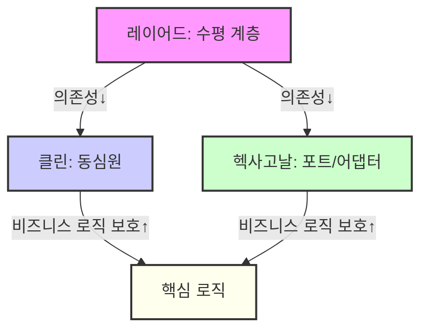

# 아키텍처 비교 및 공통점 (레이어드/클린/헥사고날)

## 1. 공통점
- 계층/구성요소 분리, 관심사 분리(SoC)
- 내부(비즈니스 로직)와 외부(프레임워크/DB) 분리 지향
- 테스트 용이성, 유지보수성, 유연성↑
- 의존성 역전 원칙(DIP) 활용(특히 클린/헥사고날)
- 실전에서는 계층 분리 실패, 의존성 규칙 위반, 인프라와의 통합 등에서 고민이 많음

## 2. 차이점 및 비교

| 구분 | 레이어드 | 클린 | 헥사고날 |
|------|----------|------|----------|
| **구조** | 수평 계층 | 동심원 | 육각형(포트/어댑터) |
| **의존성 방향** | 상위→하위 | 외부→내부(안쪽) | 외부→코어(포트) |
| **비즈니스 로직 보호** | 약함(인프라 결합) | 강함 | 강함 |
| **유연성/확장성** | 낮음 | 높음 | 높음 |
| **테스트 용이성** | 계층별 | 핵심 로직 독립 | 코어 독립 |
| **적합 상황** | 단순/소규모 | 복잡/장기/확장 | 외부 연동 다양/복잡 |
| **복잡성/학습 곡선** | 낮음 | 높음 | 높음 |

### 실전적 선택 기준/고민
- 단순 CRUD/소규모: **레이어드**
- 복잡/확장/장기: **클린**
- 외부 연동/입출력 다양: **헥사고날**
- 팀 역량/유지보수/미래 확장 고려해 선택
- 실전에서는 구조적 한계, 계층 분리 실패, 의존성 규칙 위반, 인프라와의 통합 등에서 고민이 많음

## 3. 비교 구조

## 4. 오해와 실전적 고민
- "클린/헥사고날이 무조건 좋다"는 오해: 복잡성/학습 곡선/비용/실전 적용 난이도 고려해야 함
- "레이어드는 구식"이라는 오해: 단순/소규모/명확한 책임 분리엔 여전히 최적
- 실전에서는 계층 분리 실패, 의존성 규칙 위반, 인프라와의 통합 등에서 구조적 한계와 고민이 많음

## 5. 실전 TIP/선택 가이드
- 프로젝트 특성, 팀 역량, 비즈니스 요구, 미래 확장성 등 종합적으로 고려해 선택
- 단순 CRUD/소규모 시스템에는 레이어드, 복잡/확장/장기 시스템에는 클린/헥사고날
- 외부 연동/입출력 다양, 도메인 중심 설계 필요 시 헥사고날/클린
- 구조적 한계, 실전적 고민, 실무적 선택 기준 등 반드시 고려

## 6. 세 가지 아키텍처 간의 관계와 발전 계보

- **레이어드 → 클린/헥사고날로의 발전**: 레이어드 아키텍처는 가장 기본적인 구조로, 관심사 분리와 계층화에 집중. 하지만 DB/인프라 의존성, 확장성 한계 등 구조적 한계가 명확해지면서, 이를 극복하기 위해 클린/헥사고날 아키텍처가 등장. 
- **클린 아키텍처**는 레이어드의 단방향 의존성 한계를 극복하고, 비즈니스 로직을 외부로부터 완전히 격리(동심원 구조, 의존성 규칙)하는 방향으로 발전.
- **헥사고날 아키텍처**는 클린 아키텍처의 추상적 원칙(의존성 역전, 비즈니스 로직 격리)을 실제로 구현하는 구체적 패턴(포트와 어댑터)으로 볼 수 있음. 
- **실전에서는 혼용/점진적 전환**: 기존 레이어드 구조에서 점진적으로 클린/헥사고날 구조로 전환하거나, 일부 계층만 클린/헥사고날 패턴을 적용하는 경우가 많음. 
- **DDD, MSA 등과의 결합**: 클린/헥사고날 아키텍처는 DDD, MSA 등 현대적 설계 패러다임과 결합해 복잡한 시스템에서 더 큰 효과를 발휘함.

## 7. 용어/구성요소 매핑: 레이어드 아키텍처 기준 비유

| 레이어드 아키텍처 | 클린 아키텍처 | 헥사고날 아키텍처 | 설명/비유 |
|------------------|---------------|-------------------|-----------------------------|
| Controller       | Interface Adapter (Controller/Presenter) | Primary Adapter           | 외부 요청을 받아 내부로 전달하는 역할
| Service Layer    | Use Case      | Application Core   | 비즈니스 로직/유스케이스 처리
| Repository       | Gateway/Interface Adapter | Secondary Adapter         | DB/외부 시스템과의 연결, 데이터 입출력
| Entity/Model     | Entity        | Domain Model       | 핵심 비즈니스 데이터/규칙
| (없음, DB직접)   | Frameworks & Drivers | External Adapter         | DB, 프레임워크, 외부 API 등
| (없음)           | Port (Interface) | Port (Interface)         | 도메인 관점의 추상화된 계약(인터페이스)

### 실전적 비유/설명
- 클린 아키텍처의 Use Case는 레이어드의 Service Layer와 거의 동일한 역할(비즈니스 로직/유스케이스 처리)
- Interface Adapter(Controller)는 레이어드의 Controller와 1:1 매칭, Presenter는 View/응답 변환 역할
- Gateway/Adapter는 Repository와 유사(외부 시스템 연결)
- Port(Interface)는 레이어드에는 명확히 없지만, Service-Repository 사이의 인터페이스 추상화로 비유 가능
- Frameworks & Drivers는 레이어드의 DB/외부 API/프레임워크와 동일

> **TIP:** 레이어드 아키텍처에 익숙하다면, 클린/헥사고날의 각 용어를 위 표처럼 매핑해서 이해하면 구조적 차이와 의도를 빠르게 파악할 수 있음.

---

> **정리:**
> '최고의' 아키텍처는 없으며, 프로젝트의 특성, 팀의 역량, 비즈니스 요구사항, 변화의 빈도와 규모에 따라 '가장 적합한' 아키텍처를 선택하고 지속적으로 개선하는 것이 중요. 각 아키텍처의 구조적 한계, 실전적 고민, 실무적 선택 기준을 반드시 고려해야 함. 