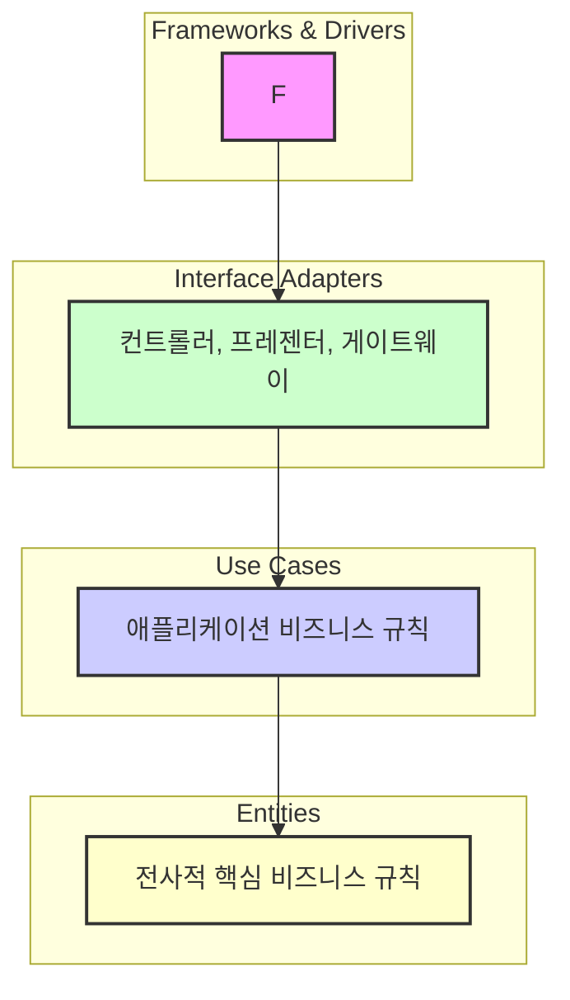

# 클린 아키텍처 (Clean Architecture)

## 1. 개념 및 배경
클린 아키텍처는 로버트 C. 마틴(언클 밥)이 제안한, 소프트웨어를 여러 계층의 동심원 구조로 분리하여 비즈니스 로직을 외부로부터 격리하는 아키텍처 패턴. 핵심은 '의존성 규칙(Dependency Rule)'로, 소스 코드 의존성은 반드시 안쪽(비즈니스 정책)으로만 향해야 함. 프레임워크, DB, UI 등 외부 요소로부터 비즈니스 로직을 보호하는 데 집중.

- **아키텍처의 필요성**: 복잡한 시스템에서 비즈니스 로직이 인프라/프레임워크/DB에 종속되는 문제를 해결. 유지보수성, 테스트 용이성, 유연성, 독립적 개발/배포를 목표로 함.

## 2. 동심원 구조 및 계층별 역할
- **Entities**: 전사적 핵심 비즈니스 규칙, 불변성, 재사용성. 다양한 애플리케이션에서 재사용 가능.
- **Use Cases**: 애플리케이션 비즈니스 규칙, 유스케이스/프로세스. 엔티티를 활용해 유스케이스 목적 달성.
- **Interface Adapters**: 데이터 변환, 컨트롤러, 프레젠터, 게이트웨이. 외부와 내부 데이터 변환 담당.
- **Frameworks & Drivers**: DB, 웹, 외부 프레임워크/도구. 세부사항이 위치하는 바깥 계층.

## 3. 의존성 규칙과 구조적 특징
- 소스 코드 의존성은 반드시 안쪽(Entities/Use Cases)으로만 향함
- 외부(Frameworks, DB, UI)는 언제든 교체 가능
- 내부(비즈니스 로직)는 외부 변화에 영향받지 않음
- DIP(Dependency Inversion Principle) 적극 활용: 고수준 모듈(비즈니스 로직)이 저수준 모듈(인프라)에 의존하지 않음. 인터페이스에 의존, 인프라가 이를 구현
- 제어 흐름은 외부→내부, 소스 코드 의존성은 내부로만

## 4. 장점
- 프레임워크/DB/UI 독립성
- 테스트 용이성, 유지보수성, 유연성↑
- 핵심 로직 보호, 독립적 개발/배포
- 빠른 개선 및 확장, 요구사항 변화에 유연하게 대응

## 5. 단점 및 구조적 한계
- 구현 복잡성, 높은 학습 곡선
- 작은 프로젝트엔 과도한 분리/비효율
- 코드량/개발비용 증가
- 계층/구성요소 많아짐, 설계/구현 난이도↑

### 실전에서 겪는 문제
- 계층 분리/의존성 규칙을 지키지 않으면 구조가 무너짐
- 실무에서는 프레임워크/DB/외부 API와의 통합에서 고민이 많음
- 도메인/유스케이스/어댑터/프레임워크 코드 분리 실패 시, 유지보수 난이도↑

## 6. 실전 TIP/고민
- 복잡한 비즈니스 로직, 장기적 유지보수/확장성 요구 시스템에 적합
- 핵심 로직(Entities/Use Cases)와 인프라(Frameworks/DB) 완전 분리 목표
- 도메인/유스케이스/어댑터/프레임워크 코드 분리 명확히
- 인터페이스 설계에 집중, 인프라 구현은 나중에 붙이기
- 테스트: 핵심 로직은 외부 의존성 없이 단위 테스트, 어댑터/프레임워크는 통합 테스트

## 7. 예시/실전적 맥락
- 복잡한 도메인, 장기적 유지보수/확장성 요구 시스템에서 효과적
- 실전에서는 계층 분리 실패, 의존성 규칙 위반, 인프라와의 통합 등에서 고민이 많음
- 도메인 주도 설계(DDD)와 결합해 사용하면 효과 극대화

## 8. 레이어드 아키텍처 용어로 비유해서 이해하기

| 클린 아키텍처         | 레이어드 아키텍처         | 설명/비유 |
|----------------------|--------------------------|-----------------------------|
| Entities             | Entity/Model             | 핵심 비즈니스 데이터/규칙, 도메인 객체
| Use Cases            | Service Layer            | 비즈니스 로직/유스케이스 처리
| Interface Adapter    | Controller/Repository    | Controller: 외부 요청 처리, Repository: DB/외부 시스템 연결
| Presenter            | (View/응답 변환)         | View/응답 변환, 데이터 포맷 변환
| Gateway              | Repository               | DB/외부 시스템과의 연결, 데이터 입출력
| Frameworks & Drivers | DB/외부 API/프레임워크   | DB, 프레임워크, 외부 시스템 등
| Port (Interface)     | (Service-Repository 사이 추상화) | 도메인 관점의 추상화된 계약(인터페이스)

### 실전적 비유/설명
- Use Case는 Service Layer와 거의 동일하게, 실제 비즈니스 로직/유스케이스를 처리
- Interface Adapter(Controller)는 레이어드의 Controller와 1:1 매칭, Presenter는 View/응답 변환 역할
- Gateway는 Repository와 유사(외부 시스템 연결)
- Port(Interface)는 레이어드에는 명확히 없지만, Service-Repository 사이의 인터페이스 추상화로 비유 가능
- Frameworks & Drivers는 레이어드의 DB/외부 API/프레임워크와 동일

> **TIP:** 레이어드 아키텍처에 익숙하다면, 클린 아키텍처의 각 용어를 위 표처럼 매핑해서 이해하면 구조적 차이와 의도를 빠르게 파악할 수 있음.

---

> **정리:**
> 클린 아키텍처는 비즈니스 로직을 외부로부터 완전히 격리해, 변화에 유연하게 대응하고 핵심 로직의 순수성을 유지하는 데 매우 효과적. 하지만 초기 구현의 복잡성과 높은 학습 곡선, 작은 프로젝트엔 과도한 분리/비효율 등은 도입 시 반드시 고려해야 할 요소. 