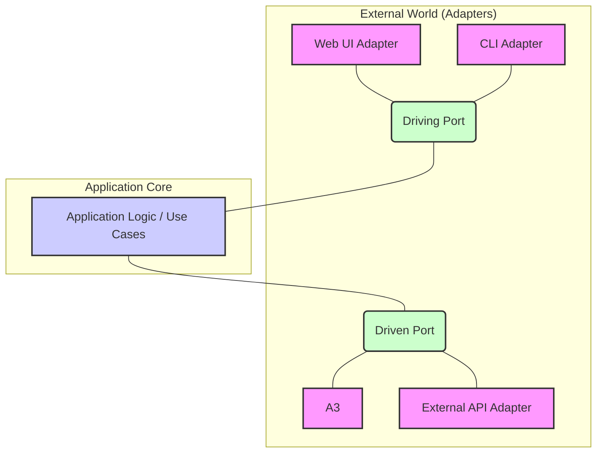

# 헥사고날 아키텍처 (Hexagonal Architecture, Ports & Adapters)

## 1. 개념 및 배경
헥사고날 아키텍처(포트와 어댑터)는 비즈니스 로직(애플리케이션 코어)을 외부 세계(프레임워크, DB, UI 등)로부터 완전히 격리하는 구조. 다양한 입출력(포트)과 구현(어댑터)을 통해 유연하고 테스트하기 쉬운 시스템을 지향. 육각형 모양은 다양한 외부 시스템과 여러 인터페이스(포트)를 통해 상호작용할 수 있음을 상징.

- **아키텍처의 필요성**: 외부 시스템/기술 변화에 유연하게 대응, 비즈니스 로직의 순수성/테스트 용이성/유지보수성 극대화

## 2. 핵심 구성 요소 및 구조
- **Application Core**: 순수 비즈니스 로직, 유스케이스
- **Ports**: 인터페이스(입력/출력), 도메인 관점의 계약. Primary(외부→코어), Secondary(코어→외부)
- **Adapters**: 포트 구현체, 외부 시스템과 연결(웹, DB, API 등)
    - **Primary Adapter**: 외부에서 코어로 진입(예: Controller)
    - **Secondary Adapter**: 코어가 외부 호출(예: Repository)

## 3. 비즈니스 로직 격리 방법 및 구조적 특징
- 코어는 포트(인터페이스)에만 의존, 어댑터(구현)는 외부에 위치
- 외부 시스템 교체/확장 용이, 테스트 더 쉬움
- 도메인 관점의 인터페이스 설계 중요(기술이 아닌 도메인 중심)
- 패키지 구조: domain, application, interfaces, infrastructure 등 명확 분리

## 4. 장점
- 유연성, 확장성, 테스트 용이성↑
- 외부 시스템/기술 교체 쉬움
- 유지보수성, 책임 분리↑
- 다양한 입출력/외부 연동에 강함

## 5. 단점 및 구조적 한계
- 단순 CRUD엔 과도한 분리/복잡성↑
- 계층/구성요소 많아짐, 학습 곡선↑
- 성능 오버헤드 가능(계층/어댑터 추가)

### 실전에서 겪는 문제
- 도메인 관점 인터페이스 설계 실패 시, 구조적 장점 상실
- 어댑터/포트 분리 실패, 기술 중심 설계 시 유지보수 난이도↑
- 실무에서는 외부 시스템 연동, 테스트 전략, 패키지 구조 등에서 고민이 많음

## 6. 실전 TIP/고민
- 다양한 입출력/외부 연동, 복잡한 비즈니스 로직 시스템에 적합
- 도메인 중심 인터페이스/포트 설계에 집중, 기술은 나중에 붙이기
- 테스트: 코어는 모의 어댑터로 단위 테스트, 어댑터/외부 시스템은 통합 테스트
- 패키지 구조 명확히, 책임 분리 철저히

## 7. 예시/실전적 맥락
- 복잡한 외부 연동, 다양한 입출력, 도메인 중심 시스템에서 효과적
- 실전에서는 포트/어댑터 설계 실패, 기술 중심 설계, 테스트 전략 등에서 고민이 많음
- 도메인 주도 설계(DDD), 클린 아키텍처와 결합해 사용하면 효과 극대화

## 8. 레이어드 아키텍처 용어로 비유해서 이해하기

| 헥사고날 아키텍처     | 레이어드 아키텍처         | 설명/비유 |
|----------------------|--------------------------|-----------------------------|
| Application Core     | Service Layer            | 비즈니스 로직/유스케이스 처리
| Domain Model         | Entity/Model             | 핵심 비즈니스 데이터/규칙, 도메인 객체
| Primary Port         | (Service Interface)      | 외부에서 코어로 진입하는 인터페이스(예: 서비스 인터페이스)
| Primary Adapter      | Controller               | 외부 요청을 받아 내부로 전달(Controller 역할)
| Secondary Port       | (Repository Interface)   | 코어가 외부 호출 시 사용하는 인터페이스(예: Repository 인터페이스)
| Secondary Adapter    | Repository               | DB/외부 시스템과의 연결, 데이터 입출력
| External Adapter     | DB/외부 API/프레임워크   | DB, 프레임워크, 외부 시스템 등

### 실전적 비유/설명
- Application Core는 Service Layer와 거의 동일하게, 실제 비즈니스 로직/유스케이스를 처리
- Primary Adapter는 Controller와 1:1 매칭(외부 요청을 받아 내부로 전달)
- Secondary Adapter는 Repository와 유사(외부 시스템 연결)
- Primary/Secondary Port는 레이어드의 Service/Repository 사이의 인터페이스 추상화로 비유 가능
- Domain Model은 Entity/Model과 동일
- External Adapter는 DB/외부 API/프레임워크와 동일

> **TIP:** 레이어드 아키텍처에 익숙하다면, 헥사고날 아키텍처의 각 용어를 위 표처럼 매핑해서 이해하면 구조적 차이와 의도를 빠르게 파악할 수 있음.

---

> **정리:**
> 헥사고날 아키텍처는 비즈니스 로직을 외부로부터 완전히 격리해, 변화에 유연하게 대응하고 핵심 로직의 순수성을 유지하는 데 매우 효과적. 하지만 단순 CRUD/소규모 시스템엔 과도한 분리/복잡성, 설계/구현 난이도, 성능 오버헤드 등은 도입 시 반드시 고려해야 할 요소. 