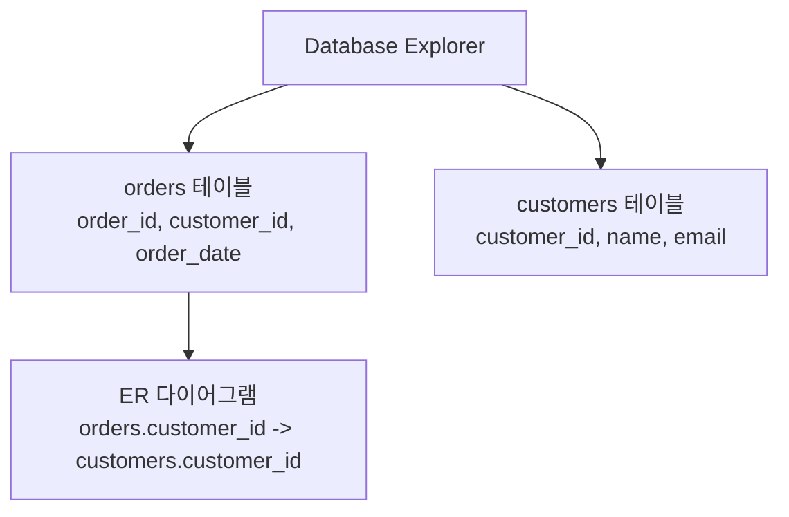
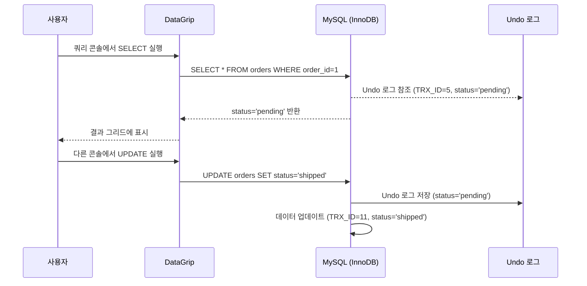

이 문서는 JetBrains의 **DataGrip**에 대한 초보자 친화적인 설명을 제공하며, MySQL의 MVCC 학습 맥락에서 데이터베이스 관리 도구로서의 DataGrip의 역할과 기능을 강조합니다. 다이어그램과 비유를 포함하여 DataGrip의 주요 기능, 이커머스 도메인에서의 활용, 그리고 MySQL MVCC와의 연관성을 직관적으로 설명합니다.

---

## 📌 목적
- DataGrip이 무엇인지, 어떤 기능을 제공하는지 이해.
- MySQL의 MVCC(Multi-Version Concurrency Control)와 같은 데이터베이스 개념을 관리하는 데 DataGrip이 어떻게 활용되는지 학습.
- 다이어그램을 통해 DataGrip의 인터페이스와 워크플로우 시각화.
- 이커머스 도메인에서의 실제 사용 사례와 실습 가이드 제공.

---

## ✅ 1. DataGrip이란?

### 1.1 정의
- **DataGrip**은 JetBrains에서 개발한 **데이터베이스 전용 IDE(Integrated Development Environment)**로, SQL 개발자와 데이터베이스 관리자(DBA)를 위해 설계되었습니다.
- MySQL, PostgreSQL, Oracle, Microsoft SQL Server 등 다양한 데이터베이스 관리 시스템(DBMS)을 지원하며, JDBC 드라이버가 있는 모든 DBMS에 연결 가능.
- **비유**: 도서관 사서가 책(데이터)을 효율적으로 찾고 관리하도록 돕는 디지털 도구. 복잡한 데이터베이스 작업을 간소화하고 생산성을 높이는 데 초점.
- **주요 목적**: SQL 쿼리 작성, 데이터베이스 스키마 탐색, 데이터 시각화, 버전 관리 통합을 통해 데이터베이스 관리와 분석을 간소화.

### 1.2 주요 특징
- **다중 DBMS 지원**: MySQL, PostgreSQL, Oracle, SQL Server, SQLite 등 다양한 데이터베이스와 호환.
- **지능형 SQL 편집기**: 문맥에 맞는 코드 자동 완성, 구문 강조, 오류 탐지 및 수정 제안.
- **스키마 탐색**: 데이터베이스 구조(테이블, 뷰, 프로시저 등)를 트리 형태로 시각화.
- **데이터 시각화**: 쿼리 결과를 차트(막대그래프, 파이차트 등)로 시각화.
- **버전 관리 통합**: Git, SVN, Mercurial 등과 연동하여 SQL 스크립트 관리.
- **쿼리 콘솔**: 여러 쿼리 실행 모드(읽기 전용, 수동 트랜잭션 등)와 쿼리 기록 저장.

---

## ✅ 2. DataGrip의 주요 기능

### 2.1 지능형 SQL 편집기
- **코드 자동 완성**: 테이블 구조, 외래 키, 데이터베이스 객체를 분석해 관련 코드 제안.
- **오류 탐지 및 수정**: 쿼리 작성 중 잠재적 버그(예: 잘못된 객체 참조)를 실시간으로 감지하고 수정 제안.
- **리팩토링**: 테이블, 컬럼, 뷰 등의 이름을 변경하면 관련 SQL 코드와 데이터베이스 참조를 자동 업데이트.
- **예시**:
  ```sql
  SELECT * FROM orders WHERE order_id = 100;
  ```
  - DataGrip은 `orders` 테이블의 컬럼(`order_id`, `customer_id` 등)을 자동 제안.

### 2.2 스키마 탐색
- 데이터베이스 구조를 트리 형태로 표시, 테이블/뷰/프로시저로 빠르게 이동.
- ER 다이어그램으로 테이블 간 관계 시각화.
- **다이어그램**:



- **설명**: `orders`와 `customers` 테이블 간 외래 키 관계를 시각화하여 스키마 이해를 돕는다.

### 2.3 쿼리 콘솔
- 여러 쿼리 실행 모드 지원(예: 읽기 전용, 결과 편집기 내 표시).
- 쿼리 실행 기록을 로컬 히스토리에 저장, 작업 손실 방지.
- **예시**:
  ```sql
  UPDATE orders SET status = 'shipped' WHERE order_id = 1;
  ```
  - 쿼리 실행 후 결과를 그리드 형태로 확인, 데이터 수정 가능.

### 2.4 데이터 시각화
- 쿼리 결과를 차트(막대그래프, 파이차트 등)로 변환.
- **예시**: 주문 상태별 통계.
  ```sql
  SELECT status, COUNT(*) FROM orders GROUP BY status;
  ```
  - DataGrip에서 결과를 파이차트로 시각화.

### 2.5 데이터 입출력
- CSV, JSON, Excel 등 다양한 형식으로 데이터 내보내기/가져오기.
- 테이블 간 데이터 비교 및 동기화.

---

## ✅ 3. MySQL MVCC와 DataGrip의 연관성

MySQL의 **MVCC(Multi-Version Concurrency Control)**는 동시성 제어를 위해 데이터의 여러 버전을 관리하며, DataGrip은 이를 효과적으로 활용하는 도구입니다.

### 3.1 MVCC와의 연계
- **스냅샷 조회**: DataGrip의 쿼리 콘솔은 `REPEATABLE READ` 격리 수준에서 MVCC 기반 스냅샷을 활용해 일관된 데이터 조회 가능.
- **트랜잭션 관리**: 수동 트랜잭션 모드로 MVCC 동작 테스트 가능.
  ```sql
  START TRANSACTION;
  SELECT * FROM orders WHERE order_id=1; -- status='pending'
  -- 다른 트랜잭션에서 status='shipped'로 업데이트
  SELECT * FROM orders WHERE order_id=1; -- 여전히 'pending' 반환
  COMMIT;
  ```
- **Undo 로그 확인**: DataGrip의 스키마 탐색으로 Undo 로그 관련 메타데이터 확인 가능.
- **쿼리 프로파일링**: MVCC로 인한 성능 병목(예: Undo 로그 증가)을 분석.

### 3.2 다이어그램: MVCC와 DataGrip 워크플로우



- **설명**: DataGrip은 MVCC의 스냅샷을 활용해 트랜잭션 간 데이터 일관성을 유지하며, 쿼리 콘솔로 이를 시각화.

---

## ✅ 4. 이커머스 도메인에서의 DataGrip 활용

### 4.1 활용 사례
- **주문 관리**:
  - 쿼리: `SELECT * FROM orders WHERE customer_id=100;`
  - DataGrip의 자동 완성으로 `customer_id`와 관련 테이블 제안.
  - ER 다이어그램으로 `orders`와 `customers` 간 관계 확인.
- **재고 동시성 제어**:
  - MVCC를 활용해 여러 트랜잭션에서 재고 데이터 조회/업데이트.
  - DataGrip의 쿼리 프로파일링으로 성능 최적화.
- **데이터 분석**:
  - 쿼리: `SELECT status, COUNT(*) FROM orders GROUP BY status;`
  - 결과를 파이차트로 시각화해 주문 상태 분포 분석.
- **스키마 변경**:
  - 리팩토링 기능으로 컬럼 이름 변경(예: `created_at` → `creation_date`).
  ```sql
  ALTER TABLE orders RENAME COLUMN created_at TO creation_date;
  ```

### 4.2 스키마 예시
```sql
CREATE TABLE orders (
    order_id BIGINT PRIMARY KEY AUTO_INCREMENT,
    customer_id BIGINT NOT NULL,
    order_date DATETIME NOT NULL,
    status VARCHAR(20) NOT NULL,
    INDEX idx_customer_date (customer_id, order_date)
);
```
- DataGrip에서 스키마 생성/수정, 외래 키 관계 시각화 가능.

---

## ✅ 5. DataGrip의 장단점

### 5.1 장점
- **다중 데이터베이스 지원**: MySQL, PostgreSQL 등 다양한 DBMS와 원활한 통합.[](https://greymatter.com/vendors/jetbrains/datagrip/)
- **지능형 코드 지원**: 문맥 기반 자동 완성, 오류 탐지로 SQL 작성 효율성 증대.[](https://medium.com/%40AlexanderObregon/mastering-jetbrains-datagrip-an-overview-and-guide-9d6c54cb8736)
- **사용자 친화적 UI**: 직관적인 스키마 탐색과 데이터 시각화.
- **버전 관리 통합**: Git 등과 연동해 SQL 스크립트 관리 용이.[](https://www.jetbrains.com/help/datagrip/faq-about-datagrip.html)
- **MVCC 활용**: MySQL의 MVCC 기반 트랜잭션 테스트에 최적.

### 5.2 단점
- **유료 라이선스**: 연간 구독 비용(약 $224.42부터)이 부담스러울 수 있음.[](https://www.componentsource.com/product/datagrip)
- **학습 곡선**: 초보자는 풍부한 기능으로 인해 적응에 시간 필요.[](https://pangea.ai/resources/datagrip-all-you-need-to-know)
- **관리 기능 제한**: Microsoft SQL Server Management Studio 같은 전용 관리 도구에 비해 관리 기능이 약함.[](https://www.reddit.com/r/Jetbrains/comments/d50gim/whats_the_point_of_datagrip/)
- **리소스 사용**: 대규모 데이터베이스 작업 시 메모리 소모 큼.[](https://www.g2.com/products/datagrip/reviews)

---

## ✅ 6. 학습 가이드

### 6.1 학습 목표
- DataGrip의 주요 기능(쿼리 콘솔, 스키마 탐색, 데이터 시각화) 이해.
- MySQL MVCC와 연계된 트랜잭션 관리 실습.
- 이커머스 도메인에서 DataGrip으로 데이터베이스 작업 최적화.

### 6.2 학습 단계
1. **기본 개념**:
   - JetBrains 공식 문서([DataGrip Documentation](https://www.jetbrains.com/datagrip/documentation/))로 기능 학습.[](https://www.jetbrains.com/help/datagrip/quick-start-with-datagrip.html)
   - [DataGrip Overview Video](https://www.jetbrains.com/datagrip/)로 인터페이스 이해.[](https://greymatter.com/vendors/jetbrains/datagrip/)
2. **실습**:
   - DataGrip 설치 및 MySQL 데이터베이스 연결.
   - `orders` 테이블 생성, MVCC 테스트 쿼리 실행:
     ```sql
     START TRANSACTION;
     SELECT * FROM orders WHERE order_id=1;
     -- 다른 콘솔에서 UPDATE 실행
     SELECT * FROM orders WHERE order_id=1;
     COMMIT;
     ```
   - 쿼리 결과를 파이차트로 시각화.
3. **적용**:
   - 이커머스 프로젝트에서 DataGrip으로 스키마 설계 및 쿼리 최적화.
   - `EXPLAIN ANALYZE`로 MVCC 관련 쿼리 성능 분석.

### 6.3 추천 자료
- **공식 문서**: [DataGrip Documentation](https://www.jetbrains.com/datagrip/documentation/)[](https://www.jetbrains.com/help/datagrip/quick-start-with-datagrip.html)
- **블로그**: [DataGrip: Mastering the Database IDE](https://medium.com/@codesolutionstuff/understanding-datagrip-2c7f0b2f6b6e)[](https://medium.com/%40AlexanderObregon/mastering-jetbrains-datagrip-an-overview-and-guide-9d6c54cb8736)
- **도서**: *High Performance MySQL* (O’Reilly)에서 MySQL과 IDE 활용 학습.

---

## 🔚 요약
- **DataGrip**: SQL 개발자와 DBA를 위한 다중 DBMS 지원 IDE.
- **주요 기능**: 지능형 SQL 편집, 스키마 탐색, 데이터 시각화, 버전 관리 통합.
- **MVCC 연계**: MySQL의 MVCC 기반 트랜잭션 관리와 스냅샷 조회 지원.
- **이커머스 활용**: 주문/재고 관리, 데이터 분석, 스키마 변경에 최적.
- **학습 팁**: 다이어그램과 실습으로 DataGrip 워크플로우 체화.