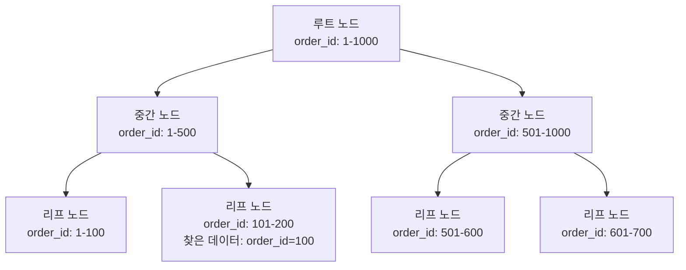

이 문서는 MySQL의 클러스터링 인덱스의 동작 방식과 구조를 초보자가 이해할 수 있도록 상세히 설명하며, 코치가 강조한 "클러스터링 인덱스의 동작 방식과 구조를 반드시 알아야 한다"는 점을 반영하여 다이어그램과 함께 직관적으로 다룹니다. 기존 문서의 내용을 기반으로 하되, 클러스터링 인덱스의 내부 구조, 동작 원리, 이커머스 도메인에서의 활용을 심화하여 설명합니다.

---

## 📌 목적
- MySQL의 클러스터링 인덱스의 동작 방식과 내부 구조를 명확히 이해.
- 다이어그램을 통해 데이터 저장, 조회, 삽입 과정을 시각적으로 설명.
- 이커머스 도메인에서 `Long` 타입 Primary Key(PK)와 클러스터링 인덱스의 중요성을 연결.
- 비유와 예제를 활용해 초보자도 쉽게 개념을 체화하도록 지원.

---

## ✅ 1. 클러스터링 인덱스란?

### 1.1 정의
- **클러스터링 인덱스**는 MySQL의 **InnoDB** 엔진에서 테이블의 데이터를 **Primary Key(PK)** 순으로 **물리적으로 정렬**하여 디스크에 저장하는 인덱스입니다.
- 테이블 자체가 클러스터링 인덱스의 구조로 저장되며, 데이터 행(row)은 PK 값에 따라 정렬된 상태로 디스크에 기록됩니다.
- **비유**: 도서관 책꽂이에 책이 번호 순으로 정렬되어 있는 것. 특정 책(PK)을 찾을 때 바로 뽑아낼 수 있음.
- **예**: 이커머스 `orders` 테이블에서 `order_id`가 PK라면, 데이터는 `order_id` 1, 2, 3, ... 순으로 디스크에 저장.

### 1.2 클러스터링 인덱스의 특징
- **단일 인덱스**: 테이블당 하나의 클러스터링 인덱스만 존재. PK가 기본적으로 클러스터링 인덱스로 사용됨.
- **물리적 정렬**: 데이터가 디스크에 PK 순으로 저장되어, PK 기반 조회가 매우 빠름.
- **PK 필수**: PK가 없으면 첫 번째 `UNIQUE NOT NULL` 키가 사용되거나, 내부적으로 `GEN_CLUST_INDEX`라는 숨겨진 인덱스가 생성됨.

---

## ✅ 2. 클러스터링 인덱스의 구조

### 2.1 B+ 트리 기반 구조
- MySQL InnoDB는 클러스터링 인덱스를 **B+ 트리** 자료구조로 관리합니다.
- **B+ 트리 특징**:
  - **노드**: 데이터를 저장하는 단위. 리프 노드(Leaf Node)와 비리프 노드(Non-Leaf Node)로 나뉨.
  - **리프 노드**: 실제 데이터 행(전체 row)을 포함하며, PK 값으로 정렬됨.
  - **비리프 노드**: 리프 노드로 이동하기 위한 포인터와 PK 값의 범위를 저장.
  - **균형 트리**: 삽입/삭제 시 트리 높이가 균형을 유지해 검색 효율성을 보장.
- **비유**: 도서관의 책꽂이 목록. 상위 목록(비리프 노드)이 책 번호 범위를 안내하고, 하위 목록(리프 노드)에 실제 책(데이터)이 정렬되어 있음.

### 2.2 다이어그램: 클러스터링 인덱스 구조

```mermaid
graph TD
    A[루트 노드<br>order_id 범위: 1-1000] --> B[중간 노드<br>order_id: 1-500]
    A --> C[중간 노드<br>order_id: 501-1000]
    B --> D[리프 노드<br>order_id: 1-100<br>데이터: {order_id, customer_id, order_date, ...}]
    B --> E[리프 노드<br>order_id: 101-200<br>데이터: {order_id, customer_id, order_date, ...}]
    C --> F[리프 노드<br>order_id: 501-600<br>데이터: {order_id, customer_id, order_date, ...}]
    C --> G[리프 노드<br>order_id: 601-700<br>데이터: {order_id, customer_id, order_date, ...}]
```

- **설명**:
  - **루트 노드**: 최상위 노드로, PK 범위를 안내(예: `order_id` 1-1000).
  - **중간 노드**: 하위 노드로 이동하기 위한 PK 범위 포인터(예: 1-500, 501-1000).
  - **리프 노드**: 실제 데이터 행(예: `order_id`, `customer_id`, `order_date` 등)을 PK 순으로 저장.
  - 데이터는 디스크 페이지 단위로 저장되며, 각 페이지는 여러 행을 포함.

---

## ✅ 3. 클러스터링 인덱스의 동작 방식

### 3.1 데이터 저장
- **과정**:
  1. 새로운 데이터 삽입 시, PK 값(`order_id`)을 기준으로 B+ 트리의 적절한 리프 노드를 찾음.
  2. 리프 노드의 디스크 페이지에 데이터를 삽입.
  3. PK가 단조 증가(`AUTO_INCREMENT`)라면, 페이지 끝에 추가되어 페이지 분할(Page Split) 최소화.
- **비유**: 도서관 책꽂이에 새 책을 번호 순으로 꽂는 것. 번호가 순차적이면 맨 끝에 추가, 무작위면 중간에 끼워넣기.
- **예**:
  ```sql
  INSERT INTO orders (order_id, customer_id, order_date) VALUES (1, 100, '2025-07-30');
  ```
  - `order_id=1`은 B+ 트리 리프 노드에 저장, 디스크 페이지에 정렬된 상태로 기록.

### 3.2 데이터 조회
- **과정**:
  1. 쿼리(예: `SELECT * FROM orders WHERE order_id = 100`)를 실행.
  2. B+ 트리의 루트 노드부터 PK 값(100)을 따라 리프 노드까지 탐색.
  3. 리프 노드에서 해당 데이터 행을 바로 읽음(추가 디스크 I/O 없음).
- **비유**: 도서관 책꽂이에서 책 번호 100을 바로 찾아 뽑는 것.
- **다이어그램**:



- **설명**: `order_id=100` 조회 시 루트 → 중간 노드(1-500) → 리프 노드(101-200)로 이동해 데이터를 바로 읽음.

### 3.3 데이터 삽입
- **단조 증가 PK**:
  - `AUTO_INCREMENT`로 생성된 `Long` PK는 순차적으로 증가(예: 1, 2, 3, ...).
  - 새 데이터는 B+ 트리 리프 노드의 마지막 페이지에 추가되어 페이지 분할 최소화.
- **무작위 PK (예: UUID)**:
  - 무작위 값은 B+ 트리 중간에 삽입되어 페이지 분할/재정렬 발생, 성능 저하.
- **비유**: 순차적 책 번호는 책꽂이 끝에 추가, 무작위 번호는 중간에 끼워넣어 책을 재정렬.
- **예**:
  ```sql
  INSERT INTO orders (order_id, customer_id, order_date) VALUES (2, 101, '2025-07-30');
  ```
  - `order_id=2`는 리프 노드 끝에 추가, 디스크 I/O 최소화.

### 3.4 데이터 업데이트/삭제
- **업데이트**:
  - PK는 변경 불가. 다른 컬럼 업데이트 시 해당 리프 노드의 데이터를 수정.
  - B+ 트리 구조는 유지되며, 페이지 분할/병합 가능성 낮음.
- **삭제**:
  - 데이터 삭제 시 B+ 트리에서 해당 행 제거, 프래그먼테이션(Fragmentation) 발생 가능.
  - 주기적으로 `OPTIMIZE TABLE` 실행하여 프래그먼테이션 정리.

---

## ✅ 4. 클러스터링 인덱스와 비클러스터링 인덱스 비교

### 4.1 비클러스터링 인덱스 (Secondary Index)
- **구조**: B+ 트리로 관리되지만, 리프 노드는 실제 데이터가 아닌 **PK 값**과 해당 컬럼(예: `customer_id`)을 저장.
- **조회 과정**:
  1. 비클러스터링 인덱스에서 조건(예: `customer_id=100`)으로 PK 값을 찾음.
  2. PK 값을 사용해 클러스터링 인덱스에서 실제 데이터를 조회(추가 I/O 발생).
- **다이어그램**:

```mermaid
graph TD
    A[비클러스터링 인덱스<br>customer_id 인덱스] --> B[리프 노드<br>customer_id=100, PK=1]
    B --> C[클러스터링 인덱스<br>order_id=1<br>데이터: {order_id=1, customer_id=100, order_date, ...}]
```

- **설명**: `WHERE customer_id=100` 쿼리 시 비클러스터링 인덱스에서 `order_id=1`을 찾고, 클러스터링 인덱스에서 데이터를 읽음.

### 4.2 차이점
| **항목**              | **클러스터링 인덱스**                     | **비클러스터링 인덱스**                  |
|-----------------------|-------------------------------------------|-----------------------------------------|
| **데이터 저장**       | 실제 데이터 행을 PK 순으로 저장           | PK와 인덱스 컬럼만 저장                 |
| **조회 속도**         | 빠름 (직접 데이터 접근)                  | 느림 (PK 조회 후 클러스터링 인덱스 탐색) |
| **디스크 I/O**        | 최소 (1번 탐색)                          | 추가 I/O 필요 (2번 탐색)                |
| **테이블당 개수**     | 1개 (PK 기반)                            | 여러 개 가능                            |
| **삽입/업데이트 비용** | 높음 (물리적 정렬 유지)                  | 낮음 (인덱스만 수정)                    |

---

## ✅ 5. `Long` 타입 PK와 클러스터링 인덱스

### 5.1 `Long` 타입(`BIGINT`) 사용 이유
이커머스에서 `Long` 타입 PK를 사용하는 이유는 클러스터링 인덱스의 동작 방식과 밀접하게 연관됩니다:
- **빠른 비교 연산**: `Long`(8바이트 정수)은 문자열(`VARCHAR`, `UUID`)보다 비교 연산이 빠름.
- **단조 증가 삽입**: `AUTO_INCREMENT`로 순차적 PK 생성(예: 1, 2, 3, ...), 페이지 분할 최소화.
- **캐시 효율성**: 정렬된 데이터는 메모리 캐시에 더 많은 데이터를 저장 가능.
- **저장 효율성**: 8바이트로 고정, `VARCHAR`(가변 크기)나 `UUID`(16~36바이트)보다 작음.
- **확장성**: `BIGINT`는 약 92경(2^63-1)까지 지원, 대규모 데이터 처리에 적합.

### 5.2 대안 비교
| **항목**          | **Long (BIGINT)**                     | **VARCHAR**                          | **UUID**                             |
|-------------------|---------------------------------------|--------------------------------------|--------------------------------------|
| **크기**         | 8바이트                              | 가변(예: 50바이트)                  | 16~36바이트                         |
| **비교 연산**    | 빠름 (정수)                         | 느림 (문자열, 인코딩/콜레이션)     | 느림 (문자열/바이너리)             |
| **삽입 성능**    | 단조 증가로 페이지 분할 적음        | 값에 따라 페이지 분할 가능          | 무작위 값으로 페이지 분할 빈발     |
| **인덱스 크기**  | 작음 (8바이트)                      | 큼 (가변 크기)                      | 큼 (16~36바이트)                   |
| **범위 쿼리**    | 효율적                              | 비효율적                           | 비효율적                           |

---

## ✅ 6. 이커머스 도메인에서의 활용

### 6.1 스키마 예시
```sql
CREATE TABLE orders (
    order_id BIGINT PRIMARY KEY AUTO_INCREMENT,
    customer_id BIGINT NOT NULL,
    order_date DATETIME NOT NULL,
    total_amount DECIMAL(10, 2),
    INDEX idx_customer_date (customer_id, order_date)
);
```
- `order_id`: 클러스터링 인덱스로, 데이터는 `order_id` 순으로 물리적 정렬.
- `idx_customer_date`: 비클러스터링 인덱스로, 고객별 주문 조회 최적화.

### 6.2 동작 예시
- **조회**:
  ```sql
  SELECT * FROM orders WHERE order_id = 100;
  ```
  - 클러스터링 인덱스를 통해 `order_id=100` 데이터 직접 접근.
- **범위 쿼리**:
  ```sql
  SELECT * FROM orders WHERE order_id BETWEEN 100 AND 200;
  ```
  - 정렬된 데이터로 범위 조회 빠름.
- **비클러스터링 인덱스 조회**:
  ```sql
  SELECT * FROM orders WHERE customer_id = 100;
  ```
  - `idx_customer_date`에서 `order_id`를 찾고, 클러스터링 인덱스에서 데이터 조회.

### 6.3 다이어그램: 이커머스 조회 과정

```mermaid
graph TD
    A[쿼리: SELECT * FROM orders WHERE order_id=100] --> B[B+ 트리 루트 노드<br>order_id: 1-1000]
    B --> C[중간 노드<br>order_id: 1-500]
    C --> D[리프 노드<br>order_id: 101-200<br>데이터: {order_id=100, customer_id=100, order_date, ...}]
```

- **설명**: `order_id=100` 조회 시 B+ 트리를 따라 리프 노드로 이동, 데이터 직접 읽음.

---

## ✅ 7. 장단점

### 7.1 장점
- **빠른 조회**: PK 기반 조회 및 범위 쿼리가 빠름(예: `WHERE order_id = ?`).
- **데이터 무결성**: PK의 고유성과 `NOT NULL` 제약으로 중복 방지.
- **캐시 효율**: 정렬된 데이터로 메모리 캐시 활용 극대화.
- **삽입 효율**: `Long` PK의 단조 증가로 페이지 분할 최소화.

### 7.2 단점
- **삽입/업데이트 비용**: 무작위 PK(예: UUID)는 페이지 분할로 성능 저하.
- **단일 인덱스**: 테이블당 하나의 클러스터링 인덱스만 가능.
- **프래그먼테이션**: 빈번한 삽입/삭제로 데이터 분산, `OPTIMIZE TABLE` 필요.

---

## ✅ 8. 학습 가이드

### 8.1 학습 목표
- 클러스터링 인덱스의 B+ 트리 구조와 동작 방식 이해.
- `Long` PK가 이커머스에서 성능과 확장성에 미치는 영향 학습.
- 물리적/비물리적 정렬의 차이와 조회/삽입 과정 체화.

### 8.2 학습 단계
1. **기본 개념**:
   - MySQL 공식 문서([InnoDB Index Types](https://dev.mysql.com/doc/refman/8.4/en/innodb-index-types.html))로 B+ 트리 학습.
   - [MySQL Tutorial: Clustered Index](https://www.mysqltutorial.org/mysql-index/mysql-clustered-index/)로 예제 확인.
2. **실습**:
   - `orders` 테이블 생성, `BIGINT AUTO_INCREMENT` PK로 데이터 삽입/조회.
   - `EXPLAIN` 명령어로 쿼리 실행 계획 분석(클러스터링 인덱스 활용 확인).
   - 무작위 PK(UUID)와 단조 증가 PK 삽입 성능 비교 실험.
3. **적용**:
   - 이커머스 프로젝트에서 PK와 인덱스 설계 최적화.
   - `OPTIMIZE TABLE`로 프래그먼테이션 관리 실습.

### 8.3 추천 자료
- MySQL 공식 문서: [InnoDB Index Types](https://dev.mysql.com/doc/refman/8.4/en/innodb-index-types.html).
- 블로그: [Understanding MySQL Clustered Index](https://medium.com/@codesolutionstuff/understanding-mysql-clustered-index-with-practical-examples-2c7f0b2f6b6e).
- 도서: *High Performance MySQL* (O’Reilly).

---

## 🔚 요약
- **클러스터링 인덱스**: PK 순으로 데이터를 물리적으로 정렬, B+ 트리로 관리.
- **동작 방식**: 데이터 저장/조회/삽입 시 B+ 트리를 따라 효율적으로 처리.
- **구조**: 루트, 중간, 리프 노드로 구성, 리프 노드에 실제 데이터 저장.
- **이커머스 활용**: `Long` PK로 빠른 조회, 삽입 효율, 대규모 데이터 처리 최적화.
- **학습 팁**: 다이어그램과 실습으로 B+ 트리 동작 체화.