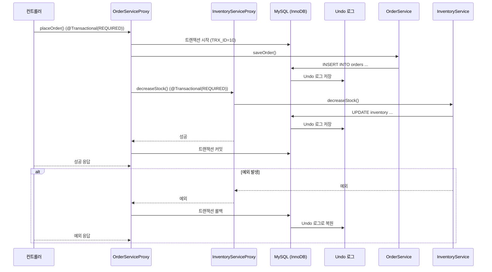

이 문서는 MySQL의 트랜잭션 전파 속성(Transaction Propagation)에 대한 초보자 친화적인 학습 자료로, 스프링 프레임워크의 `@Transactional` 어노테이션과 MySQL의 MVCC(Multi-Version Concurrency Control) 및 격리 수준(Isolation Level)과의 연관성을 중심으로 상세히 설명합니다. 이전에 작성된 [격리 수준 관련 자료](#)를 참고하여, 전파 속성의 동작 방식과 이커머스 도메인에서의 활용을 다이어그램과 비유를 통해 직관적으로 다룹니다.

---

## 📌 목적
- MySQL 트랜잭션 전파 속성의 개념과 동작 방식을 이해.
- 스프링 `@Transactional`에서 제공하는 전파 속성(Propagation)과 MySQL MVCC 및 격리 수준과의 상호작용 학습.
- 다이어그램을 통해 전파 속성의 워크플로우와 트랜잭션 관리 과정 시각화.
- 이커머스 도메인에서 전파 속성을 활용한 트랜잭션 설계 방법 탐구.
- 실습과 비유를 통해 초보자가 개념을 쉽게 체화하도록 지원.

---

## ✅ 1. 트랜잭션 전파 속성이란?

### 1.1 정의
- **트랜잭션 전파 속성(Transaction Propagation)**은 스프링 프레임워크에서 `@Transactional` 어노테이션을 사용할 때, 호출된 메서드가 기존 트랜잭션에 어떻게 참여하거나 새로운 트랜잭션을 생성할지를 정의하는 속성입니다.
- MySQL의 트랜잭션 자체는 전파 속성을 직접 다루지 않지만, 스프링의 `@Transactional`이 MySQL의 트랜잭션 관리와 결합되어 전파 속성을 구현합니다.
- **비유**: 요리사가 여러 요리(메서드)를 준비할 때, 주방(트랜잭션)을 공유할지, 새 주방을 사용할지, 또는 주방 없이 요리할지를 결정하는 규칙.
- **스프링의 맥락**: `@Transactional`은 AOP와 프록시 패턴을 통해 트랜잭션 전파 속성을 적용, MySQL의 MVCC와 격리 수준을 활용해 데이터 정합성 보장.

### 1.2 전파 속성의 필요성
- **문제**: 한 메서드가 다른 메서드를 호출할 때, 각 메서드가 트랜잭션을 어떻게 처리해야 할지 불분명.
  - 예: 주문 생성 메서드가 재고 감소 메서드를 호출할 때, 두 메서드가 동일한 트랜잭션을 공유해야 할까?
- **해결**: 전파 속성은 트랜잭션의 참여/생성 규칙을 정의해 일관된 데이터 관리 보장.

---

## ✅ 2. 스프링의 트랜잭션 전파 속성 종류

스프링은 `@Transactional(propagation = ...)`을 통해 7가지 전파 속성을 제공합니다. 각 속성은 MySQL 트랜잭션과 어떻게 상호작용하는지 아래에서 상세히 설명합니다.

### 2.1 전파 속성 목록
1. **REQUIRED** (기본값)
2. **SUPPORTS**
3. **MANDATORY**
4. **REQUIRES_NEW**
5. **NOT_SUPPORTED**
6. **NEVER**
7. **NESTED**

### 2.2 상세 설명

#### 2.2.1 REQUIRED
- **설명**: 기존 트랜잭션이 있으면 참여, 없으면 새 트랜잭션 생성.
- **MySQL 동작**: 단일 트랜잭션에서 MVCC의 스냅샷 사용, 동일한 `Connection` 공유.
- **비유**: 주방이 있으면 그 주방에서 요리, 없으면 새 주방 열기.
- **예시**:
  ```java
  @Transactional(propagation = Propagation.REQUIRED)
  public void placeOrder(Order order) {
      orderRepository.save(order);
      inventoryService.decreaseStock(order.getProductId());
  }
  ```
  - `placeOrder()`와 `decreaseStock()`이 동일 트랜잭션 공유, 실패 시 모두 롤백.

#### 2.2.2 SUPPORTS
- **설명**: 기존 트랜잭션이 있으면 참여, 없으면 트랜잭션 없이 실행.
- **MySQL 동작**: 트랜잭션이 없으면 `autocommit=true`로 단일 쿼리 실행, MVCC 미사용.
- **비유**: 주방이 있으면 사용, 없으면 간이 테이블에서 요리.
- **예시**:
  ```java
  @Transactional(propagation = Propagation.SUPPORTS)
  public void getOrderStatus(Long orderId) {
      return orderRepository.findStatusById(orderId);
  }
  ```
  - 읽기 전용 작업에 적합, 트랜잭션이 필요 없는 경우 유연.

#### 2.2.3 MANDATORY
- **설명**: 기존 트랜잭션이 있어야 참여, 없으면 예외(`IllegalTransactionStateException`) 발생.
- **MySQL 동작**: 기존 트랜잭션의 `Connection`과 MVCC 스냅샷 사용.
- **비유**: 주방이 없으면 요리 불가, 반드시 기존 주방 필요.
- **예시**:
  ```java
  @Transactional(propagation = Propagation.MANDATORY)
  public void updateOrderStatus(Long orderId, String status) {
      orderRepository.updateStatus(orderId, status);
  }
  ```
  - 주문 상태 변경은 반드시 상위 트랜잭션 내에서 실행.

#### 2.2.4 REQUIRES_NEW
- **설명**: 항상 새 트랜잭션 생성, 기존 트랜잭션이 있으면 일시 중단(Suspend).
- **MySQL 동작**: 새 `Connection` 생성, 별도의 MVCC 스냅샷 사용.
- **비유**: 기존 주방 무시하고 새 주방 열기.
- **예시**:
  ```java
  @Transactional(propagation = Propagation.REQUIRES_NEW)
  public void logOrderHistory(Long orderId, String action) {
      historyRepository.save(orderId, action);
  }
  ```
  - 주문 이력 로깅은 별도 트랜잭션으로, 상위 트랜잭션 실패와 무관.

#### 2.2.5 NOT_SUPPORTED
- **설명**: 기존 트랜잭션이 있으면 중단, 트랜잭션 없이 실행.
- **MySQL 동작**: `autocommit=true`로 쿼리 실행, MVCC 미사용.
- **비유**: 주방이 있어도 사용하지 않고 간이 테이블에서 요리.
- **예시**:
  ```java
  @Transactional(propagation = Propagation.NOT_SUPPORTED)
  public void generateReport() {
      // 보고서 생성 로직
  }
  ```
  - 트랜잭션이 필요 없는 보고서 생성에 적합.

#### 2.2.6 NEVER
- **설명**: 트랜잭션이 있으면 예외 발생, 반드시 트랜잭션 없이 실행.
- **MySQL 동작**: `autocommit=true`로 실행, MVCC 미사용.
- **비유**: 주방이 있으면 요리 불가, 반드시 간이 테이블.
- **예시**:
  ```java
  @Transactional(propagation = Propagation.NEVER)
  public void readConfig() {
      // 설정 읽기
  }
  ```
  - 트랜잭션이 필요 없는 설정 조회에 사용.

#### 2.2.7 NESTED
- **설명**: 기존 트랜잭션이 있으면 중첩 트랜잭션(Savepoint) 생성, 없으면 새 트랜잭션 생성.
- **MySQL 동작**: MySQL의 `SAVEPOINT`를 사용, 중첩 트랜잭션 롤백 가능.
- **비유**: 주방 내 별도의 작업대에서 요리, 실패 시 작업대만 정리.
- **예시**:
  ```java
  @Transactional(propagation = Propagation.NESTED)
  public void updateStockWithLog(Long productId) {
      inventoryRepository.decreaseStock(productId);
      logService.logAction("Stock updated");
  }
  ```
  - 재고 업데이트 실패 시 로그는 유지, 재고만 롤백.

---

## ✅ 3. 전파 속성과 MySQL MVCC의 연관성

### 3.1 MVCC와 전파 속성
- **MVCC(Multi-Version Concurrency Control)**: MySQL InnoDB에서 트랜잭션의 데이터 버전을 관리하여 동시성 보장.
- **전파 속성의 역할**:
  - `REQUIRED`, `MANDATORY`, `NESTED`: 동일 트랜잭션 내에서 MVCC의 단일 스냅샷 사용.
  - `REQUIRES_NEW`: 새 트랜잭션으로 별도 MVCC 스냅샷 생성.
  - `SUPPORTS`, `NOT_SUPPORTED`, `NEVER`: 트랜잭션 없으면 MVCC 미사용, `autocommit=true`.
- **격리 수준과의 상호작용**: 전파 속성은 격리 수준(예: `REPEATABLE READ`)에 따라 MVCC의 스냅샷 동작 결정.

### 3.2 다이어그램: 전파 속성과 MVCC 워크플로우



- **설명**:
  - `placeOrder()`와 `decreaseStock()`이 `REQUIRED`로 동일 트랜잭션 공유.
  - MVCC가 단일 스냅샷과 Undo 로그로 데이터 정합성 보장.
  - 예외 발생 시 전체 트랜잭션 롤백.

---

## ✅ 4. 이커머스 도메인에서의 전파 속성 활용

### 4.1 활용 사례
- **주문 처리 (`REQUIRED`)**:
  - 주문 생성과 재고 감소를 단일 트랜잭션으로 처리.
  - 실패 시 모두 롤백, 데이터 정합성 보장.
- **이력 로깅 (`REQUIRES_NEW`)**:
  - 주문 실패 여부와 관계없이 이력 로깅은 별도 트랜잭션으로 커밋.
- **보고서 생성 (`NOT_SUPPORTED`)**:
  - 트랜잭션이 필요 없는 통계 쿼리 실행.
- **중첩 작업 (`NESTED`)**:
  - 재고 업데이트 실패 시 로그는 유지, 재고만 롤백.

### 4.2 코드 예시
```java
@Service
public class OrderServiceImpl implements OrderService {
    @Autowired
    private OrderRepository orderRepository;
    @Autowired
    private InventoryService inventoryService;
    @Autowired
    private LogService logService;

    @Transactional(propagation = Propagation.REQUIRED)
    public void placeOrder(Order order) {
        orderRepository.save(order);
        inventoryService.decreaseStock(order.getProductId(), order.getQuantity());
        logService.logAction(order.getId(), "Order placed");
    }
}

@Service
public class InventoryServiceImpl implements InventoryService {
    @Autowired
    private InventoryRepository inventoryRepository;

    @Transactional(propagation = Propagation.REQUIRED)
    public void decreaseStock(Long productId, int quantity) {
        inventoryRepository.decreaseStock(productId, quantity);
    }
}

@Service
public class LogServiceImpl implements LogService {
    @Autowired
    private HistoryRepository historyRepository;

    @Transactional(propagation = Propagation.REQUIRES_NEW)
    public void logAction(Long orderId, String action) {
        historyRepository.save(orderId, action);
    }
}
```
- **설명**:
  - `placeOrder()`와 `decreaseStock()`은 `REQUIRED`로 동일 트랜잭션.
  - `logAction()`은 `REQUIRES_NEW`로 별도 트랜잭션, 주문 실패와 무관히 커밋.

### 4.3 다이어그램: 이커머스 주문 처리

```mermaid
graph TD
    A[컨트롤러] --> B[OrderServiceProxy<br>@Transactional(REQUIRED)]
    B --> C[OrderServiceImpl]
    C --> D[OrderRepository.save()]
    C --> E[InventoryServiceProxy<br>@Transactional(REQUIRED)]
    C --> F[LogServiceProxy<br>@Transactional(REQUIRES_NEW)]
    E --> G[InventoryServiceImpl]
    F --> H[LogServiceImpl]
    D --> I[MySQL: INSERT orders]
    G --> J[MySQL: UPDATE inventory]
    H --> K[MySQL: INSERT history]
    I --> L[Undo 로그]
    J --> L
    K --> M[별도 Undo 로그]
```

---

## ✅ 5. 전파 속성과 격리 수준의 상호작용

### 5.1 격리 수준 복습
- **READ UNCOMMITTED**: 커밋되지 않은 데이터 읽기 가능, MVCC 미사용.
- **READ COMMITTED**: 커밋된 데이터만 읽기, 각 조회마다 새 스냅샷.
- **REPEATABLE READ** (InnoDB 기본): 트랜잭션 동안 동일 스냅샷 유지.
- **SERIALIZABLE**: 완전 격리, 락으로 동시성 저하.

### 5.2 전파 속성과의 연계
- **REQUIRED, MANDATORY, NESTED**: 동일 트랜잭션 내에서 격리 수준 유지, MVCC의 단일 스냅샷 사용.
- **REQUIRES_NEW**: 새 트랜잭션에 별도 격리 수준 적용, 새 MVCC 스냅샷 생성.
- **SUPPORTS, NOT_SUPPORTED, NEVER**: 트랜잭션 없으면 격리 수준과 MVCC 미적용.

### 5.3 예시
- **상황**: `placeOrder()` (`REQUIRED`, `REPEATABLE READ`)가 `logAction()` (`REQUIRES_NEW`, `READ COMMITTED`) 호출.
- **동작**:
  - `placeOrder()`: MVCC 스냅샷으로 일관된 데이터 유지.
  - `logAction()`: 새 트랜잭션으로 최신 커밋 데이터 조회.

---

## ✅ 6. 전파 속성의 장단점

### 6.1 장점
- **유연성**: 다양한 트랜잭션 참여 방식으로 복잡한 비즈니스 로직 처리.
- **데이터 정합성**: `REQUIRED`, `NESTED`로 일관성 보장.
- **모듈성**: `REQUIRES_NEW`로 독립적인 트랜잭션 분리.
- **비유**: 주방 관리 규칙으로 요리사들이 효율적으로 협업.

### 6.2 단점
- **복잡성**: 전파 속성 선택이 부적절하면 예기치 않은 동작(예: 롤백 누락).
- **성능 오버헤드**: `REQUIRES_NEW`, `NESTED`는 새 `Connection`이나 Savepoint로 오버헤드 발생.
- **제한**: MySQL의 Savepoint 지원은 제한적, 복잡한 중첩 트랜잭션에 주의 필요.

---

## ✅ 7. 학습 가이드

### 7.1 학습 목표
- 트랜잭션 전파 속성의 종류와 동작 방식 이해.
- 스프링 `@Transactional`과 MySQL MVCC의 상호작용 학습.
- 이커머스에서 전파 속성을 활용한 트랜잭션 설계 실습.

### 7.2 학습 단계
1. **기본 개념**:
   - [Spring Documentation: Transaction Propagation](https://docs.spring.io/spring-framework/docs/current/reference/html/data-access.html#tx-propagation)로 전파 속성 학습.
   - [MySQL InnoDB Transactions](https://dev.mysql.com/doc/refman/8.4/en/innodb-transaction-model.html)로 MVCC 복습.
2. **실습**:
   - 스프링 부트 프로젝트 생성, 다양한 전파 속성 적용:
     ```java
     @Transactional(propagation = Propagation.REQUIRED)
     public void placeOrder(Order order) {
         orderRepository.save(order);
         inventoryService.decreaseStock(order.getProductId());
     }

     @Transactional(propagation = Propagation.REQUIRES_NEW)
     public void logAction(Long orderId, String action) {
         historyRepository.save(orderId, action);
     }
     ```
   - DataGrip으로 MySQL 쿼리 실행, 트랜잭션 동작 확인.
   - 예외 발생 시 롤백/커밋 테스트.
3. **적용**:
   - 이커머스 프로젝트에서 주문/재고/로그 처리에 적절한 전파 속성 적용.
   - `EXPLAIN ANALYZE`로 쿼리 성능 분석.

### 7.3 추천 자료
- **공식 문서**: [Spring Framework: Transaction Management](https://docs.spring.io/spring-framework/docs/current/reference/html/data-access.html#transaction)
- **블로그**: [Understanding Spring Transaction Propagation](https://medium.com/@krishnakumar_/spring-transaction-propagation-8d3b80c1551)
- **도서**: *Spring in Action* (Manning Publications)

---

## 🔚 요약
- **트랜잭션 전파 속성**: 스프링 `@Transactional`에서 트랜잭션 참여/생성 규칙 정의.
- **주요 속성**: `REQUIRED`, `REQUIRES_NEW`, `NESTED` 등으로 다양한 트랜잭션 시나리오 처리.
- **MVCC 연계**: MySQL MVCC와 결합해 데이터 정합성 보장.
- **이커머스 활용**: 주문/재고/로그 관리에서 적절한 전파 속성으로 트랜잭션 최적화.
- **학습 팁**: 다이어그램과 실습으로 전파 속성 동작 체화.