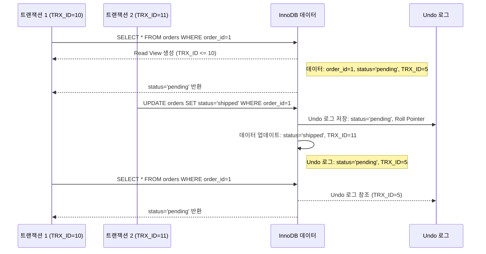
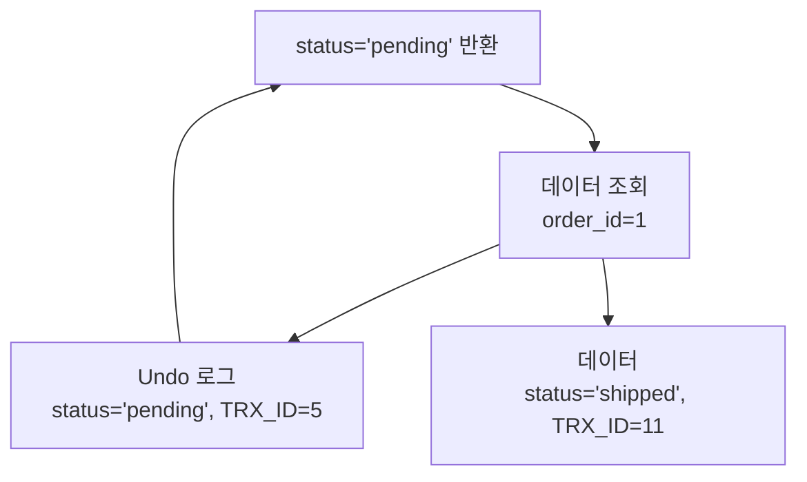
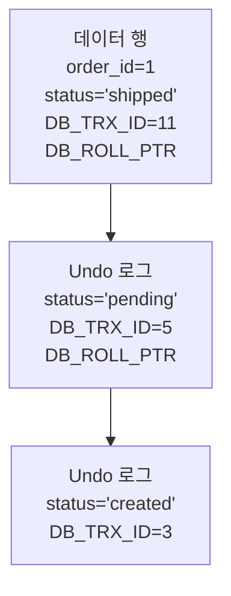

이 문서는 MySQL의 **MVCC (Multi-Version Concurrency Control, 다중 버전 동시성 제어)**를 초보자가 이해할 수 있도록 상세히 설명하며, 다이어그램과 비유를 포함해 동작 방식과 구조를 직관적으로 전달합니다. 이커머스 도메인에서의 활용과 MySQL의 트랜잭션 격리 수준(Isolation Level)과의 관계도 다룹니다. 코치가 강조한 "클러스터링 인덱스의 동작 방식과 구조"를 참고하여, MVCC의 내부 동작과 데이터 정합성 관리에 초점을 맞췄습니다.

---

## 📌 목적
- MySQL의 MVCC의 동작 방식과 내부 구조를 이해.
- 다이어그램을 통해 데이터 읽기/쓰기와 버전 관리 과정을 시각화.
- 이커머스 도메인에서 MVCC가 동시성 문제를 해결하는 방법을 학습.
- 트랜잭션 격리 수준과 MVCC의 상호작용을 명확히 설명.
- 비유와 실습을 통해 개념을 쉽게 체화.

---

## ✅ 1. MVCC란?

### 1.1 정의
- **MVCC (Multi-Version Concurrency Control)**는 MySQL의 **InnoDB** 엔진에서 트랜잭션이 동시에 실행될 때 데이터 정합성을 유지하며 동시성을 높이는 메커니즘입니다.
- 각 트랜잭션은 데이터의 **스냅샷(Snapshot)**을 보고 작업하며, 다른 트랜잭션의 쓰기 작업에 영향을 받지 않도록 설계됩니다.
- **비유**: 도서관에서 책(데이터)을 여러 독자가 동시에 읽거나 수정하려고 할 때, 각 독자에게 책의 복사본(스냅샷)을 제공해 서로 간섭 없이 작업하도록 함.
- **예**: 이커머스에서 고객 A가 주문 상태를 조회하고, 동시에 고객 B가 주문 상태를 변경하더라도, A는 일관된 데이터를 볼 수 있음.

### 1.2 MVCC의 핵심 개념
- **버전 관리**: 데이터의 여러 버전을 유지하여 트랜잭션이 특정 시점의 데이터를 볼 수 있도록 함.
- **스냅샷 격리**: 트랜잭션 시작 시점의 데이터 스냅샷을 기반으로 읽기 작업 수행.
- **Undo 로그**: 데이터 변경 시 이전 버전을 Undo 로그에 저장해 롤백과 스냅샷 제공 가능.
- **트랜잭션 ID**: 각 트랜잭션에 고유 ID를 부여해 데이터 버전 관리.

---

## ✅ 2. MVCC의 동작 방식

### 2.1 주요 구성 요소
- **Undo 로그**:
  - 데이터 변경(INSERT, UPDATE, DELETE) 시 이전 데이터를 Undo 로그에 저장.
  - 트랜잭션 롤백과 MVCC 스냅샷 제공에 사용.
- **트랜잭션 ID (TRX_ID)**:
  - 각 트랜잭션에 고유한 ID 부여.
  - 데이터 행에 TRX_ID를 기록해 어떤 트랜잭션이 데이터를 변경했는지 추적.
- **롤 포인터 (Roll Pointer)**:
  - 데이터 행이 Undo 로그의 이전 버전을 가리키는 포인터.
- **Read View**:
  - 트랜잭션 시작 시점의 데이터 스냅샷을 생성.
  - 활성 트랜잭션 목록과 비교해 적합한 데이터 버전 선택.

### 2.2 동작 과정
1. **트랜잭션 시작**:
   - 트랜잭션이 시작되면 고유한 TRX_ID와 Read View 생성.
   - Read View는 현재 활성 트랜잭션 목록과 데이터의 최신 TRX_ID를 기록.
2. **데이터 읽기**:
   - 트랜잭션은 Read View를 사용해 자신에게 보이는 데이터 버전을 선택.
   - Undo 로그를 참조해 적절한 스냅샷 제공.
3. **데이터 쓰기**:
   - 데이터 변경 시 원본 데이터를 Undo 로그에 저장.
   - 새 데이터에 현재 TRX_ID와 Roll Pointer 기록.
4. **트랜잭션 커밋/롤백**:
   - 커밋: 변경 사항을 영구 저장, Undo 로그는 주기적으로 정리.
   - 롤백: Undo 로그의 이전 버전으로 데이터 복원.

### 2.3 다이어그램: MVCC 동작 과정



- **설명**:
  - **T1**: `REPEATABLE READ` 격리 수준에서 `order_id=1` 조회, `status='pending'` (TRX_ID=5) 반환.
  - **T2**: `status`를 `shipped`로 업데이트, Undo 로그에 이전 데이터 저장.
  - **T1**: 다시 조회 시 Undo 로그에서 이전 버전(`pending`)을 참조해 일관된 데이터 반환.

---

## ✅ 3. MVCC와 트랜잭션 격리 수준

MySQL의 MVCC는 트랜잭션 격리 수준에 따라 동작이 달라집니다. 주요 격리 수준은 다음과 같습니다:

### 3.1 격리 수준별 동작
- **READ UNCOMMITTED**:
  - MVCC 미사용. 다른 트랜잭션의 커밋되지 않은 데이터(Dirty Read) 읽기 가능.
  - 예: T2가 `status='shipped'`로 변경 중, T1이 `shipped`를 볼 수 있음.
- **READ COMMITTED**:
  - 각 SELECT마다 새로운 Read View 생성.
  - 커밋된 데이터만 읽지만, 동일 트랜잭션 내에서 조회 결과가 달라질 수 있음(Non-Repeatable Read).
- **REPEATABLE READ** (InnoDB 기본):
  - 트랜잭션 시작 시 Read View 생성, 트랜잭션 동안 동일한 스냅샷 유지.
  - Undo 로그를 사용해 일관된 읽기 제공, 팬텀 읽기(Phantom Read) 방지.
- **SERIALIZABLE**:
  - 가장 엄격한 격리 수준. 트랜잭션 간 완전 격리, 락(Lock) 사용으로 동시성 저하.

### 3.2 이커머스 예시
- **상황**: 고객 A가 주문 상태 조회(`REPEATABLE READ`), 동시에 고객 B가 주문 상태 변경.
- **MVCC 동작**:
  - A의 트랜잭션은 Undo 로그를 참조해 시작 시점의 데이터(`status='pending'`) 유지.
  - B의 변경(`status='shipped'`)은 A의 조회에 영향을 주지 않음.
- **다이어그램**:



---

## ✅ 4. MVCC의 내부 구조

### 4.1 데이터 행 구조
InnoDB의 데이터 행은 MVCC를 지원하기 위해 추가 메타데이터를 포함:
- **DB_TRX_ID**: 데이터 행을 변경한 트랜잭션의 ID.
- **DB_ROLL_PTR**: Undo 로그의 이전 버전을 가리키는 포인터.
- **DB_ROW_ID**: PK가 없는 테이블의 내부 행 ID.
- **실제 데이터**: 예: `order_id`, `customer_id`, `order_date`, `status`.

### 4.2 Undo 로그 구조
- **세그먼트**: Undo 로그는 여러 세그먼트로 나뉘어 관리.
- **저장 내용**:
  - 변경 전 데이터 (예: `status='pending'`).
  - Roll Pointer로 이전 버전 연결.
- **정리**: 트랜잭션 커밋 후, 더 이상 필요 없는 Undo 로그는 **Purge Thread**가 주기적으로 정리.

### 4.3 다이어그램: 데이터와 Undo 로그



- **설명**:
  - 최신 데이터: `status='shipped'`, TRX_ID=11.
  - Undo 로그: 이전 버전(`pending`, `created`)을 연결.
  - 트랜잭션은 Read View로 적절한 버전 선택.

---

## ✅ 5. 이커머스 도메인에서의 MVCC 활용

### 5.1 활용 사례
- **주문 상태 조회**:
  - 고객이 주문 상태를 조회할 때, 다른 트랜잭션의 업데이트(예: 배송 상태 변경)에 영향을 받지 않음.
  - `REPEATABLE READ`로 일관된 스냅샷 제공.
- **재고 관리**:
  - 여러 고객이 동시에 상품 구매 시, MVCC로 각 트랜잭션의 재고 데이터 스냅샷 관리.
  - 동시성 충돌 방지를 위해 낙관적 락(Optimistic Lock) 또는 비클러스터링 인덱스 활용.
- **결제 처리**:
  - 결제 트랜잭션 중 다른 트랜잭션이 동일 데이터 수정 시, Undo 로그로 이전 데이터 유지.

### 5.2 스키마 예시
```sql
CREATE TABLE orders (
    order_id BIGINT PRIMARY KEY AUTO_INCREMENT,
    customer_id BIGINT NOT NULL,
    order_date DATETIME NOT NULL,
    status VARCHAR(20) NOT NULL,
    INDEX idx_customer_date (customer_id, order_date)
);
```

### 5.3 동작 예시
- **쿼리**:
  ```sql
  START TRANSACTION;
  SELECT * FROM orders WHERE order_id=1; -- status='pending'
  ```
  ```sql
  -- 다른 트랜잭션
  UPDATE orders SET status='shipped' WHERE order_id=1;
  COMMIT;
  ```
  ```sql
  SELECT * FROM orders WHERE order_id=1; -- 여전히 status='pending'
  COMMIT;
  ```
- **설명**: `REPEATABLE READ`에서 첫 조회 시 Read View가 생성되어 Undo 로그의 `pending` 상태 유지.

---

## ✅ 6. MVCC의 장단점

### 6.1 장점
- **높은 동시성**: 읽기 트랜잭션이 쓰기 트랜잭션에 의해 차단되지 않음.
- **일관된 읽기**: `REPEATABLE READ`로 트랜잭션 동안 동일한 데이터 스냅샷 제공.
- **효율적 롤백**: Undo 로그로 데이터 복원 용이.
- **비유**: 도서관에서 각 독자가 책 복사본을 받아 독립적으로 읽기 가능.

### 6.2 단점
- **Undo 로그 오버헤드**: 빈번한 쓰기 작업 시 Undo 로그 크기 증가, 디스크 공간 사용.
- **복잡성**: 트랜잭션 격리 수준과 Read View 관리로 구현 복잡도 증가.
- **프래그먼테이션**: 오래된 Undo 로그 정리 지연 시 성능 저하.
- **제한**: `READ UNCOMMITTED`에서는 MVCC 미사용, 데이터 정합성 문제 가능.

---

## ✅ 7. 학습 가이드

### 7.1 학습 목표
- MVCC의 동작 방식과 Undo 로그, Read View의 역할 이해.
- 트랜잭션 격리 수준(`REPEATABLE READ`, `READ COMMITTED`)과 MVCC의 상호작용 학습.
- 이커머스에서 MVCC로 동시성 문제 해결 방법 체화.

### 7.2 학습 단계
1. **기본 개념**:
   - MySQL 공식 문서([InnoDB MVCC](https://dev.mysql.com/doc/refman/8.4/en/innodb-multi-versioning.html))로 MVCC 학습.
   - [MySQL Tutorial: MVCC](https://www.mysqltutorial.org/mysql-innodb-mvcc/)로 예제 확인.
2. **실습**:
   - `orders` 테이블 생성, `REPEATABLE READ` 격리 수준으로 트랜잭션 테스트.
   - 두 트랜잭션으로 동시 조회/업데이트 실행, Undo 로그 동작 확인.
   - `EXPLAIN ANALYZE`로 쿼리 실행 계획 분석.
3. **적용**:
   - 이커머스 프로젝트에서 MVCC 기반 동시성 문제 해결(예: 재고 관리).
   - 격리 수준 변경 테스트(`READ COMMITTED` vs `REPEATABLE READ`).

### 7.3 추천 자료
- MySQL 공식 문서: [InnoDB Multi-Versioning](https://dev.mysql.com/doc/refman/8.4/en/innodb-multi-versioning.html).
- 블로그: [Understanding MVCC in MySQL](https://medium.com/@krishnakumar_/mysql-innodb-mvcc-multi-version-concurrency-control-e8d3b80c1551).
- 도서: *High Performance MySQL* (O’Reilly).

---

## 🔚 요약
- **MVCC**: 데이터의 여러 버전을 유지해 동시성 보장, Undo 로그와 Read View로 구현.
- **동작 방식**: 트랜잭션별 스냅샷 제공, 쓰기 시 Undo 로그에 이전 버전 저장.
- **구조**: 데이터 행에 TRX_ID와 Roll Pointer 포함, Undo 로그로 버전 연결.
- **이커머스 활용**: 주문 조회, 재고 관리 등에서 동시성 문제 해결.
- **학습 팁**: 다이어그램과 실습으로 MVCC 동작 체화.