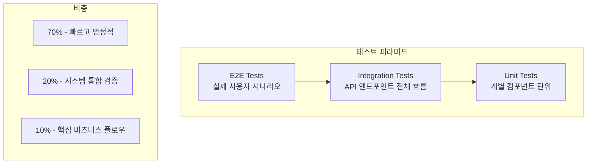

# 🧪 테스트 가이드

## 📋 목차

1. [테스트 전략](#테스트-전략)
2. [테스트 구조](#테스트-구조)
3. [단위 테스트 가이드](#단위-테스트-가이드)
4. [통합 테스트 가이드](#통합-테스트-가이드)
5. [동시성 테스트 가이드](#동시성-테스트-가이드)
6. [테스트 데이터 관리](#테스트-데이터-관리)
7. [테스트 실행 및 리포팅](#테스트-실행-및-리포팅)
8. [테스트 베스트 프랙티스](#테스트-베스트-프랙티스)

## 테스트 전략

### 🎯 테스트 피라미드



### 📊 레이어별 테스트 전략

| 레이어 | 테스트 유형 | 주요 검증 요소 | 도구 |
|--------|-------------|---------------|------|
| **API Layer** | 통합 테스트 | HTTP 요청/응답, 데이터 변환, 예외 처리 | MockMvc, @SpringBootTest |
| **Domain Layer** | 단위 테스트 | 비즈니스 로직, 상태 전이, 도메인 규칙 | Mockito, JUnit 5 |
| **Adapter Layer** | 단위 테스트 | 데이터 변환, CRUD 연산, 동시성 | ConcurrentHashMap 테스트 |

### 🎪 테스트 범위

#### 1. 기능 테스트
- **Happy Path**: 정상적인 비즈니스 플로우
- **Edge Cases**: 경계값, 극한 상황
- **Error Handling**: 예외 상황 및 에러 응답

#### 2. 비기능 테스트
- **동시성**: 멀티스레드 환경에서의 안정성
- **성능**: 응답 시간, 처리량
- **안정성**: 메모리 누수, 리소스 해제

## 테스트 구조

### 📁 디렉토리 구조

```
src/test/java/kr/hhplus/be/server/
├── integration/                    # 통합 테스트
│   ├── BalanceTest.java           # 잔액 API 통합 테스트
│   ├── CouponTest.java            # 쿠폰 API 통합 테스트
│   ├── OrderTest.java             # 주문 API 통합 테스트
│   └── ProductTest.java           # 상품 API 통합 테스트
├── unit/                          # 단위 테스트
│   ├── adapter/                   # 어댑터 레이어
│   │   ├── storage/inmemory/      # InMemory 저장소 테스트
│   │   │   ├── balance/
│   │   │   ├── coupon/
│   │   │   ├── order/
│   │   │   ├── product/
│   │   │   └── user/
│   │   └── locking/               # 락 구현 테스트
│   ├── controller/                # 컨트롤러 테스트
│   │   ├── BalanceControllerTest.java
│   │   ├── CouponControllerTest.java
│   │   └── ...
│   ├── usecase/                   # 유스케이스 테스트
│   │   ├── balance/
│   │   ├── coupon/
│   │   ├── order/
│   │   └── product/
│   ├── entity/                    # 엔티티 테스트
│   └── api/                       # API 공통 기능 테스트
└── resources/                     # 테스트 리소스
    ├── application-test.yml       # 테스트 환경 설정
    └── data/                      # 테스트 데이터
```

### 🏷️ 테스트 네이밍 규칙

#### 1. 클래스 네이밍
```java
// 통합 테스트
public class BalanceTest { }          // API 도메인명 + Test
public class OrderTest { }

// 단위 테스트  
public class ChargeBalanceUseCaseTest { }     // 테스트 대상 클래스명 + Test
public class InMemoryBalanceRepositoryTest { }
```

#### 2. 메서드 네이밍
```java
// 패턴: [테스트대상메서드]_[시나리오]_[기대결과]
@Test
@DisplayName("성공케이스: 정상 잔액 충전")
void chargeBalance_Success() { }

@Test  
@DisplayName("실패케이스: 존재하지 않는 사용자 잔액 충전")
void chargeBalance_UserNotFound() { }

@Test
@DisplayName("동시성 테스트: 같은 사용자의 동시 충전")
void chargeBalance_ConcurrentChargesForSameUser() { }
```

#### 3. 한국어 DisplayName
```java
// ✅ 좋은 예: 명확한 비즈니스 의미 전달
@DisplayName("기존에 잔액이 있던 사용자의 잔액을 충전하면 200 OK와 함께 업데이트된 잔액을 반환한다")
void chargeBalance_Success_ForExistingBalance() { }

@DisplayName("존재하지 않는 사용자 ID로 요청 시 404 Not Found를 반환한다")
void chargeBalance_UserNotFound() { }

// ❌ 나쁜 예: 기술적 세부사항만 표현
@DisplayName("chargeBalance 메서드 테스트")
void testChargeBalance() { }
```

## 단위 테스트 가이드

### 🎯 UseCase 테스트 패턴

#### 1. 기본 구조
```java
@DisplayName("ChargeBalanceUseCase 단위 테스트")
class ChargeBalanceUseCaseTest {

    @Mock
    private UserRepositoryPort userRepositoryPort;
    
    @Mock
    private BalanceRepositoryPort balanceRepositoryPort;
    
    @Mock
    private LockingPort lockingPort;
    
    @InjectMocks
    private ChargeBalanceUseCase chargeBalanceUseCase;

    @BeforeEach
    void setUp() {
        MockitoAnnotations.openMocks(this);
    }

    @Nested
    @DisplayName("성공 케이스")
    class SuccessTests {
        // 성공 시나리오 테스트들
    }

    @Nested
    @DisplayName("실패 케이스")
    class FailureTests {
        // 실패 시나리오 테스트들
    }

    @Nested
    @DisplayName("동시성 테스트")
    class ConcurrencyTests {
        // 동시성 관련 테스트들
    }
}
```

#### 2. Mockito 활용 패턴
```java
@Test
@DisplayName("성공케이스: 정상 잔액 충전")
void chargeBalance_Success() {
    // given
    Long userId = 1L;
    BigDecimal chargeAmount = new BigDecimal("50000");
    
    User user = User.builder()
            .id(userId)
            .name("테스트 사용자")
            .build();
    
    Balance existingBalance = Balance.builder()
            .id(1L)
            .user(user)
            .amount(new BigDecimal("100000"))
            .build();
    
    Balance updatedBalance = Balance.builder()
            .id(1L)
            .user(user)
            .amount(new BigDecimal("150000"))
            .build();
    
    // Mock 설정
    when(lockingPort.acquireLock(anyString())).thenReturn(true);
    when(userRepositoryPort.findById(userId)).thenReturn(Optional.of(user));
    when(balanceRepositoryPort.findByUser(user)).thenReturn(Optional.of(existingBalance));
    when(balanceRepositoryPort.save(any(Balance.class))).thenReturn(updatedBalance);
    doNothing().when(lockingPort).releaseLock(anyString());

    // when
    Balance result = chargeBalanceUseCase.execute(userId, chargeAmount);

    // then
    assertThat(result).isNotNull();
    assertThat(result.getAmount()).isEqualTo(new BigDecimal("150000"));
    
    // 호출 검증
    verify(lockingPort).acquireLock("balance-" + userId);
    verify(userRepositoryPort).findById(userId);
    verify(balanceRepositoryPort).findByUser(user);
    verify(balanceRepositoryPort).save(any(Balance.class));
    verify(lockingPort).releaseLock("balance-" + userId);
}
```

#### 3. 예외 테스트 패턴
```java
@Test
@DisplayName("실패케이스: 존재하지 않는 사용자")
void chargeBalance_UserNotFound() {
    // given
    Long userId = 999L;
    BigDecimal chargeAmount = new BigDecimal("50000");
    
    when(lockingPort.acquireLock(anyString())).thenReturn(true);
    when(userRepositoryPort.findById(userId)).thenReturn(Optional.empty());
    doNothing().when(lockingPort).releaseLock(anyString());

    // when & then
    assertThatThrownBy(() -> chargeBalanceUseCase.execute(userId, chargeAmount))
            .isInstanceOf(UserException.NotFound.class)
            .hasMessage(ErrorCode.USER_NOT_FOUND.getMessage());
            
    verify(lockingPort).releaseLock("balance-" + userId);
}
```

### 🏗️ Repository 테스트 패턴

#### 1. CRUD 기본 테스트
```java
@DisplayName("InMemoryBalanceRepository 단위 테스트")
class InMemoryBalanceRepositoryTest {

    private InMemoryBalanceRepository balanceRepository;

    @BeforeEach
    void setUp() {
        balanceRepository = new InMemoryBalanceRepository();
    }

    @Test
    @DisplayName("성공케이스: 정상 잔액 저장")
    void save_Success() {
        // given
        User user = User.builder()
                .id(1L)
                .name("테스트 사용자")
                .build();
        Balance balance = Balance.builder()
                .user(user)
                .amount(new BigDecimal("100000"))
                .build();

        // when
        Balance savedBalance = balanceRepository.save(balance);

        // then
        assertThat(savedBalance).isNotNull();
        assertThat(savedBalance.getId()).isNotNull();
        assertThat(savedBalance.getAmount()).isEqualTo(new BigDecimal("100000"));
        assertThat(savedBalance.getUser().getId()).isEqualTo(1L);
    }

    @Test
    @DisplayName("성공케이스: 사용자별 잔액 조회")
    void findByUser_Success() {
        // given
        User user = User.builder()
                .id(1L)
                .name("테스트 사용자")
                .build();
        Balance balance = Balance.builder()
                .user(user)
                .amount(new BigDecimal("50000"))
                .build();
        balanceRepository.save(balance);

        // when
        Optional<Balance> foundBalance = balanceRepository.findByUser(user);

        // then
        assertThat(foundBalance).isPresent();
        assertThat(foundBalance.get().getAmount()).isEqualTo(new BigDecimal("50000"));
    }
}
```

### 📝 Parameterized 테스트

#### 1. 다양한 입력값 테스트
```java
@ParameterizedTest
@MethodSource("provideChargeData")
@DisplayName("성공케이스: 다양한 충전 금액으로 테스트")
void chargeBalance_WithDifferentAmounts(Long userId, String chargeAmount) {
    // given
    User user = User.builder()
            .id(userId)
            .name("테스트 사용자")
            .build();
    
    BigDecimal expectedAmount = new BigDecimal("50000").add(new BigDecimal(chargeAmount));
    
    // Mock 설정...
    when(userRepositoryPort.findById(userId)).thenReturn(Optional.of(user));
    // ...

    // when
    Balance result = chargeBalanceUseCase.execute(userId, new BigDecimal(chargeAmount));

    // then
    assertThat(result.getAmount()).isEqualTo(expectedAmount);
}

static Stream<Arguments> provideChargeData() {
    return Stream.of(
            Arguments.of(1L, "10000"),
            Arguments.of(2L, "50000"),
            Arguments.of(3L, "100000")
    );
}
```

#### 2. 경계값 테스트
```java
@ParameterizedTest
@MethodSource("provideInvalidAmounts")
@DisplayName("실패케이스: 유효하지 않은 충전 금액")
void chargeBalance_WithInvalidAmounts(String description, String amount) {
    // given
    Long userId = 1L;
    BigDecimal chargeAmount = new BigDecimal(amount);

    // when & then
    assertThatThrownBy(() -> chargeBalanceUseCase.execute(userId, chargeAmount))
            .isInstanceOf(BalanceException.InvalidAmount.class)
            .hasMessage(ErrorCode.INVALID_AMOUNT.getMessage());
}

static Stream<Arguments> provideInvalidAmounts() {
    return Stream.of(
            Arguments.of("음수", "-1000"),
            Arguments.of("영", "0"),
            Arguments.of("최소값 미만", "999"),
            Arguments.of("최대값 초과", "1000001")
    );
}
```

## 통합 테스트 가이드

### 🌐 API 통합 테스트 패턴

#### 1. 기본 구조
```java
@SpringBootTest
@AutoConfigureMockMvc
@Transactional
@DisplayName("잔액 API 통합 테스트")
public class BalanceTest {

    @Autowired
    private MockMvc mockMvc;

    @Autowired
    private ObjectMapper objectMapper;

    @Autowired
    private UserRepositoryPort userRepositoryPort;

    @Autowired
    private BalanceRepositoryPort balanceRepositoryPort;

    private User userWithBalance;
    private User userWithoutBalance;

    @BeforeEach
    void setUp() {
        // 테스트 데이터 설정
        userWithBalance = userRepositoryPort.save(
            User.builder().name("User With Balance").build()
        );
        balanceRepositoryPort.save(Balance.builder()
                .user(userWithBalance)
                .amount(new BigDecimal("50000"))
                .build());

        userWithoutBalance = userRepositoryPort.save(
            User.builder().name("User Without Balance").build()
        );
    }
}
```

#### 2. API 요청/응답 테스트
```java
@Test
@DisplayName("정상적인 잔액 충전 요청 시 200 OK와 함께 업데이트된 잔액을 반환한다")
void chargeBalance_Success() throws Exception {
    // given
    long userId = userWithBalance.getId();
    BigDecimal amount = new BigDecimal("10000");
    BalanceRequest request = new BalanceRequest(userId, amount);

    // when & then
    mockMvc.perform(post("/api/balance/charge")
                    .contentType(MediaType.APPLICATION_JSON)
                    .content(objectMapper.writeValueAsString(request)))
            .andDo(print())
            .andExpect(status().isOk())
            .andExpect(jsonPath("$.code").value(ErrorCode.SUCCESS.getCode()))
            .andExpect(jsonPath("$.data.userId").value(userId))
            .andExpect(jsonPath("$.data.amount").value(60000.0)); // 50000 + 10000
}

@Test
@DisplayName("존재하지 않는 사용자 ID로 요청 시 에러를 반환한다")
void chargeBalance_UserNotFound() throws Exception {
    // given
    long nonExistentUserId = 999999L;
    BigDecimal amount = new BigDecimal("10000");
    BalanceRequest request = new BalanceRequest(nonExistentUserId, amount);

    // when & then
    mockMvc.perform(post("/api/balance/charge")
                    .contentType(MediaType.APPLICATION_JSON)
                    .content(objectMapper.writeValueAsString(request)))
            .andDo(print())
            .andExpect(status().is4xxClientError())
            .andExpect(jsonPath("$.code").exists())
            .andExpect(jsonPath("$.message").exists())
            .andExpect(jsonPath("$.data").isEmpty());
}
```

#### 3. Nested 구조로 테스트 조직화
```java
@Nested
@DisplayName("POST /api/balance/charge - 잔액 충전")
class ChargeBalance {

    @Nested
    @DisplayName("성공 케이스")
    class Success {
        @Test
        @DisplayName("기존에 잔액이 있던 사용자의 잔액을 충전한다")
        void chargeBalance_Success_ForExistingBalance() throws Exception {
            // 테스트 구현...
        }
    }

    @Nested
    @DisplayName("실패 케이스")
    class Failure {
        @Test
        @DisplayName("존재하지 않는 사용자 ID로 요청 시 에러를 반환한다")
        void chargeBalance_UserNotFound() throws Exception {
            // 테스트 구현...
        }
    }
}
```

## 동시성 테스트 가이드

### ⚡ 멀티스레드 테스트 패턴

#### 1. CountDownLatch 활용
```java
@Test
@DisplayName("동시성 테스트: 다른 사용자들의 동시 충전")
void chargeBalance_ConcurrentChargesForDifferentUsers() throws InterruptedException {
    // given
    int numberOfUsers = 10;
    BigDecimal chargeAmount = new BigDecimal("10000");
    ExecutorService executor = Executors.newFixedThreadPool(numberOfUsers);
    CountDownLatch startLatch = new CountDownLatch(1);
    CountDownLatch doneLatch = new CountDownLatch(numberOfUsers);
    AtomicInteger successCount = new AtomicInteger(0);
    
    // Mock 설정
    when(lockingPort.acquireLock(anyString())).thenReturn(true);
    doNothing().when(lockingPort).releaseLock(anyString());
    
    List<CompletableFuture<Void>> futures = new ArrayList<>();
    
    // when - 다수 사용자 동시 충전
    for (int i = 1; i <= numberOfUsers; i++) {
        final Long userId = (long) i;
        
        CompletableFuture<Void> future = CompletableFuture.runAsync(() -> {
            try {
                startLatch.await(); // 동시 시작 대기
                
                Balance result = chargeBalanceUseCase.execute(userId, chargeAmount);
                
                assertThat(result).isNotNull();
                successCount.incrementAndGet();
                
            } catch (Exception e) {
                System.err.println("충전 실패 - 사용자: " + userId + ", 오류: " + e.getMessage());
            } finally {
                doneLatch.countDown();
            }
        }, executor);
        
        futures.add(future);
    }
    
    // 동시 실행
    startLatch.countDown();
    doneLatch.await(10, TimeUnit.SECONDS);
    
    // then
    assertThat(successCount.get()).isEqualTo(numberOfUsers);
    
    // 리소스 정리
    executor.shutdown();
    if (!executor.awaitTermination(5, TimeUnit.SECONDS)) {
        executor.shutdownNow();
    }
}
```

#### 2. 락 경합 테스트
```java
@Test
@DisplayName("동시성 테스트: 같은 사용자의 동시 충전 - 락 경합")
void chargeBalance_ConcurrentChargesForSameUser() throws InterruptedException {
    // given
    Long userId = 1L;
    int numberOfCharges = 5;
    AtomicInteger successCount = new AtomicInteger(0);
    AtomicInteger lockFailureCount = new AtomicInteger(0);
    
    // 락 경합 시나리오: 첫 번째만 성공, 나머지는 락 획득 실패
    when(lockingPort.acquireLock("balance-" + userId))
            .thenReturn(true)  // 첫 번째 호출만 성공
            .thenReturn(false) // 나머지는 실패
            .thenReturn(false)
            .thenReturn(false)
            .thenReturn(false);
    
    // when - 동시 실행
    ExecutorService executor = Executors.newFixedThreadPool(numberOfCharges);
    CountDownLatch startLatch = new CountDownLatch(1);
    CountDownLatch doneLatch = new CountDownLatch(numberOfCharges);
    
    for (int i = 0; i < numberOfCharges; i++) {
        executor.submit(() -> {
            try {
                startLatch.await();
                
                Balance result = chargeBalanceUseCase.execute(userId, new BigDecimal("10000"));
                successCount.incrementAndGet();
                
            } catch (ConcurrencyException e) {
                lockFailureCount.incrementAndGet();
            } finally {
                doneLatch.countDown();
            }
        });
    }
    
    startLatch.countDown();
    doneLatch.await(10, TimeUnit.SECONDS);
    
    // then - 하나만 성공, 나머지는 락 실패
    assertThat(successCount.get()).isEqualTo(1);
    assertThat(lockFailureCount.get()).isEqualTo(numberOfCharges - 1);
    
    executor.shutdown();
}
```

#### 3. ConcurrentHashMap 동시성 테스트
```java
@Test
@DisplayName("동시성 테스트: 동일 사용자 잔액 동시 업데이트")
void save_ConcurrentUpdatesForSameUser() throws Exception {
    // given
    User user = User.builder()
            .id(100L)
            .name("동시성 테스트 사용자")
            .build();

    int numberOfThreads = 10;
    int updatesPerThread = 100;
    ExecutorService executor = Executors.newFixedThreadPool(numberOfThreads);
    CountDownLatch startLatch = new CountDownLatch(1);
    CountDownLatch doneLatch = new CountDownLatch(numberOfThreads);

    // when - 동시에 잔액 업데이트
    for (int i = 0; i < numberOfThreads; i++) {
        executor.submit(() -> {
            try {
                startLatch.await();
                
                for (int j = 0; j < updatesPerThread; j++) {
                    Balance balance = Balance.builder()
                            .user(user)
                            .amount(new BigDecimal("1000"))
                            .build();
                    balanceRepository.save(balance);
                }
            } catch (Exception e) {
                throw new RuntimeException(e);
            } finally {
                doneLatch.countDown();
            }
        });
    }

    startLatch.countDown();
    doneLatch.await();

    // then - 최종 상태 검증
    Optional<Balance> finalBalance = balanceRepository.findByUser(user);
    assertThat(finalBalance).isPresent();
    assertThat(finalBalance.get().getAmount()).isEqualTo(new BigDecimal("1000"));
    
    executor.shutdown();
}
```

## 테스트 데이터 관리

### 🏭 테스트 데이터 빌더 패턴

#### 1. 엔티티 빌더 활용
```java
public class TestDataBuilder {
    
    public static User.UserBuilder defaultUser() {
        return User.builder()
                .name("테스트 사용자")
                .createdAt(LocalDateTime.now())
                .updatedAt(LocalDateTime.now());
    }
    
    public static Balance.BalanceBuilder defaultBalance(User user) {
        return Balance.builder()
                .user(user)
                .amount(new BigDecimal("100000"))
                .createdAt(LocalDateTime.now())
                .updatedAt(LocalDateTime.now());
    }
    
    public static Product.ProductBuilder defaultProduct() {
        return Product.builder()
                .name("테스트 상품")
                .price(new BigDecimal("10000"))
                .stock(100)
                .reservedStock(0)
                .createdAt(LocalDateTime.now())
                .updatedAt(LocalDateTime.now());
    }
}

// 사용 예시
@Test
void testExample() {
    User user = TestDataBuilder.defaultUser()
            .id(1L)
            .name("특별한 사용자")
            .build();
    
    Balance balance = TestDataBuilder.defaultBalance(user)
            .amount(new BigDecimal("50000"))
            .build();
    
    // 테스트 로직...
}
```

#### 2. 팩토리 메서드 패턴
```java
public class TestFixtures {
    
    public static User createUser(Long id, String name) {
        return User.builder()
                .id(id)
                .name(name)
                .build();
    }
    
    public static Balance createBalance(User user, String amount) {
        return Balance.builder()
                .user(user)
                .amount(new BigDecimal(amount))
                .build();
    }
    
    public static Order createPendingOrder(User user, List<OrderItem> items) {
        BigDecimal totalAmount = items.stream()
                .map(OrderItem::getTotalPrice)
                .reduce(BigDecimal.ZERO, BigDecimal::add);
                
        return Order.builder()
                .user(user)
                .items(items)
                .totalAmount(totalAmount)
                .status(OrderStatus.PENDING)
                .build();
    }
}
```

### 🔄 테스트 데이터 초기화

#### 1. @BeforeEach 활용
```java
@SpringBootTest
@Transactional
class IntegrationTestBase {
    
    @Autowired
    protected UserRepositoryPort userRepositoryPort;
    
    @Autowired
    protected BalanceRepositoryPort balanceRepositoryPort;
    
    protected User testUser;
    protected Balance testBalance;
    
    @BeforeEach
    void setUpTestData() {
        // 테스트 사용자 생성
        testUser = userRepositoryPort.save(
            TestFixtures.createUser(null, "테스트 사용자")
        );
        
        // 테스트 잔액 생성
        testBalance = balanceRepositoryPort.save(
            TestFixtures.createBalance(testUser, "100000")
        );
    }
}
```

#### 2. @Sql 어노테이션 (향후 DB 전환 시)
```java
@Test
@Sql(scripts = "/test-data/users.sql", executionPhase = Sql.ExecutionPhase.BEFORE_TEST_METHOD)
@Sql(scripts = "/test-data/cleanup.sql", executionPhase = Sql.ExecutionPhase.AFTER_TEST_METHOD)
void testWithSqlData() {
    // 테스트 로직
}
```

## 테스트 실행 및 리포팅

### 🚀 테스트 실행 명령어

#### 1. Gradle 명령어
```bash
# 전체 테스트 실행
./gradlew test

# 특정 테스트 클래스 실행
./gradlew test --tests "BalanceTest"
./gradlew test --tests "*BalanceTest"

# 특정 패키지 테스트 실행
./gradlew test --tests "kr.hhplus.be.server.unit.usecase.*"
./gradlew test --tests "kr.hhplus.be.server.integration.*"

# 태그별 테스트 실행
./gradlew test --tests "*ConcurrencyTest*"

# 병렬 실행
./gradlew test --parallel --max-workers=4

# 테스트 결과 상세 출력
./gradlew test --info

# 특정 테스트 메서드만 실행
./gradlew test --tests "BalanceTest.chargeBalance_Success"
```

#### 2. IntelliJ IDEA 실행
```
1. 클래스/메서드 우클릭 → Run 'TestName'
2. Ctrl+Shift+F10 (Windows/Linux) / Cmd+Shift+R (Mac)
3. Run Configuration에서 VM options 설정:
   -Dspring.profiles.active=test
   -Xmx2g
```

### 📊 테스트 커버리지

#### 1. JaCoCo 설정 (build.gradle)
```gradle
plugins {
    id 'jacoco'
}

jacoco {
    toolVersion = "0.8.8"
}

jacocoTestReport {
    reports {
        xml.required = true
        html.required = true
        csv.required = false
    }
    
    afterEvaluate {
        classDirectories.setFrom(files(classDirectories.files.collect {
            fileTree(dir: it, exclude: [
                '**/config/**',
                '**/dto/**',
                '**/*Application*',
                '**/exception/**'
            ])
        }))
    }
}

test {
    finalizedBy jacocoTestReport
}
```

#### 2. 커버리지 실행
```bash
# 테스트 실행 후 커버리지 리포트 생성
./gradlew test jacocoTestReport

# 커버리지 리포트 확인
open build/reports/jacoco/test/html/index.html
```

### 📋 테스트 리포트 분석

#### 1. 커버리지 목표
```
- Line Coverage: 80% 이상
- Branch Coverage: 70% 이상
- Method Coverage: 90% 이상

제외 대상:
- DTO 클래스
- Configuration 클래스
- Exception 클래스
- Application 메인 클래스
```

#### 2. 테스트 결과 모니터링
```bash
# 테스트 실행 시간 측정
./gradlew test --profile

# 실패한 테스트만 재실행
./gradlew test --rerun-tasks

# 테스트 로그 상세 출력
./gradlew test --debug
```

## 테스트 베스트 프랙티스

### ✅ 작성 원칙

#### 1. AAA 패턴 (Arrange-Act-Assert)
```java
@Test
@DisplayName("성공케이스: 정상 잔액 충전")
void chargeBalance_Success() {
    // Arrange - 테스트 데이터 준비
    Long userId = 1L;
    BigDecimal chargeAmount = new BigDecimal("50000");
    User user = TestFixtures.createUser(userId, "테스트 사용자");
    
    when(userRepositoryPort.findById(userId)).thenReturn(Optional.of(user));
    
    // Act - 테스트 대상 메서드 실행
    Balance result = chargeBalanceUseCase.execute(userId, chargeAmount);
    
    // Assert - 결과 검증
    assertThat(result).isNotNull();
    assertThat(result.getAmount()).isEqualTo(new BigDecimal("50000"));
}
```

#### 2. 단일 책임 원칙
```java
// ✅ 좋은 예: 하나의 시나리오만 테스트
@Test
@DisplayName("잔액 충전 시 락을 정상적으로 획득하고 해제한다")
void chargeBalance_LockAcquisitionAndRelease() {
    // 락 관련 동작만 검증
}

@Test
@DisplayName("잔액 충전 시 사용자 존재 여부를 확인한다")
void chargeBalance_UserExistenceValidation() {
    // 사용자 검증 로직만 검증
}

// ❌ 나쁜 예: 여러 시나리오를 한 번에 테스트
@Test
void chargeBalance_AllScenarios() {
    // 락, 사용자 검증, 잔액 업데이트를 모두 검증
}
```

#### 3. 독립성 보장
```java
// ✅ 좋은 예: 각 테스트가 독립적
@BeforeEach
void setUp() {
    balanceRepository = new InMemoryBalanceRepository();  // 매번 새로운 인스턴스
}

@Test
void test1() {
    // 이 테스트의 변경사항이 다른 테스트에 영향 없음
}

// ❌ 나쁜 예: 테스트 간 상태 공유
private static User sharedUser;  // 여러 테스트에서 공유하는 상태
```

### 🎯 테스트 품질 검증

#### 1. 테스트 가독성
```java
// ✅ 좋은 예: 의도가 명확한 테스트
@Test
@DisplayName("주문 금액이 잔액보다 클 때 InsufficientBalance 예외가 발생한다")
void payOrder_InsufficientBalance() {
    // given - 잔액보다 큰 주문 금액
    Balance balance = createBalanceWithAmount("10000");
    Order order = createOrderWithAmount("20000");
    
    // when & then
    assertThatThrownBy(() -> payOrderUseCase.execute(order.getId()))
            .isInstanceOf(BalanceException.InsufficientBalance.class)
            .hasMessageContaining("잔액 부족");
}

// ❌ 나쁜 예: 의도가 불분명한 테스트
@Test
void test1() {
    Balance b = new Balance();
    b.setAmount(new BigDecimal("10000"));
    // 무엇을 테스트하려는지 불분명
}
```

#### 2. 테스트 안정성
```java
// ✅ 좋은 예: 시간에 의존하지 않는 테스트
@Test
void createCoupon_ValidDateRange() {
    LocalDateTime fixedNow = LocalDateTime.of(2024, 1, 15, 10, 0);
    LocalDateTime startDate = fixedNow.plusDays(1);
    LocalDateTime endDate = fixedNow.plusDays(30);
    
    // 고정된 시간으로 테스트
}

// ❌ 나쁜 예: 현재 시간에 의존하는 테스트
@Test
void createCoupon_BadExample() {
    LocalDateTime now = LocalDateTime.now();  // 실행 시점에 따라 결과 달라짐
    // ...
}
```

#### 3. 테스트 성능 최적화
```java
// ✅ 좋은 예: 빠른 단위 테스트
@Test
void calculateTotalAmount_Fast() {
    // Mock 객체 사용으로 빠른 실행
    when(mockRepository.findById(1L)).thenReturn(Optional.of(testData));
    
    BigDecimal result = service.calculateTotal(1L);
    
    assertThat(result).isEqualTo(expected);
}

// 통합 테스트는 별도 분리
@SpringBootTest
class SlowIntegrationTest {
    // 실제 DB 연동이 필요한 테스트만 여기에
}
```

### 🔍 테스트 리뷰 체크리스트

#### ✅ 작성 시 확인사항
- [ ] 테스트명이 의도를 명확히 표현하는가?
- [ ] AAA 패턴을 따르고 있는가?
- [ ] 하나의 시나리오만 테스트하는가?
- [ ] 테스트가 독립적으로 실행되는가?
- [ ] Edge case와 Error case를 포함하는가?
- [ ] 동시성이 중요한 부분은 동시성 테스트가 있는가?

#### 🚫 피해야 할 안티패턴
- **테스트를 위한 테스트**: 의미 없는 Getter/Setter 테스트
- **과도한 Mock 사용**: 실제 동작과 괴리되는 테스트
- **Magic Number**: 하드코딩된 값 사용
- **테스트 간 의존성**: 실행 순서에 의존하는 테스트
- **복잡한 테스트**: 테스트 자체가 복잡해서 이해하기 어려운 경우

---

**다음 읽을 문서**: [06-api-guide.md](06-api-guide.md)