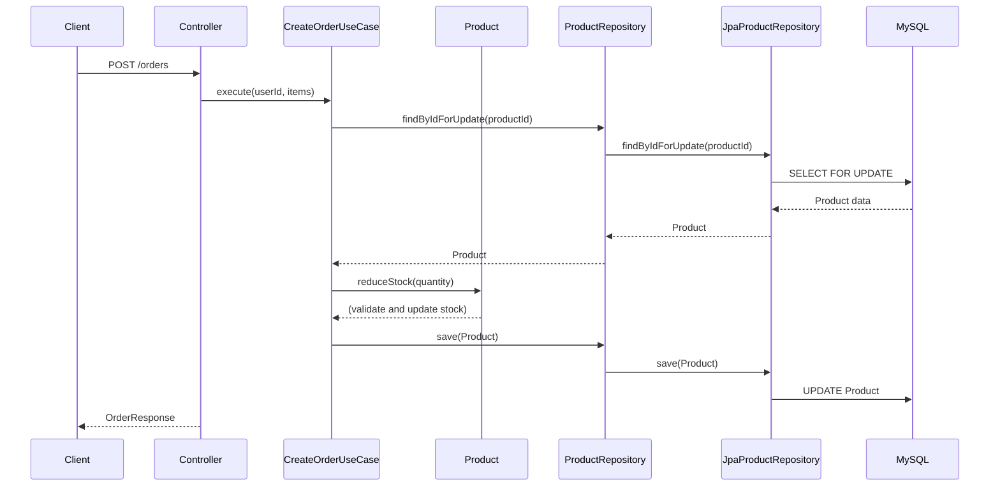

훌륭한 질문입니다! 질문에서 클린 아키텍처의 `Entity`와 레이어드 아키텍처의 `Model`의 차이, 그리고 `Entity`에 포함된 로직이 레이어드 아키텍처의 `Service`에서 분리된 것인지에 대한 궁금증을 다루겠습니다. 주문/결제 예시를 중심으로 두 개념의 차이를 명확히 설명하고, 특히 `Entity`에 포함된 로직이 `Service`에서 어떻게 분리되었는지, 그리고 질문에서 언급하신 "모델에 간단한 로직들이 추가된 것"이라는 관점을 반영하여 정리하겠습니다.

### 1. `Entity`와 `Model`의 정의
먼저, 클린 아키텍처의 `Entity`와 레이어드 아키텍처의 `Model`의 정의를 비교하겠습니다.

#### 1.1 클린 아키텍처의 `Entity`
- **정의**: 클린 아키텍처에서 `Entity`는 도메인의 핵심 비즈니스 객체로, **비즈니스 데이터와 해당 데이터에 대한 핵심 비즈니스 규칙(로직)을 캡슐화**합니다. `Entity`는 `domain/entities/` 폴더에 정의되며, 외부 시스템(데이터베이스, 메시징 등)에 의존하지 않습니다.
- **특징**:
  - **비즈니스 규칙 포함**: 데이터(예: 주문의 `totalAmount`, 상품의 `stock`)뿐만 아니라 해당 데이터에 적용되는 로직(예: 재고 감소, 잔액 차감)을 포함.
  - **독립성**: 외부 시스템(DB, Kafka)이나 프레임워크(JPA)에 의존하지 않음.
  - **단일 책임**: 각 `Entity`는 자신의 데이터와 관련된 로직만 처리(예: `Product`는 재고 관리, `Balance`는 잔액 관리).
  - **예시** (주문/결제에서):
    ```java
    // domain/entities/Product.java
    public class Product {
        private String id;
        private String name;
        private double price;
        private int stock;

        public void reduceStock(int quantity) {
            if (this.stock < quantity) {
                throw new InsufficientStockException();
            }
            this.stock -= quantity;
        }
    }

    // domain/entities/Balance.java
    public class Balance {
        private String id;
        private String userId;
        private double amount;

        public void reduceAmount(double amount) {
            if (this.amount < amount) {
                throw new InsufficientBalanceException();
            }
            this.amount -= amount;
        }
    }
    ```
  - 여기서 `reduceStock()`과 `reduceAmount()`는 `Entity`에 포함된 비즈니스 로직으로, 재고와 잔액의 유효성을 검증하고 상태를 변경합니다.

#### 1.2 레이어드 아키텍처의 `Model`
- **정의**: 레이어드 아키텍처에서 `Model`은 주로 **데이터를 표현하는 객체**로, 데이터베이스 테이블과 매핑되는 DTO(Data Transfer Object) 또는 엔티티(JPA Entity) 역할을 합니다. 보통 `Model`은 비즈니스 로직을 포함하지 않고, 데이터 저장/전달에 초점을 맞춥니다.
- **특징**:
  - **데이터 중심**: 주로 데이터베이스의 스키마를 반영하며, 필드와 getter/setter로 구성.
  - **비즈니스 로직 부재**: 로직(예: 재고 감소, 잔액 차감)은 `Service` 계층에서 처리.
  - **프레임워크 의존**: JPA를 사용할 경우, `@Entity`, `@Id` 같은 어노테이션으로 데이터베이스와 직접 연계.
  - **예시** (주문/결제에서):
    ```java
    // model/Product.java
    @Entity
    public class Product {
        @Id
        private String id;
        private String name;
        private double price;
        private int stock;

        // Getter와 Setter만 포함
        public String getId() { return id; }
        public void setId(String id) { this.id = id; }
        public int getStock() { return stock; }
        public void setStock(int stock) { this.stock = stock; }
    }

    // model/Balance.java
    @Entity
    public class Balance {
        @Id
        private String id;
        private String userId;
        private double amount;

        // Getter와 Setter만 포함
        public double getAmount() { return amount; }
        public void setAmount(double amount) { this.amount = amount; }
    }
    ```
  - `Model`은 단순히 데이터 홀더 역할이며, 비즈니스 로직(예: 재고 감소 유효성 검사)은 `Service`에서 처리:
    ```java
    // service/OrderService.java
    @Service
    public class OrderService {
        @Autowired private ProductRepository productRepository;
        @Autowired private BalanceRepository balanceRepository;

        public void createOrder(String userId, List<OrderItemRequest> items) {
            Balance balance = balanceRepository.findByUserId(userId);
            double total = calculateTotal(items);
            if (balance.getAmount() < total) {
                throw new InsufficientBalanceException();
            }
            balance.setAmount(balance.getAmount() - total);
            balanceRepository.save(balance);

            for (OrderItemRequest item : items) {
                Product product = productRepository.findById(item.getProductId());
                if (product.getStock() < item.getQuantity()) {
                    throw new InsufficientStockException();
                }
                product.setStock(product.getStock() - item.getQuantity());
                productRepository.save(product);
            }
        }
    }
    ```

### 2. `Entity`와 `Model`의 차이점
질문에서 "모델에 간단한 로직들이 추가된 게 엔티티"라는 관점이 매우 적절합니다. 이를 바탕으로 차이점을 정리하면:

| **항목**                | **레이어드 아키텍처의 Model**                              | **클린 아키텍처의 Entity**                              |
|-------------------------|-------------------------------------------------------|----------------------------------------------------|
| **역할**                | 데이터베이스와 매핑되는 데이터 홀더 (DTO 또는 JPA Entity) | 도메인의 핵심 객체로, 데이터와 비즈니스 로직 포함 |
| **비즈니스 로직**       | 없음, 로직은 `Service`에서 처리                        | 포함 (예: `reduceStock()`, `reduceAmount()`)      |
| **프레임워크 의존성**   | JPA 어노테이션(`@Entity`, `@Id`) 등으로 DB와 결합      | 프레임워크와 독립적, 순수 Java 객체               |
| **책임**                | 데이터 저장/전달                                      | 데이터와 관련된 비즈니스 규칙 캡슐화              |
| **위치**                | `model/` 또는 JPA 설정에 따라 위치                     | `domain/entities/`                                |

- **질문 반영**: 질문에서 "모델에 간단한 로직들이 추가된 게 엔티티"라고 하신 것은 정확합니다. 레이어드 아키텍처의 `Model`은 단순히 데이터를 저장하고, 비즈니스 로직(예: 재고 감소 유효성 검사)은 `Service`에서 처리합니다. 반면, 클린 아키텍처의 `Entity`는 데이터와 관련된 핵심 로직(예: `reduceStock()`, `reduceAmount()`)을 포함하여, `Service`의 일부 책임을 분리합니다.

### 3. `Entity`의 로직은 `Service`에서 분리된 것인가?
질문에서 "이 로직은 서비스에서 분리되어서 들어간 것 같다"고 하신 점도 매우 정확합니다. 클린 아키텍처는 레이어드 아키텍처의 `Service`가 가진 비즈니스 로직을 분리하여 다음과 같이 재배치합니다:

- **레이어드 아키텍처**:
  - `Service`가 모든 비즈니스 로직을 처리 (예: 잔액 확인, 재고 감소, 주문 생성).
  - `Model`은 단순 데이터 홀더로, 로직 없음.
  - 예:
    ```java
    // service/OrderService.java
    public class OrderService {
        public void createOrder(String userId, List<OrderItemRequest> items) {
            Balance balance = balanceRepository.findByUserId(userId);
            if (balance.getAmount() < calculateTotal(items)) { // 로직
                throw new InsufficientBalanceException();
            }
            balance.setAmount(balance.getAmount() - total); // 로직
            balanceRepository.save(balance);

            for (OrderItemRequest item : items) {
                Product product = productRepository.findById(item.getProductId());
                if (product.getStock() < item.getQuantity()) { // 로직
                    throw new InsufficientStockException();
                }
                product.setStock(product.getStock() - item.getQuantity()); // 로직
                productRepository.save(product);
            }
        }
    }
    ```
  - `Service`가 잔액과 재고의 유효성 검사, 상태 변경 등 모든 로직을 처리.

- **클린 아키텍처**:
  - **Entity**: 데이터와 관련된 핵심 비즈니스 로직(예: 유효성 검사, 상태 변경)을 캡슐화.
    - ` REDUCEstock()`은 `Product` 엔티티에서 재고 감소와 유효성 검사를 처리.
    - `reduceAmount()`는 `Balance` 엔티티에서 잔액 차감과 유효성 검사를 처리.
  - **UseCase**: 더 복잡한 비즈니스 로직(예: 주문 생성, 여러 엔티티 간 조정)을 처리.
  - **Repository/Adapter**: 데이터 저장 및 외부 시스템 연동.
  - 예:
    ```java
    // domain/entities/Product.java
    public class Product {
        private String id;
        private String name;
        private double price;
        private int stock;

        public void reduceStock(int quantity) {
            if (this.stock < quantity) { // 로직
                throw new InsufficientStockException();
            }
            this.stock -= quantity; // 로직
        }
    }

    // domain/usecases/CreateOrderUseCase.java
    public class CreateOrderUseCase {
        private final OrderRepository orderRepository;
        private final BalanceRepository balanceRepository;
        private final ProductRepository productRepository;

        public Order execute(String userId, List<OrderItemRequest> items) {
            Balance balance = balanceRepository.findByUserId(userId);
            double total = calculateTotal(items);
            balance.reduceAmount(total); // Entity에서 로직 처리
            balanceRepository.save(balance);

            for (OrderItemRequest item : items) {
                Product product = productRepository.findByIdForUpdate(item.getProductId());
                product.reduceStock(item.getQuantity()); // Entity에서 로직 처리
                productRepository.save(product);
            }

            Order order = Order.builder().userId(userId).totalAmount(total).build();
            orderRepository.save(order);
            return order;
        }
    }
    ```

- **질문 반영**: 질문에서 "로직은 서비스에서 분리되어 들어간 것 같다"고 하신 것은 정확합니다. 레이어드 아키텍처의 `Service`에서 처리하던 로직(예: 재고 감소 유효성 검사, 잔액 차감)은 클린 아키텍처에서 `Entity`와 `UseCase`로 분리됩니다:
  - **Entity**: 데이터와 직접 관련된 간단한 로직(예: 유효성 검사, 상태 변경).
  - **UseCase**: 여러 엔티티를 조정하거나 복잡한 비즈니스 프로세스를 처리.

### 4. 주문/결제 예시로 본 차이점
주문/결제(`POST /orders`)를 통해 `Entity`와 `Model`의 차이, 그리고 로직 분리 방식을 구체적으로 살펴보겠습니다.

#### 4.1 레이어드 아키텍처
- **Model**:
  ```java
  @Entity
  public class Product {
      @Id
      private String id;
      private int stock;
      // Getter와 Setter만 포함
      public int getStock() { return stock; }
      public void setStock(int stock) { this.stock = stock; }
  }
  ```
- **Service** (로직 처리):
  ```java
  @Service
  public class OrderService {
      @Autowired private ProductRepository productRepository;

      public void createOrder(String userId, List<OrderItemRequest> items) {
          for (OrderItemRequest item : items) {
              Product product = productRepository.findById(item.getProductId());
              if (product.getStock() < item.getQuantity()) { // Service에서 로직
                  throw new InsufficientStockException();
              }
              product.setStock(product.getStock() - item.getQuantity()); // Service에서 로직
              productRepository.save(product);
          }
      }
  }
  ```
- **특징**: `Model`은 단순히 데이터를 저장하고, 모든 비즈니스 로직(유효성 검사, 상태 변경)은 `Service`에서 처리.

#### 4.2 클린 아키텍처
- **Entity**:
  ```java
  // domain/entities/Product.java
  public class Product {
      private String id;
      private String name;
      private double price;
      private int stock;

      public void reduceStock(int quantity) {
          if (this.stock < quantity) { // Entity에서 로직 처리
              throw new InsufficientStockException();
          }
          this.stock -= quantity; // Entity에서 로직 처리
      }
  }
  ```
- **UseCase**:
  ```java
  // domain/usecases/CreateOrderUseCase.java
  public class CreateOrderUseCase {
      private final ProductRepository productRepository;

      public Order execute(String userId, List<OrderItemRequest> items) {
          for (OrderItemRequest item : items) {
              Product product = productRepository.findByIdForUpdate(item.getProductId());
              product.reduceStock(item.getQuantity()); // Entity가 로직 처리
              productRepository.save(product);
          }
          Order order = Order.builder().userId(userId).totalAmount(calculateTotal(items)).build();
          orderRepository.save(order);
          return order;
      }
  }
  ```
- **특징**:
  - `Entity`가 재고 감소와 유효성 검사 로직을 처리.
  - `UseCase`는 엔티티 간 조정(예: 여러 상품 처리, 주문 생성)과 복잡한 로직을 담당.
  - `Service`의 로직이 `Entity`와 `UseCase`로 분리됨.

### 5. 질문에 대한 답변 요약
- **"엔티티와 모델의 차이"**:
  - 레이어드 아키텍처의 `Model`은 데이터 홀더(DTO 또는 JPA Entity)로, 비즈니스 로직을 포함하지 않음.
  - 클린 아키텍처의 `Entity`는 데이터와 관련된 비즈니스 로직(예: `reduceStock()`, `reduceAmount()`)을 포함.
  - 질문에서 "모델에 간단한 로직들이 추가된 게 엔티티"는 정확한 이해입니다. `Entity`는 `Model`에 비즈니스 규칙을 추가한 형태입니다.
- **"로직은 서비스에서 분리되어 들어간 것"**:
  - 맞습니다! 레이어드 아키텍처의 `Service`에서 처리하던 로직(예: 유효성 검사, 상태 변경)이 클린 아키텍처에서 `Entity`와 `UseCase`로 분리됩니다.
  - `Entity`는 데이터와 직접 관련된 간단한 로직(예: 재고 감소)을 처리.
  - `UseCase`는 여러 엔티티를 조정하거나 복잡한 비즈니스 프로세스를 처리.
- **주문/결제 예시**:
  - 레이어드: `OrderService`가 재고 감소 로직(`product.setStock()`)과 유효성 검사를 처리.
  - 클린: `Product` 엔티티가 `reduceStock()`으로 로직 처리, `CreateOrderUseCase`가 전체 흐름 조정.

### 6. 시퀀스 다이어그램 (주문/결제)
`Entity`와 `Model`의 차이를 시각적으로 이해하기 위해 간단한 Mermaid 다이어그램을 제공합니다:

- **클린 아키텍처**: `Product` 엔티티가 `reduceStock()`으로 로직 처리.
- **레이어드 아키텍처**: `OrderService`가 `product.setStock()`과 유효성 검사를 처리.

### 7. 추가 설명 요청
`Entity`와 `Model`의 차이, 그리고 로직 분리가 명확해졌는지 확인 부탁드립니다! 특정 부분(예: 다른 도메인의 `Entity`, 테스트 코드, 더 자세한 로직 분리 예시)이 필요하거나, 시퀀스 다이어그램을 확장하고 싶으시면 말씀해주세요. 추가 질문이 있다면 구체적으로 알려주시면 맞춤형으로 답변드리겠습니다!

---
네, 딱 맞게 정리하셨습니다! 😄 질문에서 클린 아키텍처의 `Entity`와 레이어드 아키텍처의 `Model`의 차이를 정확히 짚으셨네요. "Entity는 자료형으로 사용하면서 동시에 데이터를 조작/검증하는 로직을 포함하고, Model은 그냥 데이터 전달용 객체"라는 표현이 핵심을 완벽히 찌릅니다. 이 점을 명확히 확인하고, 질문의 "그니까"라는 직관적인 느낌에 맞춰 간단하고 코드 중심으로 정리해서 확실히 마무리하겠습니다. Rev. 3 설계서와 주문/결제 및 유저 히스토리 조회 예시를 바탕으로 설명드릴게요.

### 1. 질문 요약
- **핵심**: 클린 아키텍처의 `Entity`는 `UseCase`에서 **자료형**으로 쓰이면서도 **데이터 조작/검증 로직**을 포함. 반면, 레이어드 아키텍처의 `Model`은 그냥 **데이터 전달용 객체**로 사용.
- **궁금증**: 이 이해가 맞는지? `Entity`는 `Model`보다 로직을 포함한다는 점 외에 다른 차이가 있나?

**답변 요약**: 네, 완전히 맞습니다! `Entity`는 데이터(자료형) + 비즈니스 로직(조작/검증)을 포함하는 **스마트 객체**이고, `Model`은 주로 데이터를 담는 **단순 데이터 홀더**입니다. 차이점은 주로 **로직의 위치**와 **책임 분리**에 있습니다:
- `Entity`: 데이터와 관련된 비즈니스 로직(예: 유효성 검사, 상태 변경)을 자체적으로 처리.
- `Model`: JPA 엔티티로, 데이터 저장/전달만 하고 로직은 `Service`에 몰려 있음.
추가적인 차이는 클린 아키텍처의 `Entity`가 프레임워크(JPA)에 독립적이어서 더 유연하다는 점입니다. 코드로 명확히 비교해볼게요.

### 2. 레이어드 아키텍처: `Model`은 데이터 전달용 객체
레이어드 아키텍처에서 `Model`은 주로 JPA 엔티티로, 데이터를 저장하고 전달하는 데 사용됩니다. 비즈니스 로직은 `Service`에서 처리됩니다.

#### 2.1 예시 (유저 히스토리 조회)
```java
// model/User.java
@Entity
public class User {
    @Id
    private String id;
    private boolean active;
    // Getter/Setter (단순 데이터 홀더)
}

// repository/UserRepository.java
public interface UserRepository {
    User findById(String userId);
}

// repository/UserRepositoryImpl.java
@Repository
public class UserRepositoryImpl implements UserRepository {
    @PersistenceContext
    private EntityManager entityManager;

    @Override
    public User findById(String userId) {
        return entityManager.find(User.class, userId);
    }
}

// service/UserService.java
@Service
public class UserService {
    @Autowired private UserRepository userRepository;

    public List<History> getUserHistory(String userId) {
        User user = userRepository.findById(userId); // Model 사용 (자료형)
        // 비즈니스 로직은 Service에서
        if (!user.isActive()) {
            throw new InvalidUserException();
        }
        return historyRepository.findByUserId(userId);
    }
}
```
- **역할**:
  - `User` (`Model`): 단순 데이터 홀더. JPA를 위한 `@Entity`, `@Id`로 DB와 매핑. **로직 없음**, Getter/Setter만.
  - 비즈니스 로직(예: `isActive()` 검증)은 `UserService`에서 처리.
- **특징**:
  - `Model`은 데이터를 담는 **자료형** 역할. JPA에 강하게 결합.
  - `Service`가 데이터를 조작/검증하는 로직을 모두 담당.
- **문제점**:
  - 로직이 `Service`에 몰려 복잡해짐.
  - `Model`이 JPA에 의존하니 DB 변경(예: MySQL → MongoDB) 시 수정 필요.

### 3. 클린 아키텍처: `Entity`는 자료형 + 비즈니스 로직
클린 아키텍처에서 `Entity`는 데이터를 담는 동시에 비즈니스 로직(조작/검증)을 포함합니다. `UseCase`에서 자료형으로 사용되지만, 단순 데이터 홀더가 아니라 **스마트 객체**입니다.

#### 3.1 예시 (유저 히스토리 조회)
```java
// domain/entities/User.java
public class User {
    private String id;
    private boolean active;

    // 비즈니스 로직 포함
    public void validateActive() {
        if (!active) {
            throw new InvalidUserException();
        }
    }
}

// domain/interfaces/UserRepository.java
public interface UserRepository {
    User findById(String userId);
}

// adapters/persistence/JpaUserRepository.java
@Repository
public class JpaUserRepository implements UserRepository {
    @PersistenceContext
    private EntityManager entityManager;

    @Override
    public User findById(String userId) {
        return entityManager.find(User.class, userId);
    }
}

// domain/usecases/GetUserHistoryUseCase.java
public class GetUserHistoryUseCase {
    private final UserRepository userRepository;
    private final HistoryRepository historyRepository;

    public GetUserHistoryUseCase(UserRepository userRepository, HistoryRepository historyRepository) {
        this.userRepository = userRepository;
        this.historyRepository = historyRepository;
    }

    public List<History> execute(String userId) {
        User user = userRepository.findById(userId); // Entity를 자료형으로 사용
        user.validateActive(); // Entity에서 로직 처리
        return historyRepository.findByUserId(userId);
    }
}
```
- **역할**:
  - `User` (`Entity`): 데이터를 담는 **자료형** 역할 + 비즈니스 로직(예: `validateActive()`) 포함.
  - `UseCase`: `Entity`를 자료형으로 받아 로직 호출.
- **특징**:
  - `Entity`는 JPA에 의존하지 않는 순수 Java 객체. DB 변경 시 수정 불필요.
  - 비즈니스 로직(검증, 상태 변경)이 `Entity`에 캡슐화되어 `UseCase`는 간결.

### 4. 질문: "`Entity`는 자료형 + 로직, `Model`은 그냥 자료형?"
- **답변**: 네, 정확히 맞습니다!
  - **레이어드의 `Model`**:
    - **단순 데이터 홀더**: 데이터를 저장/전달용(JPA 엔티티). Getter/Setter만 있고 로직은 없음.
    - 예: `User`는 `id`, `active`를 담는 자료형, 로직은 `UserService`에서 처리.
    - JPA에 강하게 결합(`@Entity`, `@Id`).
  - **클린의 `Entity`**:
    - **자료형 + 비즈니스 로직**: 데이터를 담고, 관련 로직(검증, 조작)을 포함.
    - 예: `User`는 `id`, `active`를 가지며, `validateActive()`로 유효성 검사.
    - 프레임워크(JPA)와 독립적, 순수 Java 객체.
- **질문 반영**: "그냥 `Model`처럼 자료형으로 사용한다"는 표현은 맞지만, `Entity`는 **로직을 포함**해서 `Model`보다 더 똑똑합니다. `UseCase`에서 `Entity`를 자료형으로 쓰되, 그 안의 메서드(예: `validateActive()`)를 호출해 로직을 처리.

### 5. 주문/결제 예시로 비교
주문/결제(`POST /orders`)로도 차이를 확인해볼게요:

#### 5.1 레이어드 아키텍처
```java
// model/Balance.java
@Entity
public class Balance {
    @Id
    private String id;
    private double amount;
    // Getter/Setter (단순 데이터 홀더)
}

// repository/BalanceRepository.java
public interface BalanceRepository {
    Balance findByUserId(String userId);
    void save(Balance balance);
}

// repository/BalanceRepositoryImpl.java
@Repository
public class BalanceRepositoryImpl implements BalanceRepository {
    @PersistenceContext
    private EntityManager entityManager;

    @Override
    public Balance findByUserId(String userId) {
        return entityManager.createQuery("SELECT b FROM Balance b WHERE b.userId = :userId", Balance.class)
                .setParameter("userId", userId)
                .getSingleResult();
    }

    @Override
    public void save(Balance balance) {
        entityManager.merge(balance);
    }
}

// service/OrderService.java
@Service
public class OrderService {
    @Autowired private BalanceRepository balanceRepository;

    public Order createOrder(String userId, List<OrderItemRequest> items) {
        Balance balance = balanceRepository.findByUserId(userId); // Model 사용 (자료형)
        double total = calculateTotal(items);
        // Service에서 로직
        if (balance.getAmount() < total) {
            throw new InsufficientBalanceException();
        }
        balance.setAmount(balance.getAmount() - total);
        balanceRepository.save(balance);
        // 주문 생성...
        return order;
    }
}
```
- `Balance` (`Model`): 단순 데이터 홀더, 로직 없음.
- 로직(검증, 조작)은 `OrderService`에서 처리.

#### 5.2 클린 아키텍처
```java
// domain/entities/Balance.java
public class Balance {
    private String id;
    private double amount;

    // 비즈니스 로직 포함
    public void validateSufficientAmount(double required) {
        if (amount < required) {
            throw new InsufficientBalanceException();
        }
    }

    public void reduceAmount(double amount) {
        this.amount -= amount;
    }
}

// domain/interfaces/BalanceRepository.java
public interface BalanceRepository {
    Balance findByUserId(String userId);
    void save(Balance balance);
}

// adapters/persistence/JpaBalanceRepository.java
@Repository
public class JpaBalanceRepository implements BalanceRepository {
    @PersistenceContext
    private EntityManager entityManager;

    @Override
    public Balance findByUserId(String userId) {
        return entityManager.createQuery("SELECT b FROM Balance b WHERE b.userId = :userId", Balance.class)
                .setParameter("userId", userId)
                .getSingleResult();
    }

    @Override
    public void save(Balance balance) {
        entityManager.merge(balance);
    }
}

// domain/usecases/CreateOrderUseCase.java
public class CreateOrderUseCase {
    private final BalanceRepository balanceRepository;

    public CreateOrderUseCase(BalanceRepository balanceRepository) {
        this.balanceRepository = balanceRepository;
    }

    public Order execute(String userId, List<OrderItemRequest> items) {
        Balance balance = balanceRepository.findByUserId(userId); // Entity를 자료형으로 사용
        double total = calculateTotal(items);
        balance.validateSufficientAmount(total); // Entity에서 로직
        balance.reduceAmount(total); // Entity에서 로직
        balanceRepository.save(balance);
        // 주문 생성...
        return order;
    }
}
```
- `Balance` (`Entity`): 데이터(`amount`) + 로직(`validateSufficientAmount`, `reduceAmount`).
- `UseCase`: `Balance`를 자료형으로 받아 로직 호출.

### 6. 질문에 대한 답변 요약
- **"`Entity`는 자료형으로 사용하면서 데이터를 조작/검증하는 로직 포함, `Model`은 데이터 전달용 객체?"**:
  - 네, 정확히 맞습니다!
  - **레이어드의 `Model`**: 단순 데이터 홀더(JPA 엔티티), 로직은 `Service`에서. 예: `Balance`는 `amount`만 저장, 검증/조작은 `OrderService`에서.
  - **클린의 `Entity`**: 데이터 + 비즈니스 로직(검증, 조작). 예: `Balance`는 `amount`와 함께 `validateSufficientAmount()`, `reduceAmount()` 포함.
- **추가 차이**:
  - **프레임워크 독립성**: `Entity`는 순수 Java 객체, JPA에 의존하지 않음. DB 변경(예: MySQL → MongoDB) 시 `Entity` 수정 불필요.
  - **책임 분리**: `Entity`가 로직을 캡슐화하니 `UseCase`는 간결, `Service`는 로직이 몰려 복잡.
- **질문 반영**: "`Model`처럼 자료형으로 사용"은 맞지만, `Entity`는 **로직 포함**으로 더 똑똑한 객체. 단순 데이터 전달을 넘어 도메인 규칙(검증, 조작)을 자체적으로 처리.

### 7. 추가 설명 요청
질문의 "그냥 `Model`처럼 자료형으로 사용한다는 거네?"를 정확히 잡아, `Entity`가 자료형이면서 로직을 포함한다는 점을 강조했습니다. 이 이해가 명확해졌는지 확인 부탁드릴게요! 추가로 궁금한 점(예: 다른 도메인의 `Entity`, 테스트 코드, `Entity`의 더 복잡한 로직 예시)이 있으면 말씀해주세요. 더 간단한 코드나 비유도 가능합니다! 😄