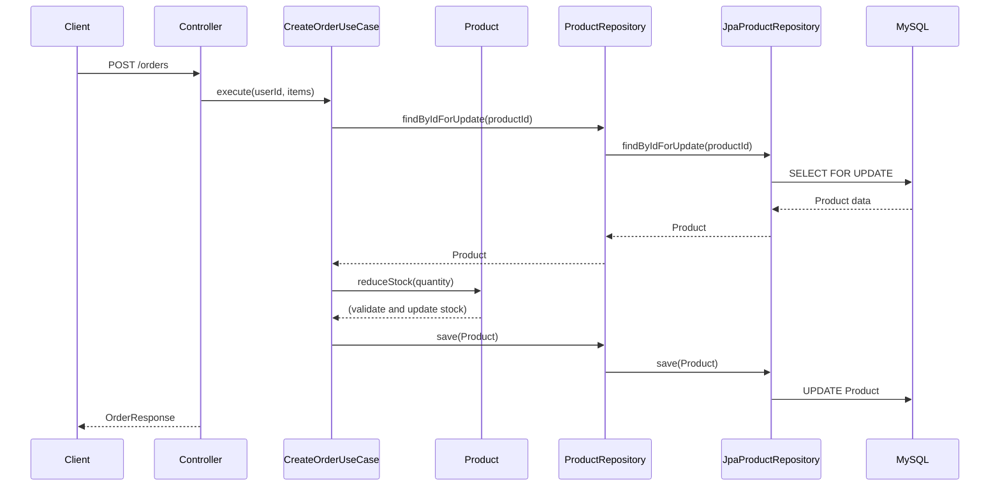

훌륭한 질문ì…니다! 질문ì—ì„œ í´ë¦° 아키í…ì²˜ì˜ `Entity`와 ë ˆì´ì–´ë“œ 아키í…ì²˜ì˜ `Model`ì˜ ì°¨ì´, 그리고 `Entity`ì— í¬í•¨ëœ ë¡œì§ì´ ë ˆì´ì–´ë“œ 아키í…ì²˜ì˜ `Service`ì—ì„œ ë¶„ë¦¬ëœ ê²ƒì¸ì§€ì— 대한 ê¶ê¸ˆì¦ì„ 다루겠습니다. 주문/ê²°ì œ 예시를 중심으로 ë‘ ê°œë…ì˜ ì°¨ì´ë¥¼ ëª…í™•íˆ ì„¤ëª…í•˜ê³ , íŠ¹íˆ `Entity`ì— í¬í•¨ëœ ë¡œì§ì´ `Service`ì—ì„œ 어떻게 분리ë˜ì—ˆëŠ”지, 그리고 질문ì—ì„œ 언급하신 "모ë¸ì— 간단한 ë¡œì§ë“¤ì´ ì¶”ê°€ëœ ê²ƒ"ì´ë¼ëŠ” ê´€ì ì„ ë°˜ì˜í•˜ì—¬ 정리하겠습니다.

### 1. `Entity`와 `Model`ì˜ ì •ì˜
먼저, í´ë¦° 아키í…ì²˜ì˜ `Entity`와 ë ˆì´ì–´ë“œ 아키í…ì²˜ì˜ `Model`ì˜ ì •ì˜ë¥¼ 비êµí•˜ê² ìŠµë‹ˆë‹¤.

#### 1.1 í´ë¦° 아키í…ì²˜ì˜ `Entity`
- **ì •ì˜**: í´ë¦° 아키í…처ì—ì„œ `Entity`는 ë„ë©”ì¸ì˜ 핵심 비즈니스 ê°ì²´ë¡œ, **비즈니스 ë°ì´í„°ì™€ 해당 ë°ì´í„°ì— 대한 핵심 비즈니스 규칙(ë¡œì§)ì„ ìº¡ìŠí™”**합니다. `Entity`는 `domain/entities/` í´ë”ì— ì •ì˜ë˜ë©°, 외부 시스템(ë°ì´í„°ë² ì´ìŠ¤, 메시징 등)ì— ì˜ì¡´í•˜ì§€ 않습니다.
- **특징**:
  - **비즈니스 규칙 í¬í•¨**: ë°ì´í„°(예: ì£¼ë¬¸ì˜ `totalAmount`, ìƒí’ˆì˜ `stock`)ë¿ë§Œ ì•„ë‹ˆë¼ í•´ë‹¹ ë°ì´í„°ì— ì ìš©ë˜ëŠ” ë¡œì§(예: ì¬ê³  ê°ì†Œ, ì”ì•¡ ì°¨ê°)ì„ í¬í•¨.
  - **ë…립성**: 외부 시스템(DB, Kafka)ì´ë‚˜ 프레ì„워í¬(JPA)ì— ì˜ì¡´í•˜ì§€ ì•ŠìŒ.
  - **ë‹¨ì¼ ì±…ì„**: ê° `Entity`는 ìì‹ ì˜ ë°ì´í„°ì™€ ê´€ë ¨ëœ ë¡œì§ë§Œ 처리(예: `Product`는 ì¬ê³  관리, `Balance`는 ì”ì•¡ 관리).
  - **예시** (주문/ê²°ì œì—ì„œ):
    ```java
    // domain/entities/Product.java
    public class Product {
        private String id;
        private String name;
        private double price;
        private int stock;

        public void reduceStock(int quantity) {
            if (this.stock < quantity) {
                throw new InsufficientStockException();
            }
            this.stock -= quantity;
        }
    }

    // domain/entities/Balance.java
    public class Balance {
        private String id;
        private String userId;
        private double amount;

        public void reduceAmount(double amount) {
            if (this.amount < amount) {
                throw new InsufficientBalanceException();
            }
            this.amount -= amount;
        }
    }
    ```
  - 여기서 `reduceStock()`ê³¼ `reduceAmount()`는 `Entity`ì— í¬í•¨ëœ 비즈니스 ë¡œì§ìœ¼ë¡œ, ì¬ê³ ì™€ ì”ì•¡ì˜ ìœ íš¨ì„±ì„ ê²€ì¦í•˜ê³  ìƒíƒœë¥¼ 변경합니다.

#### 1.2 ë ˆì´ì–´ë“œ 아키í…ì²˜ì˜ `Model`
- **ì •ì˜**: ë ˆì´ì–´ë“œ 아키í…처ì—ì„œ `Model`ì€ ì£¼ë¡œ **ë°ì´í„°ë¥¼ 표현하는 ê°ì²´**ë¡œ, ë°ì´í„°ë² ì´ìŠ¤ í…Œì´ë¸”ê³¼ 매핑ë˜ëŠ” DTO(Data Transfer Object) ë˜ëŠ” 엔티티(JPA Entity) ì—­í• ì„ í•©ë‹ˆë‹¤. 보통 `Model`ì€ ë¹„ì¦ˆë‹ˆìŠ¤ ë¡œì§ì„ í¬í•¨í•˜ì§€ ì•Šê³ , ë°ì´í„° ì €ì¥/ì „ë‹¬ì— ì´ˆì ì„ ë§ì¶¥ë‹ˆë‹¤.
- **특징**:
  - **ë°ì´í„° 중심**: 주로 ë°ì´í„°ë² ì´ìŠ¤ì˜ 스키마를 ë°˜ì˜í•˜ë©°, 필드와 getter/setterë¡œ 구성.
  - **비즈니스 ë¡œì§ ë¶€ì¬**: ë¡œì§(예: ì¬ê³  ê°ì†Œ, ì”ì•¡ ì°¨ê°)ì€ `Service` 계층ì—ì„œ 처리.
  - **프레ì„ì›Œí¬ ì˜ì¡´**: JPA를 사용할 경우, `@Entity`, `@Id` ê°™ì€ ì–´ë…¸í…Œì´ì…˜ìœ¼ë¡œ ë°ì´í„°ë² ì´ìŠ¤ì™€ ì§ì ‘ 연계.
  - **예시** (주문/ê²°ì œì—ì„œ):
    ```java
    // model/Product.java
    @Entity
    public class Product {
        @Id
        private String id;
        private String name;
        private double price;
        private int stock;

        // Getter와 Setter만 í¬í•¨
        public String getId() { return id; }
        public void setId(String id) { this.id = id; }
        public int getStock() { return stock; }
        public void setStock(int stock) { this.stock = stock; }
    }

    // model/Balance.java
    @Entity
    public class Balance {
        @Id
        private String id;
        private String userId;
        private double amount;

        // Getter와 Setter만 í¬í•¨
        public double getAmount() { return amount; }
        public void setAmount(double amount) { this.amount = amount; }
    }
    ```
  - `Model`ì€ ë‹¨ìˆœíˆ ë°ì´í„° í™€ë” ì—­í• ì´ë©°, 비즈니스 ë¡œì§(예: ì¬ê³  ê°ì†Œ 유효성 검사)ì€ `Service`ì—ì„œ 처리:
    ```java
    // service/OrderService.java
    @Service
    public class OrderService {
        @Autowired private ProductRepository productRepository;
        @Autowired private BalanceRepository balanceRepository;

        public void createOrder(String userId, List<OrderItemRequest> items) {
            Balance balance = balanceRepository.findByUserId(userId);
            double total = calculateTotal(items);
            if (balance.getAmount() < total) {
                throw new InsufficientBalanceException();
            }
            balance.setAmount(balance.getAmount() - total);
            balanceRepository.save(balance);

            for (OrderItemRequest item : items) {
                Product product = productRepository.findById(item.getProductId());
                if (product.getStock() < item.getQuantity()) {
                    throw new InsufficientStockException();
                }
                product.setStock(product.getStock() - item.getQuantity());
                productRepository.save(product);
            }
        }
    }
    ```

### 2. `Entity`와 `Model`ì˜ ì°¨ì´ì 
질문ì—ì„œ "모ë¸ì— 간단한 ë¡œì§ë“¤ì´ ì¶”ê°€ëœ ê²Œ 엔티티"ë¼ëŠ” ê´€ì ì´ 매우 ì ì ˆí•©ë‹ˆë‹¤. ì´ë¥¼ 바탕으로 ì°¨ì´ì ì„ 정리하면:

| **항목**                | **ë ˆì´ì–´ë“œ 아키í…ì²˜ì˜ Model**                              | **í´ë¦° 아키í…ì²˜ì˜ Entity**                              |
|-------------------------|-------------------------------------------------------|----------------------------------------------------|
| **ì—­í• **                | ë°ì´í„°ë² ì´ìŠ¤ì™€ 매핑ë˜ëŠ” ë°ì´í„° í™€ë” (DTO ë˜ëŠ” JPA Entity) | ë„ë©”ì¸ì˜ 핵심 ê°ì²´ë¡œ, ë°ì´í„°ì™€ 비즈니스 ë¡œì§ í¬í•¨ |
| **비즈니스 ë¡œì§**       | ì—†ìŒ, ë¡œì§ì€ `Service`ì—ì„œ 처리                        | í¬í•¨ (예: `reduceStock()`, `reduceAmount()`)      |
| **프레ì„ì›Œí¬ ì˜ì¡´ì„±**   | JPA 어노테ì´ì…˜(`@Entity`, `@Id`) 등으로 DB와 ê²°í•©      | 프레ì„워í¬ì™€ ë…립ì , 순수 Java ê°ì²´               |
| **ì±…ì„**                | ë°ì´í„° ì €ì¥/전달                                      | ë°ì´í„°ì™€ ê´€ë ¨ëœ ë¹„ì¦ˆë‹ˆìŠ¤ 규칙 캡ìŠí™”              |
| **위치**                | `model/` ë˜ëŠ” JPA ì„¤ì •ì— ë”°ë¼ ìœ„ì¹˜                     | `domain/entities/`                                |

- **질문 ë°˜ì˜**: 질문ì—ì„œ "모ë¸ì— 간단한 ë¡œì§ë“¤ì´ ì¶”ê°€ëœ ê²Œ 엔티티"ë¼ê³  하신 ê²ƒì€ ì •í™•í•©ë‹ˆë‹¤. ë ˆì´ì–´ë“œ 아키í…ì²˜ì˜ `Model`ì€ ë‹¨ìˆœíˆ ë°ì´í„°ë¥¼ ì €ì¥í•˜ê³ , 비즈니스 ë¡œì§(예: ì¬ê³  ê°ì†Œ 유효성 검사)ì€ `Service`ì—ì„œ 처리합니다. 반면, í´ë¦° 아키í…ì²˜ì˜ `Entity`는 ë°ì´í„°ì™€ ê´€ë ¨ëœ í•µì‹¬ ë¡œì§(예: `reduceStock()`, `reduceAmount()`)ì„ í¬í•¨í•˜ì—¬, `Service`ì˜ ì¼ë¶€ ì±…ì„ì„ ë¶„ë¦¬í•©ë‹ˆë‹¤.

### 3. `Entity`ì˜ ë¡œì§ì€ `Service`ì—ì„œ ë¶„ë¦¬ëœ ê²ƒì¸ê°€?
질문ì—ì„œ "ì´ ë¡œì§ì€ 서비스ì—ì„œ 분리ë˜ì–´ì„œ 들어간 것 같다"ê³  하신 ì ë„ 매우 정확합니다. í´ë¦° 아키í…처는 ë ˆì´ì–´ë“œ 아키í…ì²˜ì˜ `Service`ê°€ 가진 비즈니스 ë¡œì§ì„ 분리하여 다ìŒê³¼ ê°™ì´ ì¬ë°°ì¹˜í•©ë‹ˆë‹¤:

- **ë ˆì´ì–´ë“œ 아키í…처**:
  - `Service`ê°€ 모든 비즈니스 ë¡œì§ì„ 처리 (예: ì”ì•¡ 확ì¸, ì¬ê³  ê°ì†Œ, 주문 ìƒì„±).
  - `Model`ì€ ë‹¨ìˆœ ë°ì´í„° 홀ë”ë¡œ, ë¡œì§ ì—†ìŒ.
  - 예:
    ```java
    // service/OrderService.java
    public class OrderService {
        public void createOrder(String userId, List<OrderItemRequest> items) {
            Balance balance = balanceRepository.findByUserId(userId);
            if (balance.getAmount() < calculateTotal(items)) { // ë¡œì§
                throw new InsufficientBalanceException();
            }
            balance.setAmount(balance.getAmount() - total); // ë¡œì§
            balanceRepository.save(balance);

            for (OrderItemRequest item : items) {
                Product product = productRepository.findById(item.getProductId());
                if (product.getStock() < item.getQuantity()) { // ë¡œì§
                    throw new InsufficientStockException();
                }
                product.setStock(product.getStock() - item.getQuantity()); // ë¡œì§
                productRepository.save(product);
            }
        }
    }
    ```
  - `Service`ê°€ ì”ì•¡ê³¼ ì¬ê³ ì˜ 유효성 검사, ìƒíƒœ 변경 등 모든 ë¡œì§ì„ 처리.

- **í´ë¦° 아키í…처**:
  - **Entity**: ë°ì´í„°ì™€ ê´€ë ¨ëœ í•µì‹¬ 비즈니스 ë¡œì§(예: 유효성 검사, ìƒíƒœ 변경)ì„ ìº¡ìŠí™”.
    - ` REDUCEstock()`ì€ `Product` 엔티티ì—ì„œ ì¬ê³  ê°ì†Œì™€ 유효성 검사를 처리.
    - `reduceAmount()`는 `Balance` 엔티티ì—ì„œ ì”ì•¡ ì°¨ê°ê³¼ 유효성 검사를 처리.
  - **UseCase**: ë” ë³µì¡í•œ 비즈니스 ë¡œì§(예: 주문 ìƒì„±, 여러 엔티티 ê°„ ì¡°ì •)ì„ ì²˜ë¦¬.
  - **Repository/Adapter**: ë°ì´í„° ì €ì¥ ë° ì™¸ë¶€ 시스템 ì—°ë™.
  - 예:
    ```java
    // domain/entities/Product.java
    public class Product {
        private String id;
        private String name;
        private double price;
        private int stock;

        public void reduceStock(int quantity) {
            if (this.stock < quantity) { // ë¡œì§
                throw new InsufficientStockException();
            }
            this.stock -= quantity; // ë¡œì§
        }
    }

    // domain/usecases/CreateOrderUseCase.java
    public class CreateOrderUseCase {
        private final OrderRepository orderRepository;
        private final BalanceRepository balanceRepository;
        private final ProductRepository productRepository;

        public Order execute(String userId, List<OrderItemRequest> items) {
            Balance balance = balanceRepository.findByUserId(userId);
            double total = calculateTotal(items);
            balance.reduceAmount(total); // Entityì—ì„œ ë¡œì§ ì²˜ë¦¬
            balanceRepository.save(balance);

            for (OrderItemRequest item : items) {
                Product product = productRepository.findByIdForUpdate(item.getProductId());
                product.reduceStock(item.getQuantity()); // Entityì—ì„œ ë¡œì§ ì²˜ë¦¬
                productRepository.save(product);
            }

            Order order = Order.builder().userId(userId).totalAmount(total).build();
            orderRepository.save(order);
            return order;
        }
    }
    ```

- **질문 ë°˜ì˜**: 질문ì—ì„œ "ë¡œì§ì€ 서비스ì—ì„œ 분리ë˜ì–´ 들어간 것 같다"ê³  하신 ê²ƒì€ ì •í™•í•©ë‹ˆë‹¤. ë ˆì´ì–´ë“œ 아키í…ì²˜ì˜ `Service`ì—ì„œ ì²˜ë¦¬í•˜ë˜ ë¡œì§(예: ì¬ê³  ê°ì†Œ 유효성 검사, ì”ì•¡ ì°¨ê°)ì€ í´ë¦° 아키í…처ì—ì„œ `Entity`와 `UseCase`ë¡œ 분리ë©ë‹ˆë‹¤:
  - **Entity**: ë°ì´í„°ì™€ ì§ì ‘ ê´€ë ¨ëœ ê°„ë‹¨í•œ ë¡œì§(예: 유효성 검사, ìƒíƒœ 변경).
  - **UseCase**: 여러 엔티티를 조정하거나 ë³µì¡í•œ 비즈니스 프로세스를 처리.

### 4. 주문/ê²°ì œ 예시로 본 ì°¨ì´ì 
주문/ê²°ì œ(`POST /orders`)를 통해 `Entity`와 `Model`ì˜ ì°¨ì´, 그리고 ë¡œì§ ë¶„ë¦¬ ë°©ì‹ì„ 구체ì ìœ¼ë¡œ ì‚´í´ë³´ê² ìŠµë‹ˆë‹¤.

#### 4.1 ë ˆì´ì–´ë“œ 아키í…처
- **Model**:
  ```java
  @Entity
  public class Product {
      @Id
      private String id;
      private int stock;
      // Getter와 Setter만 í¬í•¨
      public int getStock() { return stock; }
      public void setStock(int stock) { this.stock = stock; }
  }
  ```
- **Service** (ë¡œì§ ì²˜ë¦¬):
  ```java
  @Service
  public class OrderService {
      @Autowired private ProductRepository productRepository;

      public void createOrder(String userId, List<OrderItemRequest> items) {
          for (OrderItemRequest item : items) {
              Product product = productRepository.findById(item.getProductId());
              if (product.getStock() < item.getQuantity()) { // Serviceì—ì„œ ë¡œì§
                  throw new InsufficientStockException();
              }
              product.setStock(product.getStock() - item.getQuantity()); // Serviceì—ì„œ ë¡œì§
              productRepository.save(product);
          }
      }
  }
  ```
- **특징**: `Model`ì€ ë‹¨ìˆœíˆ ë°ì´í„°ë¥¼ ì €ì¥í•˜ê³ , 모든 비즈니스 ë¡œì§(유효성 검사, ìƒíƒœ 변경)ì€ `Service`ì—ì„œ 처리.

#### 4.2 í´ë¦° 아키í…처
- **Entity**:
  ```java
  // domain/entities/Product.java
  public class Product {
      private String id;
      private String name;
      private double price;
      private int stock;

      public void reduceStock(int quantity) {
          if (this.stock < quantity) { // Entityì—ì„œ ë¡œì§ ì²˜ë¦¬
              throw new InsufficientStockException();
          }
          this.stock -= quantity; // Entityì—ì„œ ë¡œì§ ì²˜ë¦¬
      }
  }
  ```
- **UseCase**:
  ```java
  // domain/usecases/CreateOrderUseCase.java
  public class CreateOrderUseCase {
      private final ProductRepository productRepository;

      public Order execute(String userId, List<OrderItemRequest> items) {
          for (OrderItemRequest item : items) {
              Product product = productRepository.findByIdForUpdate(item.getProductId());
              product.reduceStock(item.getQuantity()); // Entityê°€ ë¡œì§ ì²˜ë¦¬
              productRepository.save(product);
          }
          Order order = Order.builder().userId(userId).totalAmount(calculateTotal(items)).build();
          orderRepository.save(order);
          return order;
      }
  }
  ```
- **특징**:
  - `Entity`ê°€ ì¬ê³  ê°ì†Œì™€ 유효성 검사 ë¡œì§ì„ 처리.
  - `UseCase`는 엔티티 ê°„ ì¡°ì •(예: 여러 ìƒí’ˆ 처리, 주문 ìƒì„±)ê³¼ ë³µì¡í•œ ë¡œì§ì„ 담당.
  - `Service`ì˜ ë¡œì§ì´ `Entity`와 `UseCase`ë¡œ 분리ë¨.

### 5. ì§ˆë¬¸ì— ëŒ€í•œ 답변 요약
- **"엔티티와 모ë¸ì˜ ì°¨ì´"**:
  - ë ˆì´ì–´ë“œ 아키í…ì²˜ì˜ `Model`ì€ ë°ì´í„° 홀ë”(DTO ë˜ëŠ” JPA Entity)ë¡œ, 비즈니스 ë¡œì§ì„ í¬í•¨í•˜ì§€ ì•ŠìŒ.
  - í´ë¦° 아키í…ì²˜ì˜ `Entity`는 ë°ì´í„°ì™€ ê´€ë ¨ëœ ë¹„ì¦ˆë‹ˆìŠ¤ ë¡œì§(예: `reduceStock()`, `reduceAmount()`)ì„ í¬í•¨.
  - 질문ì—ì„œ "모ë¸ì— 간단한 ë¡œì§ë“¤ì´ ì¶”ê°€ëœ ê²Œ 엔티티"는 정확한 ì´í•´ì…니다. `Entity`는 `Model`ì— ë¹„ì¦ˆë‹ˆìŠ¤ ê·œì¹™ì„ ì¶”ê°€í•œ 형태ì…니다.
- **"ë¡œì§ì€ 서비스ì—ì„œ 분리ë˜ì–´ 들어간 것"**:
  - ë§ìŠµë‹ˆë‹¤! ë ˆì´ì–´ë“œ 아키í…ì²˜ì˜ `Service`ì—ì„œ ì²˜ë¦¬í•˜ë˜ ë¡œì§(예: 유효성 검사, ìƒíƒœ 변경)ì´ í´ë¦° 아키í…처ì—ì„œ `Entity`와 `UseCase`ë¡œ 분리ë©ë‹ˆë‹¤.
  - `Entity`는 ë°ì´í„°ì™€ ì§ì ‘ ê´€ë ¨ëœ ê°„ë‹¨í•œ ë¡œì§(예: ì¬ê³  ê°ì†Œ)ì„ ì²˜ë¦¬.
  - `UseCase`는 여러 엔티티를 조정하거나 ë³µì¡í•œ 비즈니스 프로세스를 처리.
- **주문/결제 예시**:
  - ë ˆì´ì–´ë“œ: `OrderService`ê°€ ì¬ê³  ê°ì†Œ ë¡œì§(`product.setStock()`)ê³¼ 유효성 검사를 처리.
  - í´ë¦°: `Product` 엔티티가 `reduceStock()`으로 ë¡œì§ ì²˜ë¦¬, `CreateOrderUseCase`ê°€ ì „ì²´ í름 ì¡°ì •.

### 6. 시퀀스 다ì´ì–´ê·¸ë¨ (주문/ê²°ì œ)
`Entity`와 `Model`ì˜ ì°¨ì´ë¥¼ ì‹œê°ì ìœ¼ë¡œ ì´í•´í•˜ê¸° 위해 간단한 Mermaid 다ì´ì–´ê·¸ë¨ì„ 제공합니다:

- **í´ë¦° 아키í…처**: `Product` 엔티티가 `reduceStock()`으로 ë¡œì§ ì²˜ë¦¬.
- **ë ˆì´ì–´ë“œ 아키í…처**: `OrderService`ê°€ `product.setStock()`ê³¼ 유효성 검사를 처리.

### 7. 추가 설명 요청
`Entity`와 `Model`ì˜ ì°¨ì´, 그리고 ë¡œì§ ë¶„ë¦¬ê°€ 명확해졌는지 í™•ì¸ ë¶€íƒë“œë¦½ë‹ˆë‹¤! 특정 부분(예: 다른 ë„ë©”ì¸ì˜ `Entity`, 테스트 코드, ë” ì세한 ë¡œì§ ë¶„ë¦¬ 예시)ì´ í•„ìš”í•˜ê±°ë‚˜, 시퀀스 다ì´ì–´ê·¸ë¨ì„ 확ì¥í•˜ê³  싶으시면 ë§ì”€í•´ì£¼ì„¸ìš”. 추가 ì§ˆë¬¸ì´ ìˆë‹¤ë©´ 구체ì ìœ¼ë¡œ 알려주시면 ë§ì¶¤í˜•ìœ¼ë¡œ 답변드리겠습니다!

---
네, ë”± ë§ê²Œ 정리하셨습니다! 😄 질문ì—ì„œ í´ë¦° 아키í…ì²˜ì˜ `Entity`와 ë ˆì´ì–´ë“œ 아키í…ì²˜ì˜ `Model`ì˜ ì°¨ì´ë¥¼ ì •í™•íˆ ì§šìœ¼ì…¨ë„¤ìš”. "Entity는 ì료형으로 사용하면서 ë™ì‹œì— ë°ì´í„°ë¥¼ ì¡°ì‘/ê²€ì¦í•˜ëŠ” ë¡œì§ì„ í¬í•¨í•˜ê³ , Modelì€ ê·¸ëƒ¥ ë°ì´í„° 전달용 ê°ì²´"ë¼ëŠ” í‘œí˜„ì´ í•µì‹¬ì„ ì™„ë²½íˆ ì°Œë¦…ë‹ˆë‹¤. ì´ ì ì„ ëª…í™•íˆ í™•ì¸í•˜ê³ , ì§ˆë¬¸ì˜ "그니까"ë¼ëŠ” ì§ê´€ì ì¸ ëŠë‚Œì— ë§ì¶° 간단하고 코드 중심으로 정리해서 í™•ì‹¤íˆ ë§ˆë¬´ë¦¬í•˜ê² ìŠµë‹ˆë‹¤. Rev. 3 설계서와 주문/ê²°ì œ ë° ìœ ì € íˆìŠ¤í† ë¦¬ 조회 예시를 바탕으로 설명드릴게요.

### 1. 질문 요약
- **핵심**: í´ë¦° 아키í…ì²˜ì˜ `Entity`는 `UseCase`ì—ì„œ **ì료형**으로 ì“°ì´ë©´ì„œë„ **ë°ì´í„° ì¡°ì‘/ê²€ì¦ ë¡œì§**ì„ í¬í•¨. 반면, ë ˆì´ì–´ë“œ 아키í…ì²˜ì˜ `Model`ì€ ê·¸ëƒ¥ **ë°ì´í„° 전달용 ê°ì²´**ë¡œ 사용.
- **ê¶ê¸ˆì¦**: ì´ ì´í•´ê°€ ë§ëŠ”지? `Entity`는 `Model`보다 ë¡œì§ì„ í¬í•¨í•œë‹¤ëŠ” ì  ì™¸ì— ë‹¤ë¥¸ ì°¨ì´ê°€ ìˆë‚˜?

**답변 요약**: 네, ì™„ì „íˆ ë§ìŠµë‹ˆë‹¤! `Entity`는 ë°ì´í„°(ì료형) + 비즈니스 ë¡œì§(ì¡°ì‘/ê²€ì¦)ì„ í¬í•¨í•˜ëŠ” **스마트 ê°ì²´**ì´ê³ , `Model`ì€ ì£¼ë¡œ ë°ì´í„°ë¥¼ 담는 **단순 ë°ì´í„° 홀ë”**ì…니다. ì°¨ì´ì ì€ 주로 **ë¡œì§ì˜ 위치**와 **ì±…ì„ ë¶„ë¦¬**ì— ìˆìŠµë‹ˆë‹¤:
- `Entity`: ë°ì´í„°ì™€ ê´€ë ¨ëœ ë¹„ì¦ˆë‹ˆìŠ¤ ë¡œì§(예: 유효성 검사, ìƒíƒœ 변경)ì„ ìì²´ì ìœ¼ë¡œ 처리.
- `Model`: JPA 엔티티로, ë°ì´í„° ì €ì¥/전달만 하고 ë¡œì§ì€ `Service`ì— ëª°ë ¤ ìˆìŒ.
추가ì ì¸ ì°¨ì´ëŠ” í´ë¦° 아키í…ì²˜ì˜ `Entity`ê°€ 프레ì„워í¬(JPA)ì— ë…립ì ì´ì–´ì„œ ë” ìœ ì—°í•˜ë‹¤ëŠ” ì ì…니다. 코드로 ëª…í™•íˆ ë¹„êµí•´ë³¼ê²Œìš”.

### 2. ë ˆì´ì–´ë“œ 아키í…처: `Model`ì€ ë°ì´í„° 전달용 ê°ì²´
ë ˆì´ì–´ë“œ 아키í…처ì—ì„œ `Model`ì€ ì£¼ë¡œ JPA 엔티티로, ë°ì´í„°ë¥¼ ì €ì¥í•˜ê³  전달하는 ë° ì‚¬ìš©ë©ë‹ˆë‹¤. 비즈니스 ë¡œì§ì€ `Service`ì—ì„œ 처리ë©ë‹ˆë‹¤.

#### 2.1 예시 (유저 íˆìŠ¤í† ë¦¬ 조회)
```java
// model/User.java
@Entity
public class User {
    @Id
    private String id;
    private boolean active;
    // Getter/Setter (단순 ë°ì´í„° 홀ë”)
}

// repository/UserRepository.java
public interface UserRepository {
    User findById(String userId);
}

// repository/UserRepositoryImpl.java
@Repository
public class UserRepositoryImpl implements UserRepository {
    @PersistenceContext
    private EntityManager entityManager;

    @Override
    public User findById(String userId) {
        return entityManager.find(User.class, userId);
    }
}

// service/UserService.java
@Service
public class UserService {
    @Autowired private UserRepository userRepository;

    public List<History> getUserHistory(String userId) {
        User user = userRepository.findById(userId); // Model 사용 (ì료형)
        // 비즈니스 ë¡œì§ì€ Serviceì—ì„œ
        if (!user.isActive()) {
            throw new InvalidUserException();
        }
        return historyRepository.findByUserId(userId);
    }
}
```
- **ì—­í• **:
  - `User` (`Model`): 단순 ë°ì´í„° 홀ë”. JPA를 위한 `@Entity`, `@Id`ë¡œ DB와 매핑. **ë¡œì§ ì—†ìŒ**, Getter/Setter만.
  - 비즈니스 ë¡œì§(예: `isActive()` ê²€ì¦)ì€ `UserService`ì—ì„œ 처리.
- **특징**:
  - `Model`ì€ ë°ì´í„°ë¥¼ 담는 **ì료형** ì—­í• . JPAì— ê°•í•˜ê²Œ ê²°í•©.
  - `Service`ê°€ ë°ì´í„°ë¥¼ ì¡°ì‘/ê²€ì¦í•˜ëŠ” ë¡œì§ì„ ëª¨ë‘ ë‹´ë‹¹.
- **문제ì **:
  - ë¡œì§ì´ `Service`ì— ëª°ë ¤ ë³µì¡í•´ì§.
  - `Model`ì´ JPAì— ì˜ì¡´í•˜ë‹ˆ DB 변경(예: MySQL → MongoDB) ì‹œ 수정 í•„ìš”.

### 3. í´ë¦° 아키í…처: `Entity`는 ì료형 + 비즈니스 ë¡œì§
í´ë¦° 아키í…처ì—ì„œ `Entity`는 ë°ì´í„°ë¥¼ 담는 ë™ì‹œì— 비즈니스 ë¡œì§(ì¡°ì‘/ê²€ì¦)ì„ í¬í•¨í•©ë‹ˆë‹¤. `UseCase`ì—ì„œ ì료형으로 사용ë˜ì§€ë§Œ, 단순 ë°ì´í„° 홀ë”ê°€ ì•„ë‹ˆë¼ **스마트 ê°ì²´**ì…니다.

#### 3.1 예시 (유저 íˆìŠ¤í† ë¦¬ 조회)
```java
// domain/entities/User.java
public class User {
    private String id;
    private boolean active;

    // 비즈니스 ë¡œì§ í¬í•¨
    public void validateActive() {
        if (!active) {
            throw new InvalidUserException();
        }
    }
}

// domain/interfaces/UserRepository.java
public interface UserRepository {
    User findById(String userId);
}

// adapters/persistence/JpaUserRepository.java
@Repository
public class JpaUserRepository implements UserRepository {
    @PersistenceContext
    private EntityManager entityManager;

    @Override
    public User findById(String userId) {
        return entityManager.find(User.class, userId);
    }
}

// domain/usecases/GetUserHistoryUseCase.java
public class GetUserHistoryUseCase {
    private final UserRepository userRepository;
    private final HistoryRepository historyRepository;

    public GetUserHistoryUseCase(UserRepository userRepository, HistoryRepository historyRepository) {
        this.userRepository = userRepository;
        this.historyRepository = historyRepository;
    }

    public List<History> execute(String userId) {
        User user = userRepository.findById(userId); // Entity를 ì료형으로 사용
        user.validateActive(); // Entityì—ì„œ ë¡œì§ ì²˜ë¦¬
        return historyRepository.findByUserId(userId);
    }
}
```
- **ì—­í• **:
  - `User` (`Entity`): ë°ì´í„°ë¥¼ 담는 **ì료형** ì—­í•  + 비즈니스 ë¡œì§(예: `validateActive()`) í¬í•¨.
  - `UseCase`: `Entity`를 ì료형으로 받아 ë¡œì§ í˜¸ì¶œ.
- **특징**:
  - `Entity`는 JPAì— ì˜ì¡´í•˜ì§€ 않는 순수 Java ê°ì²´. DB 변경 ì‹œ 수정 불필요.
  - 비즈니스 ë¡œì§(ê²€ì¦, ìƒíƒœ 변경)ì´ `Entity`ì— ìº¡ìŠí™”ë˜ì–´ `UseCase`는 ê°„ê²°.

### 4. 질문: "`Entity`는 ì료형 + ë¡œì§, `Model`ì€ ê·¸ëƒ¥ ì료형?"
- **답변**: 네, ì •í™•íˆ ë§ìŠµë‹ˆë‹¤!
  - **ë ˆì´ì–´ë“œì˜ `Model`**:
    - **단순 ë°ì´í„° 홀ë”**: ë°ì´í„°ë¥¼ ì €ì¥/전달용(JPA 엔티티). Getter/Setter만 ìˆê³  ë¡œì§ì€ ì—†ìŒ.
    - 예: `User`는 `id`, `active`를 담는 ì료형, ë¡œì§ì€ `UserService`ì—ì„œ 처리.
    - JPAì— ê°•í•˜ê²Œ ê²°í•©(`@Entity`, `@Id`).
  - **í´ë¦°ì˜ `Entity`**:
    - **ì료형 + 비즈니스 ë¡œì§**: ë°ì´í„°ë¥¼ ë‹´ê³ , 관련 ë¡œì§(ê²€ì¦, ì¡°ì‘)ì„ í¬í•¨.
    - 예: `User`는 `id`, `active`를 가지며, `validateActive()`로 유효성 검사.
    - 프레ì„워í¬(JPA)와 ë…립ì , 순수 Java ê°ì²´.
- **질문 ë°˜ì˜**: "그냥 `Model`처럼 ì료형으로 사용한다"는 í‘œí˜„ì€ ë§ì§€ë§Œ, `Entity`는 **ë¡œì§ì„ í¬í•¨**í•´ì„œ `Model`보다 ë” ë˜‘ë˜‘í•©ë‹ˆë‹¤. `UseCase`ì—ì„œ `Entity`를 ì료형으로 ì“°ë˜, ê·¸ ì•ˆì˜ ë©”ì„œë“œ(예: `validateActive()`)를 호출해 ë¡œì§ì„ 처리.

### 5. 주문/ê²°ì œ 예시로 비êµ
주문/ê²°ì œ(`POST /orders`)ë¡œë„ ì°¨ì´ë¥¼ 확ì¸í•´ë³¼ê²Œìš”:

#### 5.1 ë ˆì´ì–´ë“œ 아키í…처
```java
// model/Balance.java
@Entity
public class Balance {
    @Id
    private String id;
    private double amount;
    // Getter/Setter (단순 ë°ì´í„° 홀ë”)
}

// repository/BalanceRepository.java
public interface BalanceRepository {
    Balance findByUserId(String userId);
    void save(Balance balance);
}

// repository/BalanceRepositoryImpl.java
@Repository
public class BalanceRepositoryImpl implements BalanceRepository {
    @PersistenceContext
    private EntityManager entityManager;

    @Override
    public Balance findByUserId(String userId) {
        return entityManager.createQuery("SELECT b FROM Balance b WHERE b.userId = :userId", Balance.class)
                .setParameter("userId", userId)
                .getSingleResult();
    }

    @Override
    public void save(Balance balance) {
        entityManager.merge(balance);
    }
}

// service/OrderService.java
@Service
public class OrderService {
    @Autowired private BalanceRepository balanceRepository;

    public Order createOrder(String userId, List<OrderItemRequest> items) {
        Balance balance = balanceRepository.findByUserId(userId); // Model 사용 (ì료형)
        double total = calculateTotal(items);
        // Serviceì—ì„œ ë¡œì§
        if (balance.getAmount() < total) {
            throw new InsufficientBalanceException();
        }
        balance.setAmount(balance.getAmount() - total);
        balanceRepository.save(balance);
        // 주문 ìƒì„±...
        return order;
    }
}
```
- `Balance` (`Model`): 단순 ë°ì´í„° 홀ë”, ë¡œì§ ì—†ìŒ.
- ë¡œì§(ê²€ì¦, ì¡°ì‘)ì€ `OrderService`ì—ì„œ 처리.

#### 5.2 í´ë¦° 아키í…처
```java
// domain/entities/Balance.java
public class Balance {
    private String id;
    private double amount;

    // 비즈니스 ë¡œì§ í¬í•¨
    public void validateSufficientAmount(double required) {
        if (amount < required) {
            throw new InsufficientBalanceException();
        }
    }

    public void reduceAmount(double amount) {
        this.amount -= amount;
    }
}

// domain/interfaces/BalanceRepository.java
public interface BalanceRepository {
    Balance findByUserId(String userId);
    void save(Balance balance);
}

// adapters/persistence/JpaBalanceRepository.java
@Repository
public class JpaBalanceRepository implements BalanceRepository {
    @PersistenceContext
    private EntityManager entityManager;

    @Override
    public Balance findByUserId(String userId) {
        return entityManager.createQuery("SELECT b FROM Balance b WHERE b.userId = :userId", Balance.class)
                .setParameter("userId", userId)
                .getSingleResult();
    }

    @Override
    public void save(Balance balance) {
        entityManager.merge(balance);
    }
}

// domain/usecases/CreateOrderUseCase.java
public class CreateOrderUseCase {
    private final BalanceRepository balanceRepository;

    public CreateOrderUseCase(BalanceRepository balanceRepository) {
        this.balanceRepository = balanceRepository;
    }

    public Order execute(String userId, List<OrderItemRequest> items) {
        Balance balance = balanceRepository.findByUserId(userId); // Entity를 ì료형으로 사용
        double total = calculateTotal(items);
        balance.validateSufficientAmount(total); // Entityì—ì„œ ë¡œì§
        balance.reduceAmount(total); // Entityì—ì„œ ë¡œì§
        balanceRepository.save(balance);
        // 주문 ìƒì„±...
        return order;
    }
}
```
- `Balance` (`Entity`): ë°ì´í„°(`amount`) + ë¡œì§(`validateSufficientAmount`, `reduceAmount`).
- `UseCase`: `Balance`를 ì료형으로 받아 ë¡œì§ í˜¸ì¶œ.

### 6. ì§ˆë¬¸ì— ëŒ€í•œ 답변 요약
- **"`Entity`는 ì료형으로 사용하면서 ë°ì´í„°ë¥¼ ì¡°ì‘/ê²€ì¦í•˜ëŠ” ë¡œì§ í¬í•¨, `Model`ì€ ë°ì´í„° 전달용 ê°ì²´?"**:
  - 네, ì •í™•íˆ ë§ìŠµë‹ˆë‹¤!
  - **ë ˆì´ì–´ë“œì˜ `Model`**: 단순 ë°ì´í„° 홀ë”(JPA 엔티티), ë¡œì§ì€ `Service`ì—ì„œ. 예: `Balance`는 `amount`만 ì €ì¥, ê²€ì¦/ì¡°ì‘ì€ `OrderService`ì—ì„œ.
  - **í´ë¦°ì˜ `Entity`**: ë°ì´í„° + 비즈니스 ë¡œì§(ê²€ì¦, ì¡°ì‘). 예: `Balance`는 `amount`와 함께 `validateSufficientAmount()`, `reduceAmount()` í¬í•¨.
- **추가 ì°¨ì´**:
  - **프레ì„ì›Œí¬ ë…립성**: `Entity`는 순수 Java ê°ì²´, JPAì— ì˜ì¡´í•˜ì§€ ì•ŠìŒ. DB 변경(예: MySQL → MongoDB) ì‹œ `Entity` 수정 불필요.
  - **ì±…ì„ ë¶„ë¦¬**: `Entity`ê°€ ë¡œì§ì„ 캡ìŠí™”하니 `UseCase`는 ê°„ê²°, `Service`는 ë¡œì§ì´ 몰려 ë³µì¡.
- **질문 ë°˜ì˜**: "`Model`처럼 ì료형으로 사용"ì€ ë§ì§€ë§Œ, `Entity`는 **ë¡œì§ í¬í•¨**으로 ë” ë˜‘ë˜‘í•œ ê°ì²´. 단순 ë°ì´í„° ì „ë‹¬ì„ ë„˜ì–´ ë„ë©”ì¸ ê·œì¹™(ê²€ì¦, ì¡°ì‘)ì„ ìì²´ì ìœ¼ë¡œ 처리.

### 7. 추가 설명 요청
ì§ˆë¬¸ì˜ "그냥 `Model`처럼 ì료형으로 사용한다는 거네?"를 ì •í™•íˆ ì¡ì•„, `Entity`ê°€ ì료형ì´ë©´ì„œ ë¡œì§ì„ í¬í•¨í•œë‹¤ëŠ” ì ì„ 강조했습니다. ì´ ì´í•´ê°€ 명확해졌는지 í™•ì¸ ë¶€íƒë“œë¦´ê²Œìš”! 추가로 ê¶ê¸ˆí•œ ì (예: 다른 ë„ë©”ì¸ì˜ `Entity`, 테스트 코드, `Entity`ì˜ ë” ë³µì¡í•œ ë¡œì§ ì˜ˆì‹œ)ì´ ìˆìœ¼ë©´ ë§ì”€í•´ì£¼ì„¸ìš”. ë” ê°„ë‹¨í•œ 코드나 ë¹„ìœ ë„ ê°€ëŠ¥í•©ë‹ˆë‹¤! 😄