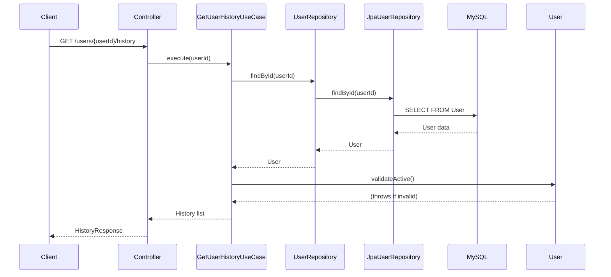

---
aliases:
  - Repository는 똑같은거 아냐?
---
좋은 질문입니다! 질문에서 클린 아키텍처의 `Repository`의 역할과 레이어드 아키텍처의 `Repository`와의 차이점, 특히 "별로 달라진 게 없어 보인다"는 점에 대해 궁금하신 것 같습니다. 클린 아키텍처와 레이어드 아키텍처에서의 `Repository`를 비교하며, 역할과 차이점을 주문/결제 및 유저 히스토리 조회 예시를 통해 명확히 설명드리겠습니다. 또한, 질문에서 언급한 "달라진 게 없어 보인다"는 관점을 반영해 차이점을 강조하고, 클린 아키텍처의 설계 철학을 중심으로 답변하겠습니다.

### 1. 클린 아키텍처에서 `Repository`의 역할
클린 아키텍처에서 `Repository`는 **도메인 계층에서 데이터 접근을 추상화**하는 인터페이스로, 도메인 로직(`UseCase`, `Entity`)과 외부 데이터 소스(DB, 캐시, 외부 API 등)를 분리하는 역할을 합니다. Rev. 3 설계서 기준으로, `Repository`는 `domain/interfaces/` 폴더에 정의되며, 외부 시스템의 세부 구현을 캡슐화한 `Adapter`가 이를 구현합니다.

#### 1.1 주요 역할
- **데이터 접근 추상화**:
  - `UseCase`가 데이터를 조회하거나 저장할 때, 구체적인 저장소(예: MySQL, MongoDB)나 기술(JPA, JDBC)을 몰라도 되도록 인터페이스를 제공.
  - 예: `UserRepository.findById(userId)`는 `User` 엔티티를 반환하지만, 데이터가 MySQL에서 오는지 Redis에서 오는지 `UseCase`는 신경 쓰지 않음.
- **의존성 역전(DIP)**:
  - 도메인 계층이 외부 시스템에 의존하지 않도록, `Repository` 인터페이스는 도메인 계층에 정의되고, `Adapter`가 이를 구현.
  - 이는 외부 시스템 변경(예: MySQL → PostgreSQL) 시 도메인 로직 변경 없이 `Adapter`만 교체 가능하게 함.
- **비즈니스 로직과의 분리**:
  - `Repository`는 데이터 조회/저장만 담당하며, 비즈니스 로직(예: 유효성 검사, 변환)은 `Entity` 또는 `UseCase`에서 처리.
- **예시** (유저 히스토리 조회):
  ```java
  // domain/interfaces/UserRepository.java
  public interface UserRepository {
      User findById(String userId);
  }

  // domain/interfaces/HistoryRepository.java
  public interface HistoryRepository {
      List<History> findByUserId(String userId);
  }
  ```
- **구현** (Adapter):
  ```java
  // adapters/persistence/JpaUserRepository.java
  @Repository
  public class JpaUserRepository implements UserRepository {
      @PersistenceContext
      private EntityManager entityManager;

      @Override
      public User findById(String userId) {
          return entityManager.find(User.class, userId);
      }
  }
  ```

### 2. 레이어드 아키텍처에서 `Repository`의 역할
레이어드 아키텍처에서도 `Repository`는 데이터 접근을 담당하지만, 설계 철학과 구현 방식에서 클린 아키텍처와 차이가 있습니다.

#### 2.1 주요 역할
- **데이터 접근**:
  - `Service`가 데이터베이스에서 데이터를 조회/저장하기 위해 `Repository`를 호출.
  - 보통 JPA의 `@Repository`를 사용해 데이터베이스와 직접 연계.
- **프레임워크 결합**:
  - Spring Data JPA의 `JpaRepository`를 확장하거나, 직접 쿼리를 작성해 데이터베이스와 강하게 결합.
  - 예: `UserRepository extends JpaRepository<User, String>`.
- **비즈니스 로직 혼재 가능**:
  - `Service`가 비즈니스 로직을 주로 처리하지만, 복잡한 쿼리나 데이터 가공 로직이 `Repository`에 포함될 수 있음.
- **예시** (유저 �스토리 조회):
  ```java
  // repository/UserRepository.java
  @Repository
  public interface UserRepository extends JpaRepository<User, String> {
      User findById(String userId);
  }

  // service/UserService.java
  @Service
  public class UserService {
      @Autowired private UserRepository userRepository;
      @Autowired private HistoryRepository historyRepository;

      public List<History> getUserHistory(String userId) {
          User user = userRepository.findById(userId);
          if (!user.isActive()) {
              throw new InvalidUserException();
          }
          return historyRepository.findByUserId(userId);
      }
  }
  ```

### 3. 클린 아키텍처 vs 레이어드 아키텍처의 `Repository` 차이점
질문에서 "별로 달라진 게 없어 보인다"고 하셨는데, 겉보기에는 `Repository`가 데이터를 조회/저장하는 역할로 비슷해 보이지만, 클린 아키텍처는 설계 철학과 책임 분리에서 중요한 차이가 있습니다. 이를 비교하면:

| **항목**                | **레이어드 아키텍처의 Repository**                     | **클린 아키텍처의 Repository**                        |
|-------------------------|----------------------------------------------------|--------------------------------------------------|
| **위치**                | `repository/` 폴더, 프레임워크와 결합              | `domain/interfaces/`, 도메인 계층에 정의         |
| **정의**                | JPA 인터페이스(`JpaRepository`) 또는 구현체        | 순수 인터페이스, 구현체는 `Adapter`에 위임       |
| **프레임워크 의존성**   | Spring Data JPA, Hibernate 등에 강하게 결합        | 프레임워크 독립적, `Adapter`가 기술적 세부사항 처리 |
| **책임**                | 데이터 조회/저장, 때로는 쿼리 로직 포함            | 데이터 조회/저장만, 로직은 `Entity`/`UseCase`로 분리 |
| **의존성 방향**         | `Service`가 `Repository`에 의존                   | `UseCase`가 `Repository` 인터페이스에 의존, `Adapter`가 구현 |
| **테스트 용이성**       | DB 의존성으로 Mocking 복잡                        | 인터페이스 기반, Mocking 쉬움                    |
| **변경 유연성**         | DB 변경 시 `Repository`와 `Service` 수정 필요      | DB 변경 시 `Adapter`만 수정                     |

- **질문 반영**: "별로 달라진 게 없어 보인다"는 느낌은 `Repository`가 데이터 조회/저장 역할을 한다는 점에서 비슷해 보이기 때문입니다. 하지만 클린 아키텍처에서는:
  - `Repository`가 **도메인 계층의 인터페이스**로 정의되어 프레임워크와 독립적.
  - 구현은 `Adapter`로 분리되어 의존성 역전(DIP)을 준수.
  - 비즈니스 로직이 `Entity`와 `UseCase`로 분리되어 `Repository`는 단순 데이터 접근에 집중.

### 4. 유저 �스토리 조회 예시로 비교
질문에서 언급한 유저 히스토리 조회(`GET /users/{userId}/history`)를 통해 차이점을 구체적으로 살펴보겠습니다.

#### 4.1 레이어드 아키텍처
```java
// model/User.java
@Entity
public class User {
    @Id
    private String id;
    private boolean active;
    // Getter/Setter
}

// repository/UserRepository.java
@Repository
public interface UserRepository extends JpaRepository<User, String> {
    User findById(String userId);
}

// repository/HistoryRepository.java
@Repository
public interface HistoryRepository extends JpaRepository<History, String> {
    List<History> findByUserId(String userId);
}

// service/UserService.java
@Service
public class UserService {
    @Autowired private UserRepository userRepository;
    @Autowired private HistoryRepository historyRepository;

    public List<History> getUserHistory(String userId) {
        User user = userRepository.findById(userId); // JPA Repository 호출
        if (!user.isActive()) { // Service에서 로직
            throw new InvalidUserException();
        }
        return historyRepository.findByUserId(userId); // JPA Repository 호출
    }
}
```
- **특징**:
  - `UserRepository`는 Spring Data JPA의 `JpaRepository`를 확장, DB와 강하게 결합.
  - `Service`가 `Repository`를 직접 호출하고, 비즈니스 로직(유효성 검사)도 처리.
  - DB 변경(예: MySQL → MongoDB) 시 `Repository`와 `Service` 수정 필요.

#### 4.2 클린 아키텍처
```java
// domain/entities/User.java
public class User {
    private String id;
    private boolean active;

    public void validateActive() { // Entity에서 로직
        if (!active) {
            throw new InvalidUserException();
        }
    }
}

// domain/interfaces/UserRepository.java
public interface UserRepository {
    User findById(String userId);
}

// domain/interfaces/HistoryRepository.java
public interface HistoryRepository {
    List<History> findByUserId(String userId);
}

// domain/usecases/GetUserHistoryUseCase.java
public class GetUserHistoryUseCase {
    private final UserRepository userRepository;
    private final HistoryRepository historyRepository;

    public GetUserHistoryUseCase(UserRepository userRepository, HistoryRepository historyRepository) {
        this.userRepository = userRepository;
        this.historyRepository = historyRepository;
    }

    public List<History> execute(String userId) {
        User user = userRepository.findById(userId); // Repository 인터페이스 호출
        user.validateActive(); // Entity에서 로직
        return historyRepository.findByUserId(userId);
    }
}

// adapters/persistence/JpaUserRepository.java
@Repository
public class JpaUserRepository implements UserRepository {
    @PersistenceContext
    private EntityManager entityManager;

    @Override
    public User findById(String userId) {
        return entityManager.find(User.class, userId); // DB 구현
    }
}
```
- **특징**:
  - `UserRepository`는 도메인 계층의 순수 인터페이스, JPA와 독립적.
  - 구현은 `JpaUserRepository` (`Adapter`)에서 처리.
  - 비즈니스 로직(유효성 검사)은 `User` 엔티티의 `validateActive()`로 이동.
  - DB 변경 시 `JpaUserRepository`만 수정, `UseCase`와 `Entity`는 그대로.

### 5. 주문/결제 예시로 비교
주문/결제(`POST /orders`)에서도 유사한 차이가 나타납니다.

#### 5.1 레이어드 아키텍처
```java
// model/Balance.java
@Entity
public class Balance {
    @Id
    private String id;
    private String userId;
    private double amount;
    // Getter/Setter
}

// repository/BalanceRepository.java
@Repository
public interface BalanceRepository extends JpaRepository<Balance, String> {
    Balance findByUserId(String userId);
}

// service/OrderService.java
@Service
public class OrderService {
    @Autowired private BalanceRepository balanceRepository;

    public Order createOrder(String userId, List<OrderItemRequest> items) {
        Balance balance = balanceRepository.findByUserId(userId);
        double total = calculateTotal(items);
        if (balance.getAmount() < total) { // Service에서 로직
            throw new InsufficientBalanceException();
        }
        balance.setAmount(balance.getAmount() - total); // Service에서 로직
        balanceRepository.save(balance);
        // 주문 생성 로직...
        return order;
    }
}
```

#### 5.2 클린 아키텍처
```java
// domain/entities/Balance.java
public class Balance {
    private String id;
    private String userId;
    private double amount;

    public void validateSufficientAmount(double required) {
        if (amount < required) {
            throw new InsufficientBalanceException();
        }
    }

    public void reduceAmount(double amount) {
        this.amount -= amount;
    }
}

// domain/interfaces/BalanceRepository.java
public interface BalanceRepository {
    Balance findByUserId(String userId);
    void save(Balance balance);
}

// domain/usecases/CreateOrderUseCase.java
public class CreateOrderUseCase {
    private final BalanceRepository balanceRepository;

    public Order execute(String userId, List<OrderItemRequest> items) {
        Balance balance = balanceRepository.findByUserId(userId); // Repository 호출
        double total = calculateTotal(items);
        balance.validateSufficientAmount(total); // Entity에서 로직
        balance.reduceAmount(total); // Entity에서 로직
        balanceRepository.save(balance);
        // 주문 생성 로직...
        return order;
    }
}

// adapters/persistence/JpaBalanceRepository.java
@Repository
public class JpaBalanceRepository implements BalanceRepository {
    @PersistenceContext
    private EntityManager entityManager;

    @Override
    public Balance findByUserId(String userId) {
        return entityManager.createQuery("SELECT b FROM Balance b WHERE b.userId = :userId", Balance.class)
                .setParameter("userId", userId)
                .getSingleResult();
    }

    @Override
    public void save(Balance balance) {
        entityManager.merge(balance);
    }
}
```

### 6. 질문에 대한 답변 요약
- **"`Repository`의 역할은 무엇인가?"**:
  - 클린 아키텍처에서 `Repository`는 도메인 계층의 인터페이스로, 데이터 조회/저장을 추상화하여 `UseCase`가 외부 시스템(DB, 캐시 등)에 의존하지 않도록 합니다.
  - 역할: 데이터를 `Entity` 형태로 조회/저장, 의존성 역전(DIP) 준수, 비즈니스 로직과 데이터 접근 분리.
- **"레이어드에서 별로 달라진 게 없나?"**:
  - 겉보기에는 `Repository`가 데이터를 조회/저장하는 역할로 비슷해 보이지만, 클린 아키텍처에서는:
    - **도메인 계층 소속**: `Repository`가 `domain/interfaces/`에 정의되어 프레임워크와 독립적.
    - **의존성 역전**: `UseCase`가 인터페이스에 의존, 구현은 `Adapter`가 처리.
    - **책임 분리**: 비즈니스 로직은 `Entity`/`UseCase`로 이동, `Repository`는 데이터 접근에 집중.
    - **변경 유연성**: DB 변경 시 `Adapter`만 수정, 도메인 로직은 그대로.
  - 레이어드에서는 `Repository`가 JPA에 강하게 결합되고, 로직이 `Service`와 `Repository`에 혼재될 수 있음.
- **흐름**:
  - 클린: `UseCase → Repository (인터페이스) → Adapter → Entity (로직 처리) → UseCase`.
  - 레이어드: `Service → Repository (JPA) → Model (데이터 홀더)`.

### 7. 시퀀스 다이어그램
유저 히스토리 조회의 흐름:


### 8. 추가 설명 요청
`Repository`의 역할과 클린 아키텍처에서의 차이점이 명확해졌는지 확인 부탁드립니다! 질문에서 "별로 달라진 게 없어 보인다"는 점을 고려해 차이점을 강조했는데, 추가로 궁금한 점(예: 특정 도메인의 `Repository`, 테스트 코드, 다른 계층과의 상호작용)이 있으면 말씀해주세요. 더 자세한 예시나 다이어그램도 제공 가능합니다!


---
알겠습니다! 😅 질문에서 "설계적 맥락 같은 추상적인 얘기 그만하고, 실질적으로 `RepositoryImpl`과 `Adapter`가 구현체로써 똑같은 거 아니냐"는 점과 "그냥 폴더를 나눠서 관리 쉽게 한 거 아니냐"는 핵심을 제대로 잡으셨습니다. 그 좌절감에 맞춰 최대한 직설적이고 간단히, 코드 중심으로 답변드릴게요. `RepositoryImpl`과 `Adapter`의 **구현체로서의 역할**에 초점을 맞춰 차이점을 명확히 하고, "폴더 나눈 거 빼고 뭐가 다르냐"는 질문에 딱 맞게 설명하겠습니다.

### 1. 질문 요약
- **핵심**: `RepositoryImpl`과 `Adapter`는 구현체로서 코드상 역할이 똑같아 보인다. 클린 아키텍처에서 `Adapter`를 쓰는 건 그냥 `RepositoryImpl`을 `adapters/` 폴더로 나눠 관리 쉽게 한 거 아니냐?
- **궁금증**: **구현체 레벨**에서 `RepositoryImpl`과 `Adapter`의 차이가 있나? 아니면 그냥 폴더 위치(`repository/` → `adapters/`)만 다르고 역할은 동일한가?

**답변 요약**: **코드 수준**에서 `RepositoryImpl`과 `Adapter`는 거의 동일합니다. 둘 다 인터페이스(`Repository`)를 구현해 데이터 조회/저장 같은 일을 합니다(예: `entityManager.find()`). 하지만 클린 아키텍처의 `Adapter`는 **폴더 구조**와 **관리 방식**에서 차이가 있습니다:
- `RepositoryImpl`은 `repository/`에 DB 중심으로 섞여 있고, Kafka/Redis 같은 다른 시스템은 별도 모듈로 처리.
- `Adapter`는 `adapters/persistence/`, `adapters/messaging/`, `adapters/cache/`로 외부 시스템별로 체계적으로 나뉘어 관리.
- **실질적 차이**: 구현체 자체의 코드(기능)는 똑같지만, **다양한 외부 시스템(DB, Kafka, Redis 등)을 통합적으로 관리**하기 위해 폴더를 나눈 것. 추가 역할은 없고, **관리와 구조화**가 다름.

### 2. 구현체 레벨: `RepositoryImpl` vs `Adapter`
질문에서 "실질적인 구현체 역할"에 초점을 맞춰, 코드로 비교해보겠습니다.

#### 2.1 레이어드 아키텍처: `RepositoryImpl`
```java
// model/User.java
@Entity
public class User {
    @Id
    private String id;
    // Getter/Setter
}

// repository/UserRepository.java
public interface UserRepository {
    User findById(String userId);
}

// repository/UserRepositoryImpl.java
@Repository
public class UserRepositoryImpl implements UserRepository {
    @PersistenceContext
    private EntityManager entityManager;

    @Override
    public User findById(String userId) {
        return entityManager.find(User.class, userId); // JPA로 DB 조회
    }
}
```
- **역할**: `UserRepository` 인터페이스를 구현, JPA로 DB에서 데이터 조회.
- **위치**: `repository/` 폴더.
- **특징**: JPA에 강하게 의존, DB 중심. Kafka/Redis 같은 다른 시스템은 별도 모듈(예: `KafkaConsumer`, `RedisClient`)로 처리.

#### 2.2 클린 아키텍처: `Adapter`
```java
// domain/entities/User.java
public class User {
    private String id;
    // ...
}

// domain/interfaces/UserRepository.java
public interface UserRepository {
    User findById(String userId);
}

// adapters/persistence/JpaUserRepository.java
@Repository
public class JpaUserRepository implements UserRepository {
    @PersistenceContext
    private EntityManager entityManager;

    @Override
    public User findById(String userId) {
        return entityManager.find(User.class, userId); // JPA로 DB 조회
    }
}
```
- **역할**: `UserRepository` 인터페이스를 구현, JPA로 DB에서 데이터 조회.
- **위치**: `adapters/persistence/` 폴더.
- **특징**: 코드 자체는 `RepositoryImpl`과 동일. 하지만 `adapters/` 아래에서 DB, Kafka, Redis 등이 체계적으로 관리됨.

#### 2.3 코드 수준 비교
- **코드**: `UserRepositoryImpl.findById()`와 `JpaUserRepository.findById()`는 완전히 동일 (`entityManager.find(User.class, userId)`).
- **질문 반영**: 그래서 "이거 그냥 똑같은 거 아니냐!"는 느낌이 맞습니다. **구현체로서의 기능**은 똑같습니다.

### 3. 질문: "그냥 폴더 나눠서 관리 쉽게 한 거 아니냐?"
- **답변**: 네, 정확히 맞습니다! **구현체로서의 역할**은 `RepositoryImpl`과 `Adapter`가 동일합니다. 차이는 **폴더 구조**와 **관리 방식**입니다:
  - **레이어드**:
    - 모든 구현체(`RepositoryImpl`, `KafkaImpl`, `RedisImpl`)가 `repository/`에 섞여 있거나, Kafka/Redis는 별도 모듈(예: `messaging/`, `cache/`)로 흩어짐.
    - 예: `repository/UserRepositoryImpl` (JPA), `messaging/KafkaConsumer` (Kafka), `cache/RedisClient` (Redis).
    - **문제**: DB, Kafka, Redis 등이 각기 다른 구조로 관리되니 프로젝트가 커질수록 복잡해짐.
  - **클린**:
    - `Adapter`는 `adapters/` 폴더 아래 `persistence/`, `messaging/`, `cache/`로 나뉘어 체계적으로 관리.
    - 예: `adapters/persistence/JpaUserRepository`, `adapters/messaging/KafkaMessagingAdapter`, `adapters/cache/RedisCacheAdapter`.
    - **장점**: 모든 외부 시스템(DB, Kafka, Redis 등)이 `adapters/` 아래 통합적으로 정리, 유지보수 쉬움.

#### 3.1 Kafka/Redis 예시
질문에서 "레이어드에서 `KafkaImpl`, `RedisImpl`로 하면 똑같지 않냐"고 하셨으니, 이를 비교:

- **레이어드** (Kafka/Redis 처리):
  ```java
  // repository/KafkaUserRepositoryImpl.java
  @Component
  public class KafkaUserRepositoryImpl implements UserRepository {
      private final KafkaTemplate<String, Object> kafkaTemplate;

      @Override
      public User findById(String userId) {
          // Kafka에서 데이터 조회 (가정)
          return new User(userId);
      }
  }

  // cache/RedisClient.java (별도 모듈)
  @Component
  public class RedisClient {
      private final RedisTemplate<String, Object> redisTemplate;

      public User getUser(String userId) {
          return (User) redisTemplate.opsForValue().get("user:" + userId);
      }
  }
  ```
  - **문제**: `KafkaUserRepositoryImpl`은 `repository/`에, `RedisClient`는 `cache/`에. 구조가 분산되어 관리 복잡.

- **클린**:
  ```java
  // adapters/messaging/KafkaUserRepository.java
  @Component
  public class KafkaUserRepository implements UserRepository {
      private final KafkaTemplate<String, Object> kafkaTemplate;

      @Override
      public User findById(String userId) {
          // Kafka에서 데이터 조회 (가정)
          return new User(userId);
      }
  }

  // adapters/cache/RedisUserRepository.java
  @Component
  public class RedisUserRepository implements UserRepository {
      private final RedisTemplate<String, Object> redisTemplate;

      @Override
      public User findById(String userId) {
          return (User) redisTemplate.opsForValue().get("user:" + userId);
      }
  }
  ```
  - **장점**: `adapters/persistence/`, `adapters/messaging/`, `adapters/cache/`로 모든 외부 시스템이 한 폴더 아래 체계적으로 정리.

### 4. 질문: "`Adapter`에 추가 역할이 있나?"
- **답변**: **구현체로서의 역할**은 `RepositoryImpl`과 `Adapter`가 동일합니다. `Adapter`에 새로운 기능(예: 추가 메서드, 복잡한 로직)이 추가된 건 아닙니다.
- **차이의 핵심**: `Adapter`는 **관리와 구조화**를 위해 `adapters/` 폴더에 체계적으로 나뉘어 있습니다:
  - 레이어드: `repository/`에 DB 중심 구현체, Kafka/Redis는 별도 모듈로 흩어짐.
  - 클린: `adapters/` 아래 `persistence/`, `messaging/`, `cache/`로 통합 관리.
- **질문 반영**: "그냥 폴더 나눠서 관리 쉽게 한 거 아니냐?" → 네, 맞습니다! **실질적 역할은 똑같고**, 클린 아키텍처는 **폴더 구조를 나눠 관리 용이성**을 높인 겁니다. 하지만 이건 단순한 폴더 이동이 아니라, **프로젝트 규모가 커질 때 유지보수와 확장성을 위해** 설계된 구조입니다.

### 5. 주문/결제 예시
주문/결제(`POST /orders`)로도 비교해볼게요:

#### 5.1 레이어드
```java
// repository/BalanceRepositoryImpl.java
@Repository
public class BalanceRepositoryImpl implements BalanceRepository {
    @PersistenceContext
    private EntityManager entityManager;

    @Override
    public Balance findByUserId(String userId) {
        return entityManager.createQuery("SELECT b FROM Balance b WHERE b.userId = :userId", Balance.class)
                .setParameter("userId", userId)
                .getSingleResult();
    }
}
```
- 위치: `repository/`.
- Kafka/Redis는 별도 모듈(예: `messaging/KafkaConsumer`, `cache/RedisClient`)로 관리.

#### 5.2 클린
```java
// adapters/persistence/JpaBalanceRepository.java
@Repository
public class JpaBalanceRepository implements BalanceRepository {
    @PersistenceContext
    private EntityManager entityManager;

    @Override
    public Balance findByUserId(String userId) {
        return entityManager.createQuery("SELECT b FROM Balance b WHERE b.userId = :userId", Balance.class)
                .setParameter("userId", userId)
                .getSingleResult();
    }
}
```
- 위치: `adapters/persistence/`.
- Kafka/Redis는 `adapters/messaging/`, `adapters/cache/`에 통합.

### 6. 질문에 대한 답변 요약
- **"그냥 폴더 나눠서 관리 쉽게 한 거 아니냐?"**:
  - 네, 정확히 맞습니다! **구현체로서의 역할**은 `RepositoryImpl`과 `Adapter`가 똑같습니다(예: 둘 다 `entityManager.find()`).
  - 차이는 **폴더 구조와 관리 방식**:
    - 레이어드: `repository/`에 DB 중심, Kafka/Redis는 별도 모듈로 분산.
    - 클린: `adapters/persistence/`, `adapters/messaging/`, `adapters/cache/`로 모든 외부 시스템을 통합 관리.
  - **왜 이렇게 했냐?** 프로젝트가 커질수록 DB, Kafka, Redis, gRPC 등 다양한 시스템을 체계적으로 정리해 유지보수 쉽게 하기 위함.
- **"`Adapter`에 추가 역할이 있나?"**:
  - 추가 기능(메서드, 로직)은 없음. `Adapter`는 `RepositoryImpl`과 코드상 동일.
  - 다만, `adapters/` 폴더로 나뉘어 **외부 시스템(DB, Kafka, Redis 등)을 체계적으로 관리**하는 역할이 강조됨.
- **"설계적 맥락 그만!" 반영**:
  - 추상적인 얘기 줄이고, 코드 중심으로 정리했습니다. **구현체 역할은 똑같고**, 클린 아키텍처는 `adapters/`로 폴더를 나눠 관리 용이성을 높인 겁니다.

### 7. 비유로 직관적 설명
- **레이어드**: "주방(`repository/`)에 DB 요리사(`RepositoryImpl`)가 있고, Kafka/Redis 요리사는 다른 방(`messaging/`, `cache/`)에 흩어져 있음. 셰프(`Service`)가 각 방을 돌아다니며 재료 받아 요리."
- **클린**: "모든 요리사(DB, Kafka, Redis)가 한 주방(`adapters/`)에 모여, 각자 구역(`persistence/`, `messaging/`, `cache/`)에서 재료 준비. 셰프(`UseCase`)는 주방만 찾아가면 됨."

### 8. 추가 설명 요청
질문의 "그냥 폴더 위치만 다르잖아"에 맞춰, **구현체 역할은 똑같고 폴더 구조로 관리 용이성을 높였다**는 점을 강조했습니다. 이게 명확해졌는지 확인 부탁드릴게요! 추가로 궁금한 점(예: Kafka/Redis `Adapter` 예시, 테스트 코드, 특정 도메인)이 있으면 말씀해주세요. 더 간단한 코드나 비유도 가능합니다! 😄