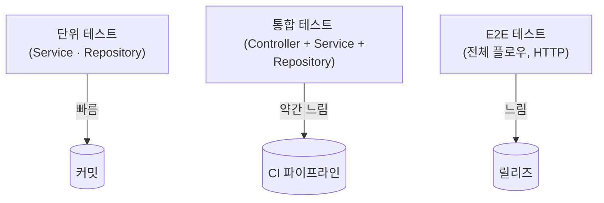

# 느슨하고 좋은 테스트 코드 작성 가이드

> 이 문서는 HHplus TDD 과제에서 논의된 내용을 바탕으로, **강결합을 피하고 리팩토링에 강건한 테스트 코드를 작성**하기 위한 실전 지침을 제공합니다. 실무·프로젝트 전반에 적용할 수 있도록 Mock 활용 전략, 테스트 냄새, 참고 자료까지 폭넓게 다룹니다.

---

## 1. 테스트 계층 구조 한눈에 보기



* **단위(Unit)**: 로직을 완전히 격리 → 빠르고, 실패 위치가 명확
* **통합(Integration)**: 실제 구현 조합 → 비즈니스 흐름 검증
* **E2E**: 최종 사용자 시나리오 → 배포 전 안정망

> ⚖️  **균형 잡힌 피라미드**를 유지하라. 느린 테스트가 빨라지는 일은 드물다.

> 🧱 **비유**: 건물을 짓는다고 생각해보세요.  
> • *단위 테스트*는 ‘벽돌 한 장’을 검사하는 과정입니다.  
> • *통합 테스트*는 여러 벽돌을 쌓아 ‘방 한 칸’을 만들어보는 단계입니다.  
> • *E2E 테스트*는 완성된 집에 가구를 들여놓고 실제로 살아보며 문제를 찾는 과정입니다.

---

## 2. Mockist vs Classicist 두 학파의 균형 잡기

| 구분 | Mockist(런던) | Classicist(시카고) |
|------|---------------|---------------------|
| 검증 관점 | **행위(Interaction)** | **상태(State)** |
| 격리 수준 | 의존 객체 "모두" Mock | 실제 객체(또는 Fake) 사용 |
| 테스트 속도 | 매우 빠름 | 상대적으로 느림 |
| 깨짐 위험 | 구현 변경 시 민감 | 비교적 안정 |

**전략**: *“경계를 넘어갈 때만 Mock!”*

* Service 테스트: Repository를 Mock (경계)
* Repository 테스트: 인메모리 DB/Fake 사용 (구현 검증)
* Controller/Integration 테스트: Mock 금지, 실제 조합 실행

> 🔌 **비유**: 콘센트(인터페이스)는 그대로인데 내부 전선(구현)이 바뀌어도 플러그만 꽂으면 전기가 흐르듯, 서비스는 **인터페이스만** 맞으면 어떤 구현체가 오든 문제없이 동작합니다.

---

## 3. 좋은 테스트의 5가지 특징

1. **실행 빠름**: < 200ms/테스트 → 개발 루프가 끊기지 않음
2. **단순 명료**: _Given-When-Then_ 패턴, 한 가지 시나리오만 검증
3. **구현 독립**: 내부 메서드 호출 순서를 검증하지 않음
4. **재현 가능**: 외부 시계·네트워크에 의존 X (Timecop, WireMock 활용)
5. **의도를 설명**: 실패 메시지만 봐도 비즈니스 규칙이 드러남

> 🏎️ **비유**: 좋은 테스트는 F1 경기의 피트스톱처럼 *빠르고 정확*해야 합니다. 차가 잠깐 멈춰 타이어만 갈고 바로 레이스에 복귀하듯, 개발자는 코드를 고친 뒤 즉시 결과를 받아야 합니다.

---

## 4. 나쁜 테스트 냄새 체크리스트

| 냄새 | 설명 |
|------|------|
| **설정 지옥** | `given()` 블록이 수십 줄 → 객체 설계가 잘못됐을 신호 |
| **Fragile Test** | 내부 구현 변경만으로 깨짐 (`spy`, `InOrder`, `private` 메서드 검증) |
| **Test Code Duplication** | 유사한 arrange/act/assert 블록이 반복 |
| **Slow Test** | 단위 테스트인데 수 초 이상 걸림; I/O 과도 의존 |
| **Conditional Test Logic** | `if (isLinux()) ...` 테스트 안에서 조건 분기 |

---

## 5. 코드 예시로 보는 Good vs Bad

### 5.1 Bad: 구현 강결합 테스트
```java
// 😫 잘못된 예 — 내부 메서드 호출 순서 검증
@Test
void charge_internal_order_test() {
    var real = new PointServiceImpl(userPointRepository);
    var spy = Mockito.spy(real);

    spy.charge(1L, 1000L);

    InOrder order = Mockito.inOrder(spy, userPointRepository);
    order.verify(spy).validateAmount(1000L);
    order.verify(spy).checkAndGetUserPoint(1L);
    order.verify(userPointRepository).saveOrUpdate(any());
}
```

### 5.2 Good: 행위 + 상태 최소 검증
```java
// 🎉 좋은 예 — 경계 넘는 호출 & 최종 상태만 검증
@Test
void charge_success() {
    // given
    when(userPointRepository.findById(1L))
        .thenReturn(new UserPoint(1L, 0L, System.currentTimeMillis()));

    // when
    UserPoint result = pointService.charge(1L, 1000L);

    // then
    assertThat(result.point()).isEqualTo(1000L);
    verify(userPointRepository).saveOrUpdate(any(UserPoint.class));
}
```

> 내부가 어떻게 변하든 **비즈니스 결과**만 보장하면 테스트는 그대로다.

---

## 6. 인프라 의존성 제거 Tip

1. **시계(clock) 추상화**: `Clock` 주입 → 시간 기반 테스트 제어
2. **UUID/랜덤**: `java.util.Random` 대신 `RandomStub` 주입
3. **스레드 슬립 금지**: `Awaitility`, 가짜 executor 사용
4. **DB 격리**: H2, Testcontainers로 실제 쿼리 실행하되 빠르게 초기화

> 🧪 **비유**: 화학 실험에서도 작은 비커(격리 환경)에 시약을 넣어 반응을 관찰하듯, 테스트 역시 외부 시스템과 분리된 안전한 공간에서 실행해야 합니다.

---

## 7. 더 공부해볼 키워드

이 가이드에서 다룬 내용을 한층 더 확장하고 싶을 때, 아래 키워드를 검색하거나 공식 문서를 참고해 보세요.

* 테스트 피라미드(Test Pyramid)
* 테스트 더블(Test Double): Dummy, Stub, Spy, Mock, Fake
* 단일 책임 원칙(SRP)
* 의존성 역전 원칙(DIP)
* 테스트 격리(Isolation) vs 현실성(Realism)
* 인메모리 데이터베이스(H2, SQLite, Embedded MongoDB)
* Testcontainers & Docker 기반 통합 테스트
* 테스트 병렬화(Parallel Test Execution) & CI/CD 최적화
* 플런트 API & BDD 스타일 테스트(JUnit5, AssertJ, Kotest)

---

## 8. 요약

* **인터페이스(계약)에만 의존** → 구현 변경에 강건
* **경계에서만 Mock** → 테스트 격리와 의미 있는 검증 동시 달성
* **비즈니스 결과에 집중** → 리팩토링 자유 보장
* **테스트 피라미드**를 지켜, 빠른 피드백·높은 신뢰성을 확보하자

> 테스트는 **안전망이자 문서**입니다. 잘 설계된 테스트는 리팩토링의 두려움을 없애고, 코드베이스의 이해도를 높여줍니다. 이제 자신 있게 리팩토링하고, 오류 없는 코드를 배포하세요! 