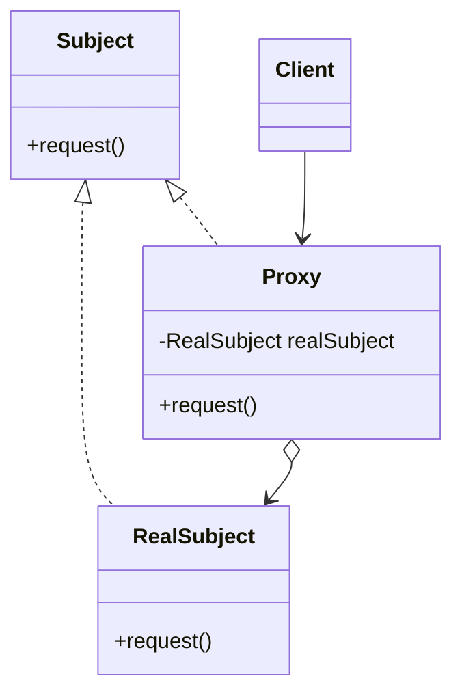
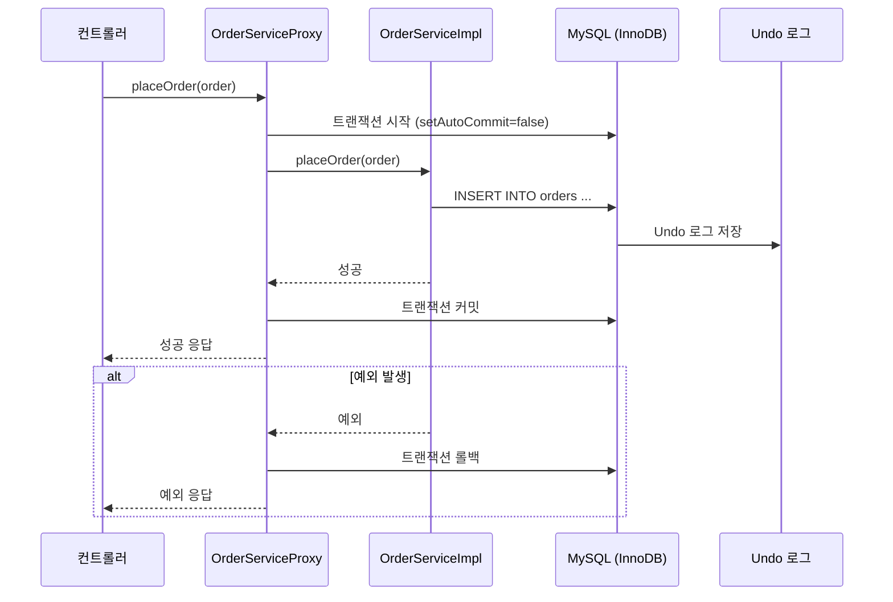

이 문서는 **프록시 패턴(Proxy Pattern)**에 대한 초보자 친화적인 설명을 제공하며, 특히 스프링 프레임워크의 `@Transactional` 어노테이션이 프록시 패턴을 활용해 트랜잭션을 처리하는 맥락을 중심으로 다룹니다. 다이어그램과 비유를 통해 프록시 패턴의 개념, 동작 방식, 구조를 상세히 설명하고, MySQL MVCC 및 이커머스 도메인에서의 활용을 연결합니다.

---

## 📌 목적
- 프록시 패턴의 개념과 동작 방식을 이해.
- 스프링의 `@Transactional` 어노테이션이 프록시 패턴을 통해 트랜잭션을 관리하는 과정 학습.
- 다이어그램을 통해 프록시 패턴의 구조와 워크플로우 시각화.
- 이커머스 도메인에서 프록시 패턴과 MySQL MVCC의 연관성 탐구.
- 실습과 비유로 초보자가 개념을 쉽게 체화하도록 지원.

---

## ✅ 1. 프록시 패턴이란?

### 1.1 정의
- **프록시 패턴**은 객체에 대한 접근을 제어하거나 추가적인 동작을 삽입하기 위해 실제 객체를 대신하는 대리자(Proxy) 객체를 사용하는 디자인 패턴입니다.
- **비유**: 비서가 상사의 일정을 관리하듯, 프록시 객체는 실제 객체의 작업을 대리하며 부가적인 작업(예: 권한 확인, 로깅, 트랜잭션 관리)을 수행.
- **스프링의 맥락**: 스프링에서 `@Transactional`은 프록시 패턴을 사용해 메서드 호출 전/후에 트랜잭션을 시작하거나 커밋/롤백 처리.

### 1.2 프록시 패턴의 종류
- **가상 프록시(Virtual Proxy)**: 객체 생성 비용이 높을 때 지연 로딩(Lazy Loading) 제공.
- **원격 프록시(Remote Proxy)**: 원격 객체(예: 다른 서버) 접근 제어.
- **보호 프록시(Protection Proxy)**: 권한 확인 등 접근 제어.
- **스마트 프록시(Smart Proxy)**: 추가 기능(로깅, 캐싱, 트랜잭션 관리 등) 제공.
  - **스프링 @Transactional**: 스마트 프록시로, 트랜잭션 관리 추가.

---

## ✅ 2. 프록시 패턴의 구조

### 2.1 구성 요소
- **Subject**: 실제 객체와 프록시가 구현하는 공통 인터페이스.
- **RealSubject**: 실제 작업을 수행하는 객체.
- **Proxy**: RealSubject를 감싸며 접근 제어 및 부가 기능 제공.
- **Client**: Proxy를 통해 RealSubject에 접근.

### 2.2 다이어그램: 프록시 패턴 구조



- **설명**:
  - **Subject**: `OrderService` 인터페이스(예: `placeOrder()` 메서드).
  - **RealSubject**: 실제 비즈니스 로직을 수행하는 `OrderServiceImpl`.
  - **Proxy**: 스프링이 생성한 프록시 객체, 트랜잭션 시작/커밋/롤백 처리.
  - **Client**: 프록시를 호출하는 컨트롤러 또는 다른 컴포넌트.

### 2.3 스프링 @Transactional에서의 프록시 패턴
- 스프링은 **AOP(Aspect-Oriented Programming)**를 사용해 프록시 패턴을 구현.
- `@Transactional`이 붙은 메서드를 호출하면, 스프링은 프록시 객체를 생성해 메서드 호출 전/후에 트랜잭션 관리 로직 삽입.
- **동작 과정**:
  1. 클라이언트가 `@Transactional` 메서드 호출.
  2. 프록시가 트랜잭션 시작(`Connection` 획득, `setAutoCommit(false)`).
  3. 실제 메서드(`RealSubject`) 실행.
  4. 예외가 없으면 커밋, 예외 발생 시 롤백.

---

## ✅ 3. 스프링 @Transactional의 프록시 패턴 동작 방식

### 3.1 동작 과정
1. **프록시 생성**:
   - 스프링 컨테이너는 `@Transactional`이 붙은 빈(Bean)에 프록시 객체를 생성.
   - 프록시는 `TransactionManager`를 사용해 트 Lipid Transaction을 관리.
2. **메서드 호출**:
   - 클라이언트가 프록시의 메서드 호출(예: `orderService.placeOrder()`).
   - 프록시는 트랜잭션 시작, 실제 객체의 메서드 호출, 트랜잭션 커밋/롤백 처리.
3. **트랜잭션 관리**:
   - 프록시는 `PlatformTransactionManager`를 통해 데이터베이스 연결 관리.
   - MySQL의 MVCC와 연계해 데이터 정합성 유지.

### 3.2 다이어그램: @Transactional 프록시 워크플로우



- **설명**:
  - **컨트롤러**가 `OrderServiceProxy`의 `placeOrder()` 호출.
  - **Proxy**가 트랜잭션 시작, `OrderServiceImpl` 호출, MySQL에 데이터 삽입.
  - MVCC로 Undo 로그 생성, 데이터 정합성 유지.
  - 성공 시 커밋, 실패 시 롤백.

### 3.3 코드 예시
```java
public interface OrderService {
    void placeOrder(Order order);
}

@Service
public class OrderServiceImpl implements OrderService {
    @Autowired
    private OrderRepository orderRepository;

    @Transactional
    public void placeOrder(Order order) {
        orderRepository.save(order);
        // 비즈니스 로직
    }
}
```
- **설명**:
  - `@Transactional`이 `placeOrder()`에 적용.
  - 스프링이 프록시 객체를 생성해 트랜잭션 관리.
  - `orderRepository.save()` 호출 시 MySQL MVCC가 Undo 로그 생성.

---

## ✅ 4. 프록시 패턴과 MySQL MVCC의 연관성

### 4.1 MVCC와의 연계
- **트랜잭션 관리**: `@Transactional` 프록시는 MySQL의 MVCC를 활용해 트랜잭션 격리 수준(`REPEATABLE READ` 등) 유지.
- **데이터 정합성**: 프록시는 트랜잭션 범위 내에서 MVCC의 스냅샷을 사용해 일관된 데이터 제공.
- **Undo 로그**: 프록시가 롤백 요청 시 MVCC의 Undo 로그를 활용해 데이터 복원.

### 4.2 이커머스 예시
- **상황**: 고객이 주문을 생성(`placeOrder()`)하는 동안 다른 트랜잭션이 동일 주문 데이터를 수정.
- **프록시 역할**:
  - `@Transactional` 프록시가 트랜잭션 시작, MVCC로 스냅샷 생성.
  - 다른 트랜잭션의 변경은 Undo 로그에 저장, 현재 트랜잭션에 영향 없음.
- **쿼리 예시**:
  ```sql
  START TRANSACTION;
  INSERT INTO orders (order_id, customer_id, status) VALUES (1, 100, 'pending');
  COMMIT;
  ```
  - 프록시가 트랜잭션 관리, MVCC가 Undo 로그로 데이터 버전 관리.

---

## ✅ 5. 이커머스 도메인에서의 프록시 패턴 활용

### 5.1 활용 사례
- **주문 처리**:
  - `@Transactional`으로 주문 생성/업데이트 시 트랜잭션 보장.
  - 예: 주문 생성 후 재고 감소, 결제 처리까지 하나의 트랜잭션으로 관리.
- **재고 관리**:
  - 동시 주문 요청 시 `@Transactional` 프록시와 MVCC로 데이터 정합성 유지.
  - 예: `UPDATE inventory SET stock = stock - 1 WHERE product_id = 1;`
- **로깅 및 모니터링**:
  - 프록시로 메서드 호출 전/후에 로깅 추가(예: 주문 생성 시간 기록).
- **캐싱**:
  - 프록시로 자주 조회되는 데이터(예: 상품 정보)를 캐싱.

### 5.2 코드 예시
```java
@Service
public class OrderServiceImpl implements OrderService {
    @Autowired
    private OrderRepository orderRepository;
    @Autowired
    private InventoryRepository inventoryRepository;

    @Transactional
    public void placeOrder(Order order) {
        orderRepository.save(order);
        inventoryRepository.decreaseStock(order.getProductId(), order.getQuantity());
    }
}
```
- **설명**:
  - 프록시가 트랜잭션 시작, `save()`와 `decreaseStock()` 실행.
  - 예외 발생 시 롤백, MVCC의 Undo 로그로 데이터 복원.

### 5.3 다이어그램: 이커머스 주문 처리

```mermaid
graph TD
    A[컨트롤러] --> B[OrderServiceProxy<br>@Transactional]
    B --> C[트랜잭션 시작]
    B --> D[OrderServiceImpl]
    D --> E[OrderRepository.save()]
    D --> F[InventoryRepository.decreaseStock()]
    E --> G[MySQL: INSERT orders]
    F --> H[MySQL: UPDATE inventory]
    G --> I[Undo 로그 저장]
    H --> I
    C --> J[트랜잭션 커밋/롤백]
```

---

## ✅ 6. 프록시 패턴의 장단점

### 6.1 장점
- **접근 제어**: 권한 확인, 트랜잭션 관리 등 부가 기능 추가.
- **유연성**: 실제 객체 변경 없이 프록시로 기능 확장(예: 로깅, 캐싱).
- **트랜잭션 관리**: `@Transactional`로 데이터 정합성 보장.
- **비유**: 비서가 상사의 핵심 업무를 방해하지 않고 부가 업무 처리.

### 6.2 단점
- **복잡성 증가**: 프록시 추가로 코드 디버깅과 이해가 어려워질 수 있음.
- **성능 오버헤드**: 프록시 호출로 약간의 처리 시간 증가.
- **제한**: 스프링 프록시는 `final` 클래스/메서드나 내부 호출(self-invocation)에서 동작하지 않음.
  - 예: `@Transactional` 메서드가 같은 클래스 내 다른 메서드 호출 시 프록시 미작동.

---

## ✅ 7. 학습 가이드

### 7.1 학습 목표
- 프록시 패턴의 구조와 스프링 `@Transactional`의 동작 방식 이해.
- MySQL MVCC와 프록시 패턴의 상호작용 학습.
- 이커머스에서 트랜잭션 관리와 데이터 정합성 보장 실습.

### 7.2 학습 단계
1. **기본 개념**:
   - [Spring Documentation: AOP](https://docs.spring.io/spring-framework/docs/current/reference/html/core.html#aop)로 프록시 패턴 학습.
   - [Design Patterns: Proxy](https://refactoring.guru/design-patterns/proxy)로 패턴 구조 이해.
2. **실습**:
   - 스프링 부트 프로젝트 생성, `@Transactional` 적용.
     ```java
     @Service
     public class OrderServiceImpl {
         @Transactional
         public void placeOrder(Order order) {
             // 주문 저장 및 재고 감소
         }
     }
     ```
   - DataGrip으로 MySQL 쿼리 실행, MVCC 동작 확인.
   - 예외 발생 시 롤백 테스트.
3. **적용**:
   - 이커머스 프로젝트에서 `@Transactional`로 주문/재고 관리 구현.
   - 프록시 로그 추가(예: `Aspect`로 로깅 구현).

### 7.3 추천 자료
- **공식 문서**: [Spring Framework: Transaction Management](https://docs.spring.io/spring-framework/docs/current/reference/html/data-access.html#transaction)
- **블로그**: [Understanding Spring AOP and Proxy](https://medium.com/@krishnakumar_/spring-aop-and-proxy-pattern-8d3b80c1551)
- **도서**: *Spring in Action* (Manning Publications)

---

## 🔚 요약
- **프록시 패턴**: 실제 객체를 대리하는 객체로 접근 제어 및 부가 기능 제공.
- **스프링 @Transactional**: 프록시 패턴으로 트랜잭션 시작/커밋/롤백 관리.
- **MVCC 연계**: MySQL MVCC와 결합해 데이터 정합성 보장.
- **이커머스 활용**: 주문/재고 관리에서 트랜잭션과 동시성 문제 해결.
- **학습 팁**: 다이어그램과 실습으로 프록시 패턴과 `@Transactional` 체화.