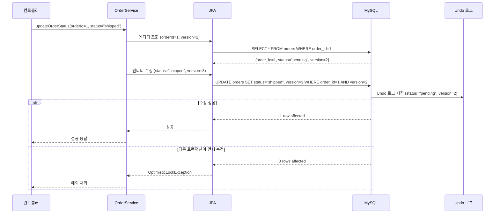
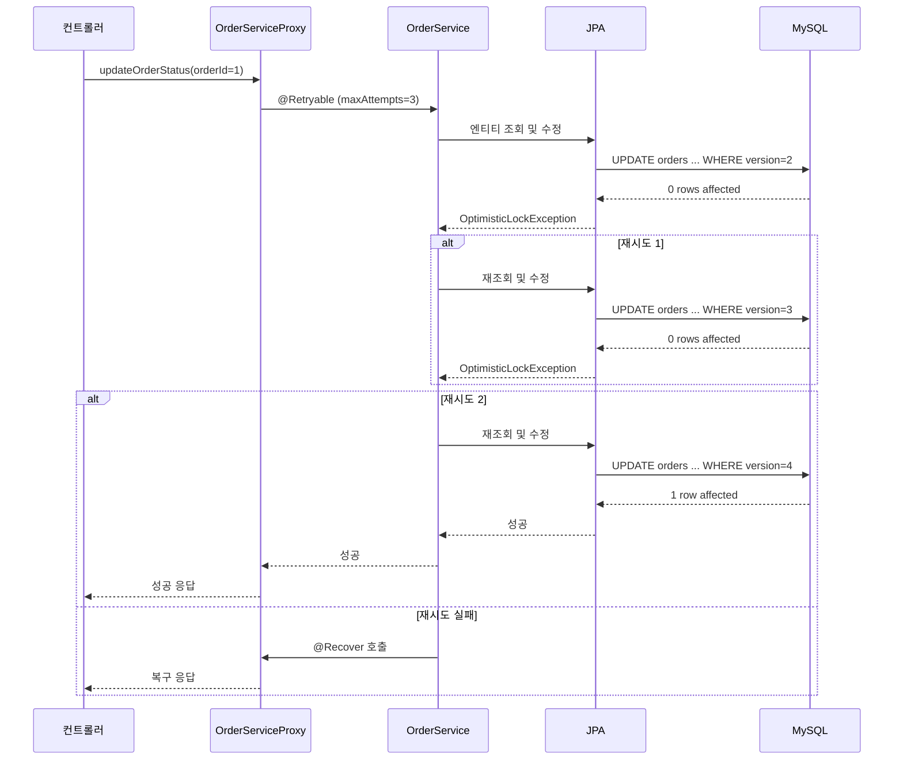

이 문서는 **낙관적 락(Optimistic Locking)**과 **Spring Retry**를 함께 사용하는 패턴에 대한 초보자 친화적인 학습 자료입니다. 특히, 스프링 프레임워크의 `@Version` 어노테이션과 `@Retryable` 어노테이션을 중심으로, 이커머스 도메인에서 동시성 제어와 재시도 로직을 어떻게 구현하는지 상세히 설명합니다. MySQL의 MVCC(Multi-Version Concurrency Control), 스프링의 트랜잭션 전파 속성, AOP, 프록시 패턴과의 연관성을 다루며, 다이어그램과 비유를 통해 직관적으로 이해할 수 있도록 구성했습니다.

---

## 📌 목적
- 낙관적 락(`@Version`)과 Spring Retry(`@Retryable`)의 개념과 동작 방식 이해.
- 두 패턴을 함께 사용하여 동시성 문제 해결 방법을 학습.
- 다이어그램을 통해 낙관적 락과 재시도 메커니즘의 워크플로우 시각화.
- 이커머스 도메인에서 재고 관리, 주문 처리 등 실제 사용 사례 탐구.
- 실습과 비유를 통해 초보자가 개념을 쉽게 체화하도록 지원.

---

## ✅ 1. 낙관적 락과 Spring Retry란?

### 1.1 낙관적 락 (Optimistic Locking)
- **정의**: 데이터 충돌이 드물게 발생한다고 가정하고, 데이터 수정 시 버전 정보를 확인하여 충돌을 감지하는 동시성 제어 기법.
- **스프링/JPA의 구현**: `@Version` 어노테이션을 엔티티에 추가하여 버전 컬럼(예: `version`) 관리.
- **비유**: 도서관에서 책을 빌리기 전, 책의 대출 상태(버전)를 확인하고, 다른 사람이 먼저 빌렸으면 대출 실패.
- **MySQL 동작**: JPA가 `UPDATE` 쿼리에서 `WHERE` 절에 버전 조건을 추가, 수정된 행이 없으면 `OptimisticLockException` 발생.

### 1.2 Spring Retry
- **정의**: Spring Retry는 특정 예외 발생 시 메서드를 자동으로 재시도하는 메커니즘을 제공하는 라이브러리.
- **스프링의 구현**: `@Retryable` 어노테이션으로 메서드에 재시도 로직 적용, `RetryTemplate`으로 커스터마이징 가능.
- **비유**: 도서관에서 책 대출이 실패하면, 잠시 기다렸다가 다시 시도.
- **맥락**: `@Retryable`은 낙관적 락 실패(`OptimisticLockException`) 시 재시도를 통해 동시성 문제를 해결.

### 1.3 왜 함께 사용하나?
- **낙관적 락**: 동시성 충돌 감지, 데이터 정합성 보장.
- **Spring Retry**: 충돌 발생 시 자동 재시도로 복잡한 수동 재시도 로직 제거.
- **이커머스 활용**: 재고 감소, 주문 상태 변경 등 동시 요청이 빈번한 상황에서 유용.

---

## ✅ 2. 낙관적 락 (@Version)의 구조와 동작 방식

### 2.1 구조
- **엔티티에 `@Version` 추가**:
  - JPA 엔티티에 `version` 필드(정수 또는 타임스탬프) 추가.
  - 데이터 수정 시 `version` 값을 증가, `UPDATE` 쿼리에 버전 조건 포함.
- **MySQL 쿼리**:
  ```sql
  UPDATE orders SET status = 'shipped', version = version + 1
  WHERE order_id = 1 AND version = 2;
  ```
  - 수정된 행이 0이면 `OptimisticLockException` 발생.

### 2.2 동작 과정
1. **데이터 조회**: 엔티티 조회 시 `version` 값 확인.
2. **데이터 수정**: 수정 요청 시 JPA가 `WHERE version = ?` 조건으로 `UPDATE` 실행.
3. **충돌 감지**: 다른 트랜잭션이 먼저 수정하여 `version`이 변경되면 수정 실패.
4. **예외 처리**: `OptimisticLockException` 발생, 재시도 로직 필요.

### 2.3 다이어그램: 낙관적 락 동작



- **설명**:
  - `OrderService`가 `orderId=1`의 상태를 변경.
  - JPA가 `version=2`로 `UPDATE`, 성공 시 `version=3`.
  - 다른 트랜잭션이 `version`을 변경하면 실패, 예외 발생.

---

## ✅ 3. Spring Retry (@Retryable)의 구조와 동작 방식

### 3.1 구조
- **@Retryable**:
  - 메서드에 적용, 특정 예외 발생 시 재시도.
  - 속성: `maxAttempts`(최대 재시도 횟수), `backoff`(재시도 간 대기 시간).
- **@Recover**:
  - 재시도 실패 후 실행할 복구 로직 정의.
- **의존성**:
  ```xml
  <dependency>
      <groupId>org.springframework.retry</groupId>
      <artifactId>spring-retry</artifactId>
      <version>2.0.7</version>
  </dependency>
  <dependency>
      <groupId>org.springframework</groupId>
      <artifactId>spring-aspects</artifactId>
      <version>6.1.12</version>
  </dependency>
  ```
- **활성화**: `@EnableRetry`를 스프링 설정 클래스에 추가.

### 3.2 동작 과정
1. **예외 발생**: `@Retryable` 메서드에서 예외(예: `OptimisticLockException`) 발생.
2. **재시도**: 최대 `maxAttempts`까지 메서드 재실행.
3. **복구**: 재시도 실패 시 `@Recover` 메서드 호출.
4. **MySQL 연계**: 재시도마다 새 `Connection`으로 MVCC 스냅샷 갱신.

### 3.3 다이어그램: Spring Retry 동작



- **설명**:
  - `OptimisticLockException` 발생 시 최대 3번 재시도.
  - 성공 시 커밋, 실패 시 `@Recover`로 복구.

---

## ✅ 4. 낙관적 락과 Spring Retry의 통합

### 4.1 통합 이유
- **낙관적 락**: 동시성 충돌 감지, `OptimisticLockException`으로 실패 알림.
- **Spring Retry**: 실패 시 자동 재시도로 복잡한 수동 재시도 로직 제거.
- **이커머스 활용**: 재고 감소, 주문 상태 변경 등 동시 요청이 빈번한 상황에서 충돌 해결.

### 4.2 코드 예시
```java
@Entity
public class Order {
    @Id
    private Long orderId;
    private String status;
    @Version
    private Long version; // 낙관적 락을 위한 버전 컬럼
}

@Service
@EnableRetry
public class OrderServiceImpl implements OrderService {
    @Autowired
    private OrderRepository orderRepository;

    @Transactional
    @Retryable(
        value = OptimisticLockException.class,
        maxAttempts = 3,
        backoff = @Backoff(delay = 100)
    )
    public void updateOrderStatus(Long orderId, String status) {
        Order order = orderRepository.findById(orderId)
            .orElseThrow(() -> new IllegalArgumentException("Order not found"));
        order.setStatus(status);
        orderRepository.save(order); // version 체크 및 증가
    }

    @Recover
    public void recover(OptimisticLockException e, Long orderId, String status) {
        // 재시도 실패 시 복구 로직
        log.error("Failed to update order {} after retries", orderId);
        throw new RuntimeException("Update failed after retries");
    }
}
```
- **설명**:
  - `@Version`으로 `Order` 엔티티의 버전 관리.
  - `@Retryable`로 `OptimisticLockException` 발생 시 최대 3번 재시도, 100ms 대기.
  - 재시도 실패 시 `@Recover`로 로깅 및 예외 처리.

### 4.3 MySQL 쿼리
- **조회**:
  ```sql
  SELECT order_id, status, version FROM orders WHERE order_id = 1;
  ```
- **수정**:
  ```sql
  UPDATE orders SET status = 'shipped', version = 3
  WHERE order_id = 1 AND version = 2;
  ```
- **실패 시**: `0 rows affected` → `OptimisticLockException` → `@Retryable` 재시도.

---

## ✅ 5. 이커머스 도메인에서의 활용

### 5.1 활용 사례
- **재고 감소**:
  - 여러 고객이 동시에 상품 구매 시, `@Version`으로 재고 충돌 감지.
  - `@Retryable`로 충돌 시 재시도, 최종 성공 또는 복구.
- **주문 상태 변경**:
  - 동시 주문 상태 업데이트(예: `pending` → `shipped`) 시 낙관적 락 적용.
- **결제 처리**:
  - 결제 상태 업데이트 시 동시성 충돌 방지.

### 5.2 코드 예시: 재고 관리
```java
@Entity
public class Inventory {
    @Id
    private Long productId;
    private Integer stock;
    @Version
    private Long version;
}

@Service
@EnableRetry
public class InventoryServiceImpl implements InventoryService {
    @Autowired
    private InventoryRepository inventoryRepository;

    @Transactional
    @Retryable(value = OptimisticLockException.class, maxAttempts = 3)
    public void decreaseStock(Long productId, int quantity) {
        Inventory inventory = inventoryRepository.findById(productId)
            .orElseThrow(() -> new IllegalArgumentException("Product not found"));
        if (inventory.getStock() < quantity) {
            throw new IllegalStateException("Insufficient stock");
        }
        inventory.setStock(inventory.getStock() - quantity);
        inventoryRepository.save(inventory);
    }

    @Recover
    public void recover(OptimisticLockException e, Long productId, int quantity) {
        log.error("Failed to decrease stock for product {}", productId);
        throw new RuntimeException("Stock update failed");
    }
}
```
- **설명**:
  - `@Version`으로 재고 충돌 감지.
  - `@Retryable`로 실패 시 재시도, 최대 3번.
  - 실패 시 `@Recover`로 복구.

### 5.3 다이어그램: 이커머스 재고 관리

```mermaid
graph TD
    A[컨트롤러] --> B[InventoryServiceProxy<br>@Transactional @Retryable]
    B --> C[InventoryServiceImpl]
    C --> D[InventoryRepository.findById()]
    C --> E[InventoryRepository.save()]
    D --> F[MySQL: SELECT ...]
    E --> G[MySQL: UPDATE inventory ... WHERE version=?]
    G --> H[Undo 로그]
    G --> I[0 rows affected]
    I --> B[OptimisticLockException]
    B --> C[재시도]
    B --> J[@Recover: 복구 로직]
```

---

## ✅ 6. 낙관적 락과 Spring Retry의 장단점

### 6.1 장점
- **낙관적 락**:
  - 락 오버헤드 적음, 동시성 충돌 드문 경우 효율적.
  - MySQL MVCC와 결합해 데이터 정합성 보장.
- **Spring Retry**:
  - 자동 재시도로 복잡한 수동 재시도 로직 제거.
  - `@Recover`로 실패 시 복구 로직 제공.
- **비유**: 도서관에서 책 대출 실패 시 자동으로 재시도, 최종 실패 시 사서가 대체책 제안.

### 6.2 단점
- **낙관적 락**:
  - 충돌 빈번 시 재시도 오버헤드 증가.
  - `version` 컬럼 관리로 스키마 복잡성 증가.
- **Spring Retry**:
  - 재시도 횟수/대기 시간 설정 부적절 시 성능 저하.
  - 복구 로직이 없으면 최종 실패 처리 어려움.
- **제한**: MySQL의 MVCC와 격리 수준에 따라 재시도 성공률 변동.

---

## ✅ 7. MySQL MVCC 및 트랜잭션 전파 속성과의 연관성

### 7.1 MVCC 연계
- **낙관적 락**: `UPDATE` 시 `version` 체크, MVCC의 Undo 로그로 이전 버전 유지.
- **Spring Retry**: 재시도마다 새 MVCC 스냅샷 사용, 최신 `version`으로 갱신.
- **격리 수준**: `REPEATABLE READ`에서 스냅샷 유지, `READ COMMITTED`에서 최신 데이터 조회.

### 7.2 전파 속성 연계
- **REQUIRED**: 낙관적 락과 재시도를 동일 트랜잭션 내에서 처리.
- **REQUIRES_NEW**: 재시도마다 새 트랜잭션 생성, MVCC 스냅샷 갱신.
- **NESTED**: Savepoint로 부분 롤백 가능, 재시도와 결합.

### 7.3 예시
```java
@Transactional(propagation = Propagation.REQUIRED)
@Retryable(value = OptimisticLockException.class, maxAttempts = 3)
public void processOrderAndStock(Order order) {
    orderService.updateOrderStatus(order.getId(), "shipped");
    inventoryService.decreaseStock(order.getProductId(), order.getQuantity());
}
```
- **설명**: `REQUIRED`로 단일 트랜잭션, 충돌 시 재시도.

---

## ✅ 8. 학습 가이드

### 8.1 학습 목표
- 낙관적 락(`@Version`)과 Spring Retry(`@Retryable`)의 동작 방식 이해.
- 이커머스에서 동시성 제어와 재시도 패턴 구현.
- MySQL MVCC와 트랜잭션 전파 속성과의 연계 학습.

### 8.2 학습 단계
1. **기본 개념**:
   - [Spring Data JPA: Optimistic Locking](https://docs.spring.io/spring-data/jpa/docs/current/reference/html/#transactions)로 낙관적 락 학습.
   - [Spring Retry Documentation](https://docs.spring.io/spring-retry/docs/current/reference/html/)로 Retry 학습.
2. **실습**:
   - 스프링 부트 프로젝트 생성, 의존성 추가:
     ```xml
     <dependency>
         <groupId>org.springframework.retry</groupId>
         <artifactId>spring-retry</artifactId>
     </dependency>
     ```
   - `@Version`과 `@Retryable` 적용:
     ```java
     @Entity
     public class Inventory {
         @Id
         private Long productId;
         private Integer stock;
         @Version
         private Long version;
     }

     @Service
     @EnableRetry
     public class InventoryServiceImpl {
         @Transactional
         @Retryable(value = OptimisticLockException.class)
         public void decreaseStock(Long productId, int quantity) {
             // 재고 감소 로직
         }
     }
     ```
   - DataGrip으로 MySQL 쿼리 실행, `UPDATE` 쿼리와 Undo 로그 확인.
3. **적용**:
   - 이커머스 프로젝트에서 재고/주문 관리에 낙관적 락과 재시도 적용.
   - `EXPLAIN ANALYZE`로 쿼리 성능 분석.

### 8.3 추천 자료
- **공식 문서**: [Spring Data JPA: Optimistic Locking](https://docs.spring.io/spring-data/jpa/docs/current/reference/html/#transactions), [Spring Retry](https://docs.spring.io/spring-retry/docs/current/reference/html/)
- **블로그**: [Spring Optimistic Locking and Retry](https://medium.com/@krishnakumar_/spring-optimistic-locking-and-retry-8d3b80c1551)
- **도서**: *Spring in Action* (Manning Publications)

---

## 🔚 요약
- **낙관적 락 (@Version)**: 버전 체크로 동시성 충돌 감지, `OptimisticLockException` 발생.
- **Spring Retry (@Retryable)**: 충돌 시 자동 재시도, `@Recover`로 복구.
- **이커머스 활용**: 재고/주문 관리에서 동시성 문제 해결.
- **MVCC 연계**: MySQL MVCC로 데이터 정합성 보장.
- **학습 팁**: 다이어그램과 실습으로 낙관적 락과 재시도 패턴 체화.