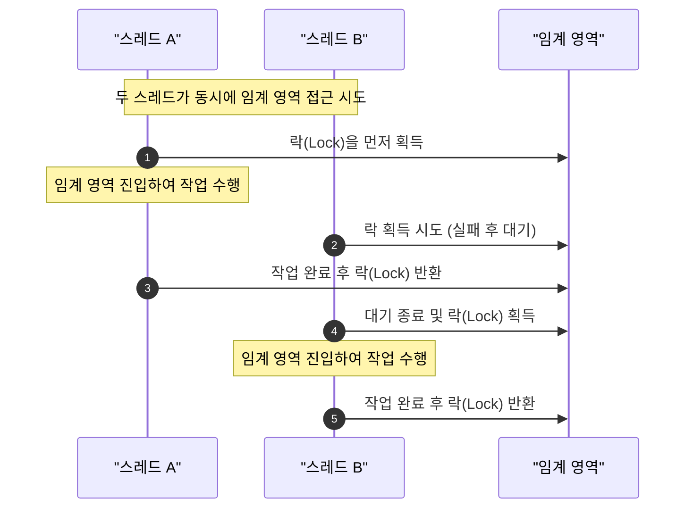
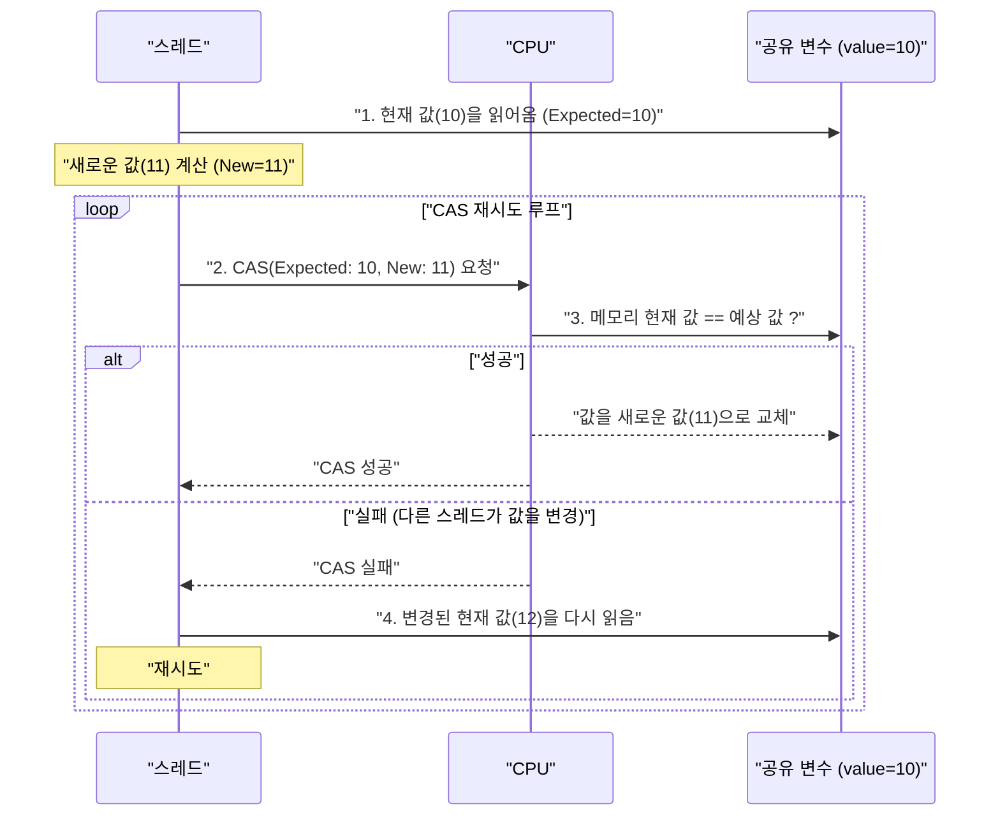
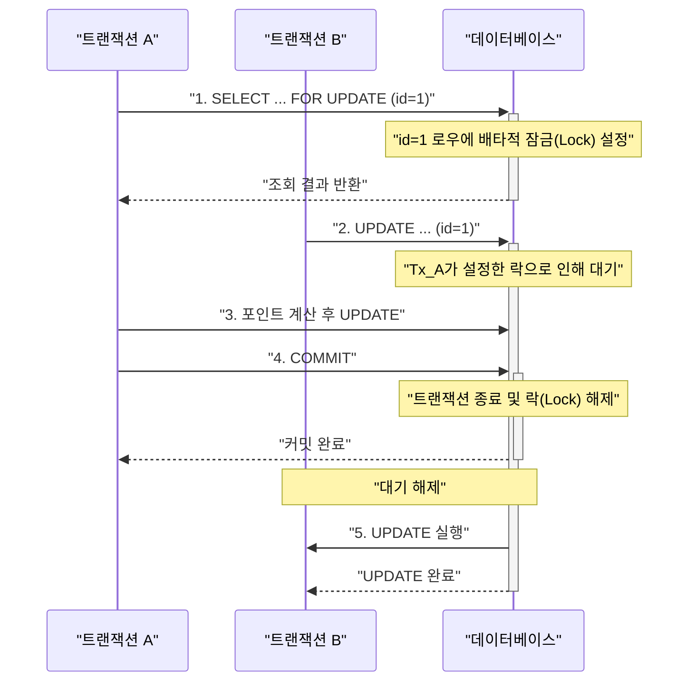
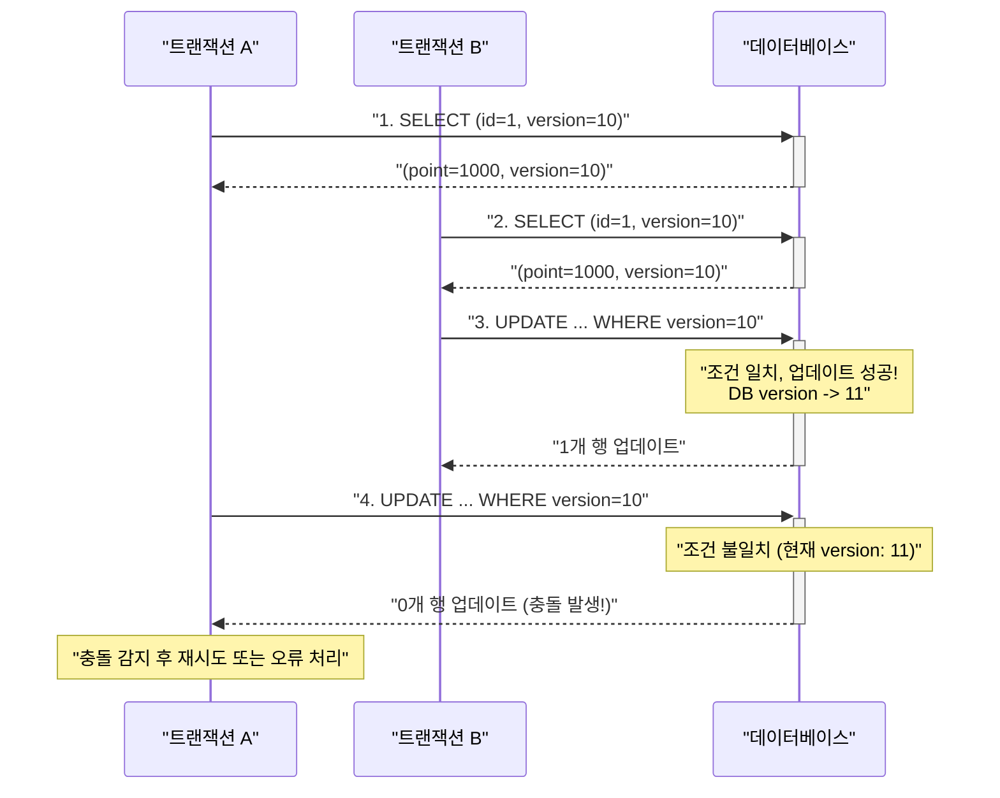
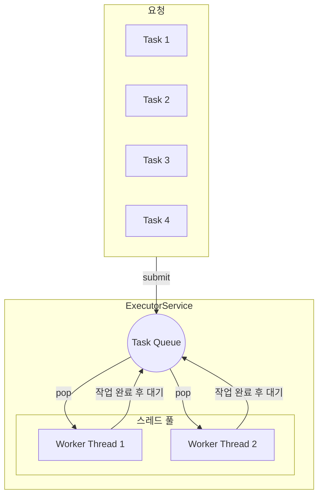
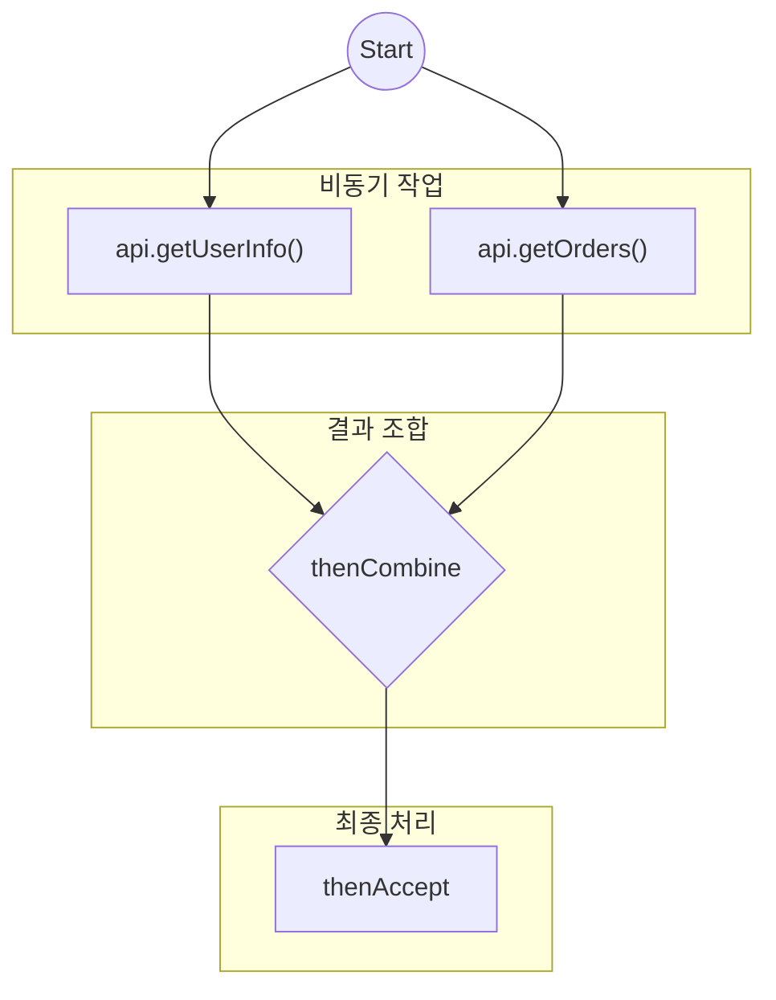
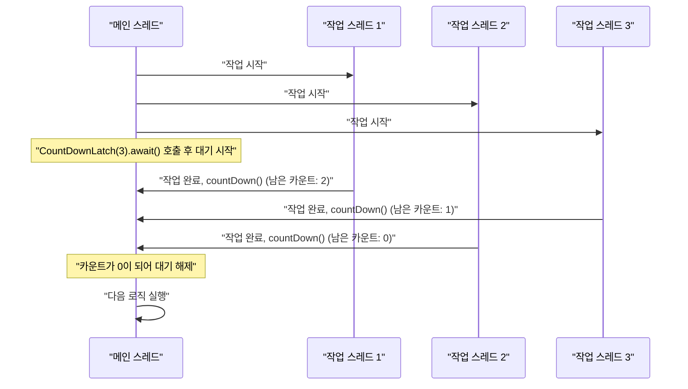

# Java 동시성 처리 완벽 가이드

## 1. 동시성(Concurrency)이란 무엇이고, 왜 필요한가?

### 개념: "동시에 여러 일이 처리되는 것"

가장 간단한 비유는 **레스토랑 주방**입니다.

-   **동시성이 없는 주방(Single-Thread):** 요리사 한 명이 주문 접수, 재료 손질, 요리, 설거지까지 모든 것을 순서대로 처리합니다. 한 가지 일이 끝나야만 다음 일을 시작할 수 있습니다. 손님이 몰리면 레스토랑은 마비됩니다.
-   **동시성이 있는 주방(Multi-Thread):** 여러 요리사가 각자 역할을 분담합니다. 한 명은 주문을 받고, 다른 한 명은 재료를 손질하며, 또 다른 한 명은 불 앞에서 요리를 합니다. 이들은 각자 독립적으로 일하지만, 때로는 같은 조리대(공유 자원)를 사용해야 하거나, A 요리가 끝나야 B 요리를 시작할 수 있는(작업 의존성) 상황이 발생합니다.

이처럼, **동시성 프로그래밍**은 여러 작업(스레드)이 독립적으로 실행되면서도, 때로는 공유된 자원(메모리, 데이터베이스 등)에 안전하게 접근하고 서로 협력하여 전체적인 처리 효율을 높이는 기술을 말합니다.

### 동시성 vs 병렬성 (Concurrency vs Parallelism)

-   **동시성 (Concurrency):** 여러 작업을 번갈아가며 처리하여 **'동시에 처리되는 것처럼 보이게'** 하는 것. 싱글 코어 CPU에서도 가능합니다. (Context Switching)
-   **병렬성 (Parallelism):** 여러 작업을 **'물리적으로 진짜 동시에'** 처리하는 것. 멀티 코어 CPU가 있어야만 가능합니다.

> 동시성은 **문제를 구조화하는 방식**이고, 병렬성은 **실제로 동시에 실행되는 것**을 의미합니다. 동시성 코드를 잘 작성하면, 멀티 코어 환경에서 자연스럽게 병렬성을 통해 성능 향상을 얻을 수 있습니다.

### 동시성 처리의 필요성과 의의

1.  **성능 향상 (Performance):**
    -   **CPU 활용 극대화:** 최신 CPU는 대부분 멀티 코어입니다. 동시성 처리를 통해 여러 코어를 동시에 활용하여 프로그램의 전체 실행 시간을 단축시킬 수 있습니다.
    -   **I/O 대기 시간 활용:** 데이터베이스 조회, 파일 읽기, 네트워크 통신 등 I/O 작업이 발생하는 동안 CPU는 아무 일도 하지 않고 대기합니다. 이때 다른 스레드가 CPU를 사용하여 다른 작업을 처리하면 전체 시스템의 처리량이 크게 향상됩니다.

2.  **응답성 개선 (Responsiveness):**
    -   데스크톱 애플리케이션이나 모바일 앱에서 버튼을 클릭했을 때, 시간이 오래 걸리는 작업을 별도의 스레드에서 처리하면 UI가 멈추지 않고 사용자의 다른 입력을 계속 받을 수 있습니다. (e.g., 파일 다운로드 중에도 UI는 반응)

### 동시성 프로그래밍의 가장 큰 숙제: "공유 자원 문제"

여러 스레드가 하나의 자원(e.g., 특정 유저의 포인트 잔액)에 동시에 접근하여 값을 변경하려고 할 때 문제가 발생합니다. 이를 **동시성 문제**라고 부릅니다.

-   **경쟁 상태 (Race Condition):** 여러 스레드가 공유 데이터에 동시에 접근하여 값을 읽고, 변경하고, 쓰는 과정에서 실행 순서에 따라 결과가 예상과 다르게 나오는 현상.
    -   *예시: 1000 포인트를 가진 유저에게 스레드 A와 스레드 B가 동시에 500 포인트를 충전하는 경우, 최종 결과가 2000이 아닌 1500이 될 수 있습니다.*
-   **교착 상태 (Deadlock):** 두 개 이상의 스레드가 서로가 점유하고 있는 자원을 무한정 기다리는 상태.
-   **기아 상태 (Starvation):** 특정 스레드가 자원을 할당받을 우선순위에 계속 밀려 영원히 실행되지 못하는 상태.

---

## 2. 애플리케이션 레벨(In-Memory) 동시성 처리 - 기초

Java 애플리케이션 내부 메모리에서 발생하는 동시성 문제를 해결하기 위한 **기초적인 잠금(Locking) 도구**입니다. **단일 애플리케이션 인스턴스 내에서만 유효합니다.**

### 방안 1: `synchronized` 키워드 (가장 기본적인 잠금)

가장 간단하고 전통적인 방법으로, 특정 메서드나 코드 블록을 한 번에 하나의 스레드만 실행할 수 있도록 보장합니다. 이를 **'상호 배제(Mutual Exclusion)'**라고 하며, 해당 영역을 **'임계 영역(Critical Section)'**이라고 부릅니다.

-   **동작 원리:** 객체마다 보이지 않는 고유한 '락(Lock)'을 가지고 있습니다. `synchronized` 블록에 진입하려는 스레드는 해당 객체의 락을 획득해야 하며, 락을 획득한 스레드만 코드 블록을 실행할 수 있습니다. 실행이 끝나면 락을 자동으로 반환합니다.

```java
// 메서드 전체에 적용
public synchronized void chargePoint(long userId, long amount) {
    // 이 메서드는 한 번에 하나의 스레드만 실행 가능
    UserPoint userPoint = userPointRepository.findById(userId);
    userPointRepository.save(userPoint.charge(amount));
}

// 특정 코드 블록에만 적용
public void chargePoint(long userId, long amount) {
    // ... 다른 로직들 ...
    synchronized (this) { // this 객체의 락을 사용
        // 이 블록은 한 번에 하나의 스레드만 실행 가능
        UserPoint userPoint = userPointRepository.findById(userId);
        userPointRepository.save(userPoint.charge(amount));
    }
    // ... 다른 로직들 ...
}
```

#### 시각화 자료: `synchronized` 동작 방식


-   **장점:**
    -   **간단함:** 키워드 하나만 붙이면 되므로 사용이 매우 쉽습니다.
    -   **자동 락 해제:** 블록을 벗어나면(정상 종료, 예외 발생 모두) JVM이 알아서 락을 해제해주므로, 락이 풀리지 않는 실수를 방지할 수 있습니다.
-   **단점:**
    -   **성능 저하:** 락을 얻기 위해 스레드들이 경쟁하는 과정에서 비용이 발생하며, 특히 경쟁이 심할수록 성능이 크게 떨어질 수 있습니다. (이를 'Pessimistic Locking' - 비관적 잠금이라고도 합니다.)
    -   **유연성 부족:** 락을 기다리는 것을 중단할 수 없고, 락 획득 시도 시간을 정할 수도 없습니다. 세밀한 제어가 불가능합니다.
    -   **교착 상태 위험:** 여러 `synchronized` 블록을 사용할 때 락 획득 순서를 신중하게 설계하지 않으면 교착 상태에 빠지기 쉽습니다.

### 방안 2: `java.util.concurrent.locks` 패키지 (유연한 고급 잠금)

Java 5부터 도입된 `Lock` 인터페이스와 그 구현체(`ReentrantLock` 등)는 `synchronized`보다 더 유연하고 강력한 잠금 기능을 제공합니다.

-   **동작 원리:** 개발자가 직접 `lock()` 메서드로 락을 획득하고, `unlock()` 메서드로 락을 해제합니다.

```java
import java.util.concurrent.locks.Lock;
import java.util.concurrent.locks.ReentrantLock;

public class PointService {
    private final Lock lock = new ReentrantLock();

    public void chargePoint(long userId, long amount) {
        lock.lock(); // 1. 락 획득
        try {
            // 2. 임계 영역: 비즈니스 로직 수행
            UserPoint userPoint = userPointRepository.findById(userId);
            userPointRepository.save(userPoint.charge(amount));
        } finally {
            lock.unlock(); // 3. 반드시 finally 블록에서 락 해제!
        }
    }
}
```

-   **장점:**
    -   **높은 유연성:**
        -   `tryLock()`: 락을 즉시 또는 정해진 시간 동안만 기다릴 수 있어, 무한 대기를 피할 수 있습니다.
        -   `lockInterruptibly()`: 락을 기다리는 동안 다른 스레드에 의해 중단될 수 있습니다.
        -   **공정성(Fairness) 설정:** 락을 기다리는 큐에서 오래 기다린 스레드에게 먼저 락을 주는 '공정 모드'를 설정할 수 있습니다.
    -   **성능:** 경쟁이 심한 환경에서 `synchronized`보다 더 나은 성능을 보이는 경우가 많습니다.
-   **단점:**
    -   **복잡성:** `try-finally` 구조를 사용하여 락을 수동으로 해제해야 합니다. `unlock()`을 호출하지 않으면 시스템 전체가 멈출 수 있는 심각한 버그가 발생합니다.
    -   **가독성:** `synchronized`에 비해 코드가 길어지고 복잡해 보일 수 있습니다.

### 방안 3: `Atomic` 변수 (잠금이 없는 동시성 처리)

`java.util.concurrent.atomic` 패키지는 '잠금(Locking)'을 사용하지 않고도 동시성을 처리하는 방법을 제공합니다. 이를 **'Non-Blocking'** 동시성 처리라고 합니다.

-   **동작 원리:** CPU가 제공하는 **CAS(Compare-And-Swap)**라는 하드웨어 수준의 원자적(atomic) 명령어를 사용합니다. "현재 메모리의 값이 내가 예상하는 값과 같다면, 새로운 값으로 교체해라"는 연산을 한 번에 수행합니다. 실패하면 성공할 때까지 재시도합니다. (이를 'Optimistic Locking' - 낙관적 잠금이라고도 합니다.)

```java
import java.util.concurrent.atomic.AtomicLong;

public class UserPoint {
    private final long id;
    private final AtomicLong point; // long 대신 AtomicLong 사용
    private final long updateMillis;

    public void charge(long amount) {
        point.addAndGet(amount); // 이 연산 자체가 원자적으로 수행됨
    }
}
```

#### 시각화 자료: `Atomic` 변수의 CAS 동작 원리


-   **장점:**
    -   **최고의 성능:** 여러 스레드가 경쟁하더라도 락처럼 스레드를 대기 상태로 만들지 않으므로, 매우 빠릅니다. 경합이 심할수록 다른 방식 대비 성능이 월등히 좋습니다.
    -   **사용 편의성:** `incrementAndGet()`, `addAndGet()` 등 직관적인 메서드를 제공하여 사용이 간편합니다.
-   **단점:**
    -   **제한된 사용:** `Atomic` 변수는 하나의 변수에 대한 원자적 연산만 보장합니다. 여러 변수를 한 번에 변경해야 하는 복잡한 로직에는 사용할 수 없습니다. (e.g., 포인트 차감과 동시에 히스토리 저장을 하나의 트랜잭션으로 묶는 경우)
    -   **ABA 문제:** 값이 A였다가 B로 바뀌고, 다시 A로 돌아왔을 때 CAS는 이를 감지하지 못하는 문제가 발생할 수 있습니다. (`AtomicStampedReference`로 해결 가능하지만 복잡도가 증가합니다.)

---

## 3. 데이터베이스 레벨 동시성 처리 방안

### 트랜잭션과 격리 수준(Transaction Isolation Level)

-   **트랜잭션(Transaction):** 데이터베이스의 상태를 변화시키기 위해 수행하는 작업의 단위. **ACID**(원자성, 일관성, 고립성, 지속성) 특성을 보장하여 데이터 무결성을 지킵니다.
-   **격리 수준(Isolation Level):** 여러 트랜잭션이 동시에 처리될 때, 특정 트랜잭션이 다른 트랜잭션의 변경 내용을 얼마나 볼 수 있도록 허용할 것인지를 결정하는 수준입니다. 격리 수준이 높을수록 데이터 일관성은 높아지지만, 동시 처리 성능은 떨어집니다.

| 격리 수준             | Dirty Read | Non-Repeatable Read | Phantom Read | 특징                                         |
| --------------------- | :--------: | :-----------------: | :----------: | -------------------------------------------- |
| **READ UNCOMMITTED**  |   **O**    |        **O**        |    **O**     | 커밋되지 않은 데이터도 읽음 (거의 사용 안 함) |
| **READ COMMITTED**    |   **X**    |        **O**        |    **O**     | 커밋된 데이터만 읽음 (대부분의 DB 기본 수준)   |
| **REPEATABLE READ**   |   **X**    |        **X**        |    **O**     | 한 트랜잭션 내에서 같은 로우는 항상 같게 보임  |
| **SERIALIZABLE**      |   **X**    |        **X**        |    **X**     | 트랜잭션을 순서대로 실행 (동시성 최저)       |

-   **Dirty Read:** 커밋되지 않은 수정 중인 데이터를 다른 트랜잭션에서 읽는 현상.
-   **Non-Repeatable Read:** 한 트랜잭션 내에서 같은 쿼리를 두 번 실행했는데, 그 사이에 다른 트랜잭션이 값을 수정/삭제하여 결과가 다르게 나오는 현상.
-   **Phantom Read:** 한 트랜잭션 내에서 일정 범위의 레코드를 두 번 이상 읽었을 때, 첫 번째 쿼리에서는 없던 유령(Phantom) 레코드가 두 번째 쿼리에서 나타나는 현상.

> Spring에서는 `@Transactional(isolation = Isolation.REPEATABLE_READ)` 와 같이 어노테이션으로 쉽게 격리 수준을 지정할 수 있습니다.

### 데이터베이스 잠금을 이용한 동시성 제어

#### 방안 1: 비관적 잠금 (Pessimistic Lock)

"다른 누군가가 데이터를 수정할 것이라고 비관적으로 가정하고, 데이터를 읽는 시점부터 잠금을 건다."

-   **동작 원리:** 데이터베이스가 제공하는 잠금 기능을 사용하여, 트랜잭션이 끝날 때까지 다른 트랜잭션이 해당 데이터에 접근하는 것을 막습니다. 주로 `SELECT ... FOR UPDATE` 구문을 사용합니다.
-   **처리 과정:**
    1.  트랜잭션 A가 `SELECT * FROM user_point WHERE id = 1 FOR UPDATE;` 실행.
    2.  DB는 `id=1`인 로우에 배타적 잠금(exclusive lock)을 설정.
    3.  트랜잭션 B가 `id=1` 로우를 수정/삭제하려고 하면, 트랜잭션 A가 끝날 때까지 대기.
    4.  트랜잭션 A가 커밋/롤백되면 잠금이 해제되고, 트랜잭션 B가 작업을 이어감.

-   **장점:**
    -   **강력한 일관성:** 데이터 충돌을 원천적으로 방지하므로, 데이터 정합성이 매우 중요할 때 확실한 방법입니다.
    -   **구현 용이성:** 애플리케이션 로직이 단순해집니다.
-   **단점:**
    -   **성능 저하:** 잠금으로 인해 다른 트랜잭션의 대기 시간이 길어져 전체적인 시스템 처리량이 감소할 수 있습니다.
    -   **교착 상태(Deadlock) 위험:** 여러 트랜잭션이 서로 다른 순서로 잠금을 요청할 경우 교착 상태에 빠질 수 있습니다.

#### 시각화 자료: 비관적 잠금 (SELECT FOR UPDATE)


#### 방안 2: 낙관적 잠금 (Optimistic Lock)

"아무도 데이터를 수정하지 않을 것이라고 낙관적으로 가정하고, 잠금 없이 일단 작업을 수행한 뒤, 최종 수정 시점에 충돌 여부를 검사한다."

-   **동작 원리:** 데이터베이스 테이블에 `version`과 같은 버전 관리 컬럼을 추가하여 구현합니다.
-   **처리 과정:**
    1.  트랜잭션 A가 `id=1`, `version=10`인 데이터를 읽음.
    2.  (동시에) 트랜잭션 B도 `id=1`, `version=10`인 데이터를 읽음.
    3.  트랜잭션 B가 포인트를 수정하고 커밋. (`UPDATE user_point SET point=1500, version=11 WHERE id=1 AND version=10;`) → 성공. DB 데이터는 `version=11`이 됨.
    4.  트랜잭션 A가 포인트를 수정하고 커밋하려고 함. (`UPDATE user_point SET point=2000, version=11 WHERE id=1 AND version=10;`) → 실패. `version`이 일치하지 않아 아무 로우도 업데이트되지 않음.
    5.  업데이트 실패 시, 애플리케이션은 "충돌이 발생했으니 다시 시도하세요"와 같은 정책(재시도, 오류 알림 등)을 수행해야 함.

-   **장점:**
    -   **높은 동시성:** 데이터를 실제로 수정하기 전까지는 잠금을 사용하지 않으므로, 더 많은 트랜잭션이 동시에 처리될 수 있습니다. 읽기 작업이 많은 환경에 유리합니다.
-   **단점:**
    -   **충돌 처리 복잡성:** 충돌 발생 시 재시도 로직 등을 애플리케이션에서 직접 구현해야 합니다.
    -   **잦은 충돌 시 성능 저하:** 업데이트 충돌이 빈번하게 발생하면 재시도 비용이 더 커집니다. 처음부터 잠금을 걸어 충돌을 원천 차단하는 것이 효율적입니다.

#### 시각화 자료: 낙관적 잠금 (Version)


---

## 4. 실무에서 사용하는 고급 동시성 처리 기법

기초적인 잠금 외에, 실무에서는 작업을 관리하고, 데이터를 교환하며, 스레드 흐름을 제어하는 고수준의 도구를 적극적으로 사용합니다.

### 방안 4: 스레드 풀과 `ExecutorService` (작업 관리의 표준)

-   **개념:** 요청이 들어올 때마다 `new Thread()`로 스레드를 생성하는 것은 매우 비효율적입니다. `ExecutorService`는 미리 정해진 개수의 스레드를 만들어두고(스레드 풀), 들어오는 작업들을 작업 큐(Task Queue)에 담아두었다가 일꾼 스레드(Worker Thread)에게 할당해주는 방식입니다. 마치 패스트푸드점의 주문 관리 시스템과 같습니다.
-   **주요 사용 사례:** 웹 서버의 요청 처리, 대량의 데이터 배치 처리 등 대부분의 서버 사이드 동시성 작업의 기반이 됩니다.
-   **코드 예시:**
    ```java
    // 10개의 고정된 스레드를 가진 스레드 풀 생성
    ExecutorService executor = Executors.newFixedThreadPool(10);

    for (int i = 0; i < 100; i++) {
        executor.submit(() -> {
            System.out.println("작업 실행: " + Thread.currentThread().getName());
        });
    }
    executor.shutdown(); // 모든 작업이 끝나면 스레드 풀 종료
    ```
-   **장점:** 스레드 생성/제거 비용을 줄이고, 시스템 자원을 효율적으로 사용하여 안정성을 크게 높입니다. Spring의 `@Async` 어노테이션도 내부적으로는 이 `ExecutorService`를 사용합니다.

#### 시각화 자료: 스레드 풀 (`ExecutorService`) 모델


### 방안 5: 동시성 컬렉션 (Concurrent Collections)

-   **개념:** `java.util.concurrent` 패키지가 제공하는, 여러 스레드가 동시에 접근해도 안전하게 설계된 고성능 자료구조입니다.
-   **주요 사용 사례:**
    -   `ConcurrentHashMap`: `Hashtable`이나 `Collections.synchronizedMap`보다 훨씬 뛰어난 성능을 제공하는 스레드 안전 Map. 락을 전체가 아닌 일부 세그먼트에만 걸어 동시성을 극대화합니다.
    -   `BlockingQueue`: 생산자-소비자(Producer-Consumer) 패턴을 구현하는 핵심 도구. 큐가 비어있으면 소비 스레드는 아이템이 들어올 때까지 자동으로 대기하고, 큐가 가득 차 있으면 생산 스레드가 공간이 생길 때까지 대기합니다.
    -   `CopyOnWriteArrayList`: 읽기 작업은 잠금 없이 매우 빠르지만, 쓰기(추가, 수정, 삭제) 작업이 일어날 때마다 내부 배열을 복사하여 비용이 비쌉니다. 읽기 작업이 쓰기 작업보다 압도적으로 많은 경우에 유리합니다.
-   **장점:** 개발자가 직접 동기화 로직을 구현할 필요 없이, 검증된 고성능 자료구조를 사용하여 안전하고 간단하게 동시성 문제를 해결할 수 있습니다.

### 방안 6: `CompletableFuture` (현대적인 비동기 프로그래밍)

-   **개념:** Java 8부터 도입된, 비동기 작업의 결과를 처리하는 세련된 방법입니다. 단순히 결과를 기다리는 `Future`와 달리, 여러 비동기 작업을 조합하고, 콜백(callback)을 연결하여 '콜백 지옥' 없이 논블로킹(Non-blocking) 코드를 작성할 수 있게 해줍니다.
-   **주요 사용 사례:** 여러 외부 API를 동시에 호출하고, 그 결과를 조합하여 새로운 결과를 만들어내는 경우.
-   **코드 예시:**
    ```java
    CompletableFuture<User> userFuture = api.getUserInfo(userId);
    CompletableFuture<List<Order>> ordersFuture = api.getOrders(userId);

    userFuture.thenCombine(ordersFuture, (user, orders) -> {
        // 두 비동기 작업이 모두 끝나면, 그 결과를 조합하여 처리
        return new UserProfile(user, orders);
    }).thenAccept(profile -> System.out.println("프로필 생성 완료: " + profile));
    ```
-   **장점:** 복잡한 비동기 흐름을 선언적이고 직관적으로 표현할 수 있으며, 시스템 자원을 효율적으로 사용합니다.

#### 시각화 자료: `CompletableFuture` 작업 조합


### 방안 7: 코디네이션(Coordination) 도구

-   **개념:** 여러 스레드가 특정 조건을 만족할 때까지 기다리거나, 정해진 순서대로 작업을 진행하도록 서로를 조율(coordinate)하는 도구입니다. 오케스트라의 지휘자처럼 스레드의 실행 흐름을 제어합니다.
-   **주요 사용 사례:**
    -   `CountDownLatch`: 특정 수의 작업(스레드)이 모두 완료될 때까지 메인 스레드가 기다려야 할 때 사용합니다. (e.g., 동시성 테스트에서 모든 요청 스레드가 끝날 때까지 대기)
    -   `Semaphore`: 특정 자원에 접근할 수 있는 스레드의 최대 개수를 제한할 때 사용합니다. (e.g., DB 커넥션 풀)
    -   `CyclicBarrier`: 여러 스레드가 모두 특정 지점(barrier)에 도달할 때까지 서로 기다렸다가, 모두 도달하면 동시에 다음 작업을 시작해야 할 때 사용합니다.

#### 시각화 자료: `CountDownLatch` 동작 방식


---

## 5. 어떤 방안을 선택해야 할까? (종합 가이드)

상황에 맞는 최적의 동시성 처리 방안을 선택하기 위한 가이드라인입니다.

| 상황 / 조건                     | 추천 방안                                                                | 이유                                                                                                                              |
| ------------------------------- | ------------------------------------------------------------------------ | --------------------------------------------------------------------------------------------------------------------------------- |
| **단일 인스턴스, 간단한 로직**  | `synchronized` 또는 `ReentrantLock`                                      | 구현이 가장 간단하고 직관적입니다. 코드가 복잡하지 않다면 이 방법으로 충분합니다.                                                 |
| **단일 인스턴스, 높은 경합**    | `Atomic` 변수, `ConcurrentHashMap` 등                                    | 잠금(Lock)을 사용하지 않는 Non-blocking 방식으로, 스레드 경합이 심할 때 최고의 성능을 보여줍니다.                                  |
| **분산 환경 (서버 여러 대)**    | **DB 잠금 (비관적/낙관적)**, Redis 등 분산 락                               | 애플리케이션 메모리 락은 다른 서버에 영향을 주지 못하므로, 모든 서버가 공유하는 데이터 저장소를 이용한 잠금이 필수적입니다.         |
| **읽기 > 쓰기** (충돌 거의 없음)  | **낙관적 잠금 (Optimistic Lock)**                                        | 쓰기 충돌이 거의 없다면, 불필요한 잠금 비용을 없애 동시성을 극대화할 수 있습니다.                                                  |
| **쓰기 > 읽기** (충돌 빈번)       | **비관적 잠금 (Pessimistic Lock)**                                       | 충돌이 잦으면 낙관적 잠금의 재시도 비용이 더 커집니다. 처음부터 잠금을 걸어 충돌을 원천 차단하는 것이 효율적입니다.                 |
| **데이터 정합성이 매우 중요할 때**| **비관적 잠금**, DB `SERIALIZABLE` 격리 수준                             | 데이터 일관성을 가장 확실하게 보장하는 방법입니다. 금융 거래, 재고 관리 등에서 사용됩니다.                                        |
| **독립적인 여러 작업 처리**     | `ExecutorService` (스레드 풀)                                            | 안정적인 시스템 운영을 위한 필수 요소입니다. 스레드를 효율적으로 재사용하여 자원을 관리합니다.                                    |
| **여러 API 호출 및 조합**       | `CompletableFuture`                                                      | 논블로킹 방식으로 여러 비동기 작업을 효율적으로 조합하여 응답 시간을 단축시킬 수 있습니다.                                        |
| **여러 스레드의 작업 조율 필요**| `CountDownLatch`, `CyclicBarrier` 등                                     | 특정 조건 하에 스레드들의 실행 흐름을 정교하게 제어해야 할 때 사용합니다.                                                          |

### 최종 선택 전략: "계층적으로 생각하기"

1.  **가장 먼저 데이터의 특성을 파악하세요.**
    -   이 데이터는 여러 서버에 걸쳐 공유되는가? → **DB 레벨 잠금** 또는 **분산 락**을 최우선으로 고려.
    -   아니면, 단일 서버 내의 메모리에서만 관리되는 데이터인가? → **애플리케이션 레벨 잠금** 고려.

2.  **애플리케이션 레벨이라면, 복잡도를 따져보세요.**
    -   단순히 카운터 하나만 올리는가? → `AtomicInteger`가 정답.
    -   하나의 객체 상태만 일관성 있게 바꾸면 되는가? → `synchronized`로 시작.
    -   더 세밀한 제어가 필요하거나, 성능이 중요하다면? → `ReentrantLock`.

3.  **DB 레벨이라면, 충돌 빈도를 예측하세요.**
    -   충돌이 거의 없을 것이다. (e.g., 대부분 유저는 자기 정보만 수정) → **낙관적 잠금**.
    -   충돌이 빈번할 것이다. (e.g., 선착순 이벤트, 공유 재고) → **비관적 잠금**.

이 가이드를 바탕으로 프로젝트의 특성과 요구사항에 가장 적합한 동시성 처리 전략을 선택하시길 바랍니다.

**결론적으로, 동시성 처리는 '정답'이 있기보다는 '상황에 맞는 최적의 도구'를 선택하는 문제입니다.** 애플리케이션의 아키텍처(단일/분산), 데이터의 특성(조회/수정 빈도), 성능 목표를 종합적으로 고려하여 점진적으로 개선해나가는 것이 가장 좋은 접근 방식입니다. 