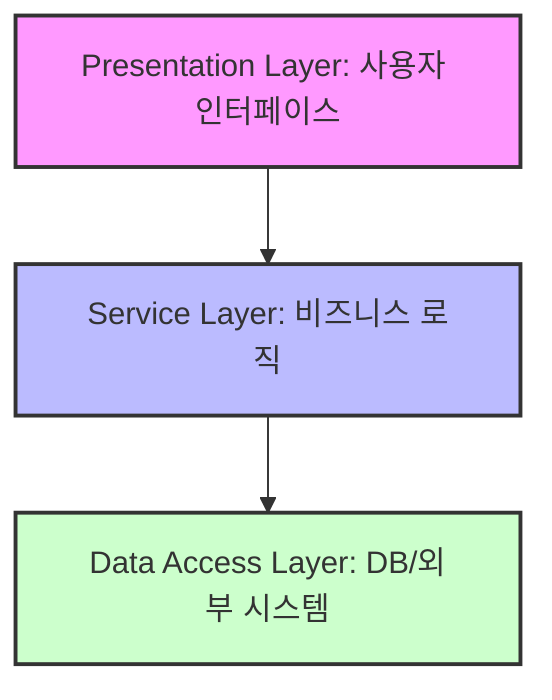

# 레이어드 아키텍처 (Layered Architecture)

## 1. 개념 및 필요성
레이어드 아키텍처는 소프트웨어를 여러 수평 계층(Layer)으로 나누어 각 계층이 특정 역할과 책임을 갖도록 설계하는 가장 보편적인 아키텍처 패턴입니다. 각 계층은 바로 아래 계층에만 의존하며, 관심사의 분리를 통해 코드의 응집도와 유지보수성을 높입니다. 소규모/단순 시스템에 적합하며, 개발 용이성과 테스트 용이성이 높아 실무에서 가장 많이 쓰이는 출발점입니다.

- **아키텍처의 필요성**: 시스템이 커질수록 코드 중복, 구조적 혼란, 변경의 어려움이 커짐. 레이어드 아키텍처는 이런 복잡성을 줄이고, 각 계층의 책임을 명확히 하여 유지보수와 확장성을 높임.

## 2. 전형적 계층 구조 및 역할

- **Presentation Layer (프레젠테이션/컨트롤러)**
    - 사용자 인터페이스, 입력/출력 담당
    - 사용자 요청을 받아 Service Layer로 전달
    - 웹 브라우저, 데스크탑 앱, GUI 등
- **Service Layer (서비스/비즈니스 로직)**
    - 비즈니스 규칙, 트랜잭션, 도메인 로직 처리
    - Presentation과 Data Access 계층 연결
    - 비즈니스 로직과 비즈니스가 아닌 로직(인증, 로깅 등) 혼재 시 복잡해질 수 있음
- **Data Access Layer (데이터 접근/Repository)**
    - DB, 외부 시스템과의 데이터 입출력 담당
    - 영속성, 데이터 저장/조회/수정/삭제
    - DB 주도 설계로 흐르기 쉬움

### 실전적 고민
- 서비스가 커지면 Service Layer 내에서 비즈니스 로직이 중복되거나, 비즈니스 로직과 비즈니스가 아닌 로직이 섞여 유지보수가 어려워짐
- 데이터베이스 변경(예: MySQL→ElasticSearch) 시, 상위 계층까지 영향이 커짐

## 3. 데이터 흐름 및 의존성
- 상위 계층이 하위 계층을 호출하는 단방향 의존성
- 데이터 흐름: Presentation → Service → Data Access
- 의존성 방향이 하향식이라 DB/인프라에 강하게 결합되는 경향

## 4. 장점
- 관심사 분리(SoC), 코드 응집도↑
- 각 계층별 단위 테스트 용이
- 개발/유지보수/역할 분담 쉬움
- 소규모/단순 시스템에 적합
- 구현이 쉽고, 팀 내 합의가 쉬움

## 5. 단점 및 구조적 한계
- 계층간 강한 결합(특히 DB 의존성)
- 확장성/유연성 한계, 모놀리식 경향
- 성능 오버헤드(계층 순차 통과)
- 대규모/복잡 시스템엔 부적합
- 데이터베이스 주도 설계 유도(비즈니스 로직이 DB 구조에 종속)
- 계층별 역할 분리가 흐려지면 유지보수 난이도↑
- 서비스 계층이 커지면 Mock 객체 폭증, 테스트 어려움

### 실전에서 겪는 문제
- DB 스키마/기술 변경 시, 서비스/프레젠테이션 계층까지 영향
- 모든 요청이 모든 계층을 통과해야 하므로 성능 저하
- 역할 분리 실패 시, 코드가 계층을 무시하고 직접 접근하는 안티패턴 발생

## 6. 실전 TIP/고민
- 단순 CRUD/소규모 프로젝트에 적합
- DB/인프라 변경이 잦거나 복잡한 비즈니스 로직엔 한계
- 계층별 책임/의존성 명확히 구분할 것
- 비즈니스 로직과 인프라 로직(인증, 로깅 등) 분리 노력 필요
- 계층별 테스트 전략: Presentation(MockMvc), Service(Mock/Stub), Data Access(Embedded DB 등)

## 7. 예시/실전적 맥락
- 전통적인 Spring MVC, Java EE, 대부분의 웹앱이 이 구조로 시작
- "작은 집 짓기"에 적합, 복잡해지면 구조적 한계가 명확히 드러남
- 실전에서는 계층간 의존성/결합도/테스트 전략/DB 의존성 등에서 고민이 많음

---

> **정리:**
> 레이어드 아키텍처는 단순하고 친숙하지만, 내재된 하향식 의존성 구조로 인해 인프라(특히 데이터베이스)와의 강한 결합을 초래하는 경향이 있음. 서비스 계층이 데이터 접근 계층에 직접 의존하게 되면, 데이터베이스 스키마나 기술 변화에 따라 상위 계층까지 영향이 커짐. 단순/소규모 시스템에는 충분하지만, 복잡한 비즈니스 로직/확장성/유연성이 요구되는 시스템에는 한계가 명확함. 