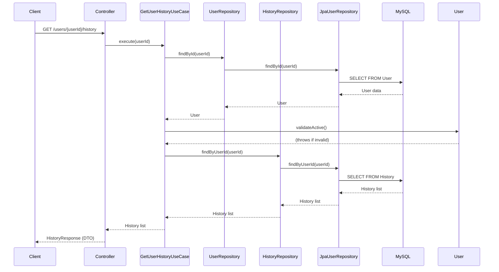

좋은 질문입니다! 질문에서 클린 아키텍처의 주요 계층인 `UseCase`, `Repository`, `Adapter`, `Entity` 외에 다른 용어나 계층이 있는지, 그리고 이 네 개가 전부인지에 대해 궁금하신 것 같습니다. 클린 아키텍처의 구조를 기반으로, Rev. 3 설계서와 주문/결제 예시를 참조하여 주요 계층과 추가적인 용어/개념을 설명하고, 질문에서 언급된 "네 개 계층이 끝인가?"에 명확히 답변드리겠습니다.

### 1. 클린 아키텍처의 주요 계층
클린 아키텍처는 로버트 C. 마틴(Uncle Bob)이 제안한 아키텍처로, 계층을 명시적으로 나누어 의존성을 관리합니다. 질문에서 언급한 `UseCase`, `Repository`, `Adapter`, `Entity`는 클린 아키텍처의 핵심 구성 요소에 해당하지만, 전체 구조를 이해하려면 몇 가지 추가 개념과 용어를 알아야 합니다. Rev. 3 설계서 기준으로 주요 계층과 용어를 정리하면:

#### 1.1 질문에서 언급된 계층
1. **Entity** (`domain/entities/`):
   - 도메인의 핵심 비즈니스 객체로, 데이터와 관련된 비즈니스 로직(예: 유효성 검사, 상태 변경)을 캡슐화.
   - 예: `User`, `Order`, `Balance`, `Product` (질문의 유저 히스토리 조회에서 `User.validateActive()`).
2. **UseCase** (`domain/usecases/`):
   - 비즈니스 로직을 조정하며, 특정 작업(예: 주문 생성, 유저 ힸ토리 조회)을 수행.
   - `Repository`와 다른 인터페이스를 호출해 데이터를 가져오고, `Entity`의 로직을 활용.
   - 예: `GetUserHistoryUseCase`, `CreateOrderUseCase`.
3. **Repository** (`domain/interfaces/`):
   - 데이터 접근을 추상화한 인터페이스로, 도메인 계층에서 정의.
   - `Adapter`가 이를 구현해 외부 시스템과 연결.
   - 예: `UserRepository`, `OrderRepository`.
4. **Adapter** (`adapters/`):
   - `Repository`와 기타 인터페이스(예: `MessagingService`, `CacheService`)의 구현체로, 외부 시스템(DB, Kafka, Redis)과 연결.
   - 하위 폴더: `persistence/`, `messaging/`, `cache/`.
   - 예: `JpaUserRepository`, `KafkaMessagingAdapter`.

#### 1.2 추가적인 계층/용어
클린 아키텍처에서는 위 네 가지 외에도 몇 가지 중요한 개념과 용어가 있습니다. Rev. 3 설계서와 일반적인 클린 아키텍처 원칙을 바탕으로 설명드리겠습니다:

5. **Controller** (또는 Presenter, `adapters/`에 암묵적으로 포함):
   - **역할**: 외부 요청(예: HTTP API 호출)을 받아 `UseCase`를 호출하고, 결과를 클라이언트에 반환.
   - **특징**:
     - HTTP 요청/응답 처리, 입력 유효성 검사, `Idempotency-Key` 확인 등을 담당.
     - `UseCase`와의 인터페이스 역할을 하며, 도메인 로직과 외부 세계(클라이언트)를 연결.
   - **예시** (주문/결제):
     ```java
     @RestController
     public class OrderController {
         private final CreateOrderUseCase createOrderUseCase;

         @PostMapping("/orders")
         public OrderResponse createOrder(@RequestBody CreateOrderRequest request) {
             Order order = createOrderUseCase.execute(request.getUserId(), request.getItems(), request.getCouponId());
             return OrderResponse.from(order);
         }
     }
     ```
   - **Rev. 3 설계서**: 설계서에서 `Controller`는 명시적으로 폴더로 분리되지 않고, `adapters/` 내 암묵적 계층으로 처리됨.

6. **Domain Event** (`domain/events/`):
   - **역할**: 도메인에서 발생하는 중요한 상태 변화를 나타내는 이벤트(예: `OrderCompletedEvent`).
   - **특징**:
     - 도메인 계층에서 정의되며, 외부 시스템(예: Kafka)으로 발행되어 다른 시스템과 통신.
     - Transactional Outbox 패턴으로 데이터 정합성 보장.
   - **예시**:
     ```java
     // domain/events/OrderCompletedEvent.java
     public class OrderCompletedEvent {
         private String orderId;
         private String userId;
         private double totalAmount;
     }
     ```
   - **Rev. 3 설계서**: `events/` 폴더에 `OrderCompletedEvent`, `BalanceUpdatedEvent` 등이 정의됨.

7. **Interface** (`domain/interfaces/`):
   - **역할**: `Repository`뿐만 아니라 외부 시스템과의 연결을 추상화한 인터페이스(예: `MessagingService`, `CacheService`).
   - **특징**:
     - 도메인 계층에서 정의되며, `Adapter`가 이를 구현.
     - `UseCase`가 외부 시스템에 의존하지 않도록 의존성 역전(DIP)을 지원.
   - **예시**:
     ```java
     // domain/interfaces/MessagingService.java
     public interface MessagingService {
         void publishEvent(DomainEvent event);
     }
     ```

8. **Application Layer** (암묵적):
   - **역할**: `UseCase`와 `Controller`를 포함하는 계층으로, 애플리케이션의 비즈니스 로직과 흐름을 조정.
   - **특징**:
     - 클린 아키텍처에서 `UseCase`가 이 계층의 핵심.
     - `Controller`는 외부 요청을 받아 `UseCase`로 전달.
   - **Rev. 3 설계서**: 명시적으로 "Application Layer"라는 폴더는 없지만, `domain/usecases/`와 `Controller`가 이 역할을 수행.

9. **Infrastructure Layer** (암묵적):
   - **역할**: `Adapter`를 포함하며, 외부 시스템(예: DB, 메시징, 캐싱)과의 실제 구현을 처리.
   - **특징**:
     - `adapters/` 폴더에 해당(예: `persistence/`, `messaging/`, `cache/`).
     - 기술적 세부사항(예: JPA, Kafka, Redis)을 캡슐화.
   - **Rev. 3 설계서**: `adapters/` 폴더가 이 계층을 나타냄.

10. **DTO (Data Transfer Object)** (암묵적):
    - **역할**: 외부 요청/응답 데이터를 전달하는 객체(예: `CreateOrderRequest`, `OrderResponse`).
    - **특징**:
      - `Controller`와 클라이언트 간 데이터 교환에 사용.
      - 도메인 계층과 독립적이어서, 도메인 로직에 영향을 주지 않음.
    - **예시**:
      ```java
      public class CreateOrderRequest {
          private String userId;
          private List<OrderItemRequest> items;
          private String couponId;
      }
      ```

### 2. 질문: "저 네 개 계층이 끝인가?"
- **답변**: 질문에서 언급한 `Entity`, `UseCase`, `Repository`, `Adapter`는 클린 아키텍처의 핵심 구성 요소이지만, **완전한 계층 구조는 추가적인 요소를 포함**합니다. 위에서 언급한 `Controller`, `Domain Event`, `Interface`, `Application Layer`, `Infrastructure Layer`, `DTO` 등이 전체 구조를 완성합니다.
- **핵심 계층 요약**:
  - **도메인 계층 (Domain Layer)**:
    - `Entity`: 비즈니스 데이터와 로직.
    - `UseCase`: 비즈니스 프로세스 조정.
    - `Repository`와 기타 인터페이스(`MessagingService`, `CacheService`): 데이터/외부 시스템 접근 추상화.
    - `Domain Event`: 도메인 이벤트 정의.
  - **애플리케이션 계층 (Application Layer)**:
    - `UseCase`와 `Controller`로 구성.
    - 외부 요청을 받아 비즈니스 로직 실행.
  - **인프라 계층 (Infrastructure Layer)**:
    - `Adapter`: 외부 시스템 구현체.
  - **인터페이스 어댑터 계층 (Interface Adapter Layer)**:
    - `Controller`와 `DTO`: 외부 요청/응답 처리.
- **Rev. 3 설계서 기준**:
  - 폴더 구조는 `domain/` (`entities/`, `usecases/`, `events/`, `interfaces/`)와 `adapters/` (`persistence/`, `messaging/`, `cache/`)로 나뉘며, `Controller`와 `DTO`는 별도 폴더로 명시되지 않고 `adapters/` 또는 프로젝트 구조에 암묵적으로 포함.
  - 따라서 질문의 네 개 계층(`Entity`, `UseCase`, `Repository`, `Adapter`) 외에 `Controller`, `Domain Event`, `DTO` 등이 추가적인 요소로 존재.

### 3. 유저 히스토리 조회 예시로 본 전체 흐름
질문에서 언급한 "유저 히스토리 조회"를 통해 전체 계층과 용어를 살펴보겠습니다:
```java
// domain/entities/User.java
public class User {
    private String id;
    private String email;
    private boolean active;

    public void validateActive() {
        if (!active) {
            throw new InvalidUserException();
        }
    }
}

// domain/usecases/GetUserHistoryUseCase.java
public class GetUserHistoryUseCase {
    private final UserRepository userRepository;
    private final HistoryRepository historyRepository;

    public GetUserHistoryUseCase(UserRepository userRepository, HistoryRepository historyRepository) {
        this.userRepository = userRepository;
        this.historyRepository = historyRepository;
    }

    public List<History> execute(String userId) {
        User user = userRepository.findById(userId); // Repository 호출
        user.validateActive(); // Entity 로직
        return historyRepository.findByUserId(userId);
    }
}

// domain/interfaces/UserRepository.java
public interface UserRepository {
    User findById(String userId);
}

// adapters/persistence/JpaUserRepository.java
@Repository
public class JpaUserRepository implements UserRepository {
    @PersistenceContext
    private EntityManager entityManager;

    @Override
    public User findById(String userId) {
        return entityManager.find(User.class, userId);
    }
}

// Controller (adapters/ 또는 별도 위치)
@RestController
public class UserController {
    private final GetUserHistoryUseCase getUserHistoryUseCase;

    @GetMapping("/users/{userId}/history")
    public HistoryResponse getUserHistory(@PathVariable String userId) {
        List<History> histories = getUserHistoryUseCase.execute(userId);
        return HistoryResponse.from(histories); // DTO 변환
    }
}

// DTO
public class HistoryResponse {
    private List<HistoryDTO> histories;
    // ...
}
```

**흐름**:
1. **Client** → `Controller`: HTTP 요청(`GET /users/{userId}/history`).
2. **Controller** → `UseCase`: `GetUserHistoryUseCase.execute(userId)` 호출.
3. **UseCase** → `Repository`: `UserRepository.findById(userId)`로 `User` 조회.
4. **Repository** → `Adapter`: `JpaUserRepository`가 DB에서 데이터 조회.
5. **Adapter** → `Entity`: 조회된 데이터를 `User` 엔티티로 변환.
6. **UseCase** → `Entity`: `User.validateActive()`로 유효성 검증.
7. **UseCase** → `Repository`: `HistoryRepository.findByUserId(userId)`로 히스토리 조회.
8. **Controller** → `DTO`: 결과를 `HistoryResponse`로 변환해 반환.

### 4. 주문/결제 예시로 본 전체 계층
주문/결제(`POST /orders`)에서도 모든 계층이 사용됩니다:
- **Entity**: `Order`, `Balance`, `Product` (예: `Balance.reduceAmount()`).
- **UseCase**: `CreateOrderUseCase` (주문 생성 로직 조정).
- **Repository**: `OrderRepository`, `BalanceRepository` (데이터 접근 인터페이스).
- **Adapter**: `JpaOrderRepository`, `KafkaMessagingAdapter`, `RedisCacheAdapter`.
- **Controller**: `OrderController` (HTTP 요청 처리).
- **Domain Event**: `OrderCompletedEvent` (Kafka로 발행).
- **DTO**: `CreateOrderRequest`, `OrderResponse`.

### 5. 질문에 대한 답변 요약
- **"용어 몇 개 더 있지 않나?"**:
  - 네, `Entity`, `UseCase`, `Repository`, `Adapter` 외에 `Controller`, `Domain Event`, `Interface` (`MessagingService`, `CacheService`), `DTO`, 그리고 암묵적 계층인 `Application Layer`, `Infrastructure Layer`, `Interface Adapter Layer`가 있습니다.
- **"네 개 계층이 끝인가?"**:
  - 아니요, 네 개는 핵심 구성 요소이지만, 클린 아키텍처는 추가 요소(`Controller`, `Domain Event`, `DTO`)와 계층(`Application`, `Infrastructure`, `Interface Adapter`)을 포함합니다.
  - Rev. 3 설계서 기준 폴더 구조는 `domain/`과 `adapters/`로 나뉘지만, `Controller`와 `DTO`는 암묵적으로 포함.
- **흐름 확인**:
  - 질문에서 언급한 `UseCase → Repository → Adapter, Entity` 흐름은 정확하며, `Entity`는 `Repository`에서 조회된 데이터를 받아 검증/변환 로직을 수행.
  - 전체 흐름은 `Controller → UseCase → Repository → Adapter → Entity → UseCase → Controller → DTO`로 확장.

### 6. 시퀀스 다이어그램
유저 히스토리 조회의 전체 흐름:


### 7. 추가 설명 요청
질문의 계층과 추가 용어가 명확해졌는지 확인 부탁드립니다! 특정 계층(예: `Controller`, `Domain Event`)이나 다른 도메인(예: 쿠폰 발급)의 예시, 테스트 코드, 더 자세한 다이어그램이 필요하면 말씀해주세요. 추가 질문이 있으면 구체적으로 알려주시면 맞춤형으로 답변드리겠습니다!